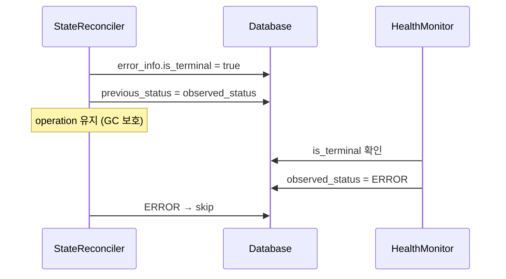
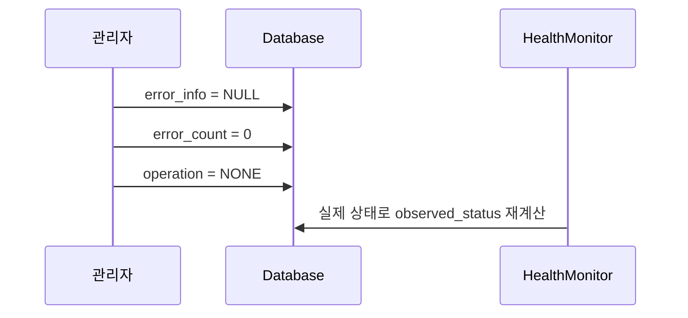

# Error Handling (M2)

> [README.md](./README.md)로 돌아가기

---

## 핵심 원칙

1. **ERROR는 fallback 상태** - 모든 예외는 궁극적으로 ERROR로 수렴
2. **구조화된 에러 정보** - reason + message + is_terminal
3. **자동 재시도 후 관리자 개입** - 3회 재시도, 초과 시 알림
4. **GC 보호** - ERROR 상태 workspace의 archive는 삭제하지 않음

---

## 책임 분리

| 컴포넌트 | 역할 |
|---------|------|
| StateReconciler | error_info, error_count 설정, is_terminal 판정 (주 소유자) |
| HealthMonitor | is_terminal 읽고 observed_status = ERROR 설정 (Single Writer) |

> **원칙**: StateReconciler는 error_info, HealthMonitor는 observed_status만 변경
>
> **예외**: 불변식 위반(ContainerWithoutVolume 등)에서 error_info가 NULL일 때만 HealthMonitor가 error_info를 1회 설정할 수 있다.

---

## ErrorInfo 구조

| 필드 | 타입 | 설명 |
|------|------|------|
| reason | string | 에러 유형 |
| message | string | 사람이 읽는 메시지 |
| is_terminal | bool | true면 ERROR로 전환 |
| operation | string | 실패한 operation |
| error_count | int | 연속 실패 횟수 |
| context | dict | reason별 상세 정보 |
| occurred_at | string | ISO 8601 timestamp |

---

## ErrorReason

| reason | 설명 | 재시도 | is_terminal |
|--------|------|--------|-------------|
| Mismatch | 상태 불일치 (expected vs actual) | 3회 | 초과 시 |
| Unreachable | API/인프라 호출 실패 | 3회 | 초과 시 |
| ActionFailed | 작업 실행 실패 | 3회 | 초과 시 |
| Timeout | 작업 시간 초과 | 0회 | 즉시 |
| RetryExceeded | 재시도 한계 초과 | - | 항상 |
| DataLost | 데이터 손실/손상 | 0회 | 즉시 |

---

## context 필드 예시

| reason | context 예시 |
|--------|-------------|
| Mismatch | `{"expected": "volume_exists=True", "actual": "False"}` |
| Unreachable | `{"endpoint": "k8s-api", "status_code": 503}` |
| ActionFailed | `{"action": "archive", "exit_code": 1}` |
| Timeout | `{"operation": "ARCHIVING", "elapsed_seconds": 1800}` |
| DataLost | `{"archive_key": "...", "detail": "checksum mismatch"}` |
| RetryExceeded | `{"max_retries": 3, "last_error": "..."}` |

---

## ERROR 전환 흐름

---

## ERROR 복구 흐름

### 복구 시나리오

| reason | 복구 방법 |
|--------|----------|
| Mismatch | 관리자 확인 후 수동 트리거 |
| Unreachable | 인프라 복구 후 수동 복구 |
| ActionFailed | 원인 해결 후 수동 복구 |
| Timeout | 리소스 확장/timeout 조정 후 수동 복구 |
| RetryExceeded | 근본 원인 해결 후 수동 복구 |
| DataLost | 백업 복원 또는 새 workspace 생성 |

> 자동 복구 경로 없음. 관리자가 문제 해결 후 API 호출 필요.

---

## 재시도 책임 분리

| 레벨 | 책임 | 재시도 | 시간 |
|------|------|--------|------|
| Job 내부 | 일시적 네트워크 glitch | 3회 | 총 30~60초 |
| StateReconciler | Job 실행 실패 | 3회 | 30초 간격 |

> **Job 내부 재시도**: S3 일시 오류, TCP 리셋 등 짧은 장애 복구
>
> **SR 재시도**: 노드 문제, 권한 오류, 리소스 부족 등 근본 장애 복구
>
> **최악의 경우**: Job 내부 3회 × SR 3회 = 9회 S3 호출
> 이는 의도된 동작으로, 일시적 장애와 근본 장애를 구분하여 처리한다.

---

## GC 동작

| 상태 | GC 동작 | 이유 |
|------|---------|------|
| ERROR | 보호 (삭제 안 함) | 복구 시 archive 필요 |
| DELETED | 삭제 대상 | soft-delete workspace |

---

## 에러 코드 매핑

| 기존 코드 | ErrorReason |
|----------|-------------|
| ARCHIVE_NOT_FOUND | DataLost |
| S3_ACCESS_ERROR | Unreachable |
| CHECKSUM_MISMATCH | DataLost |
| TAR_EXTRACT_FAILED | ActionFailed |
| VOLUME_CREATE_FAILED | ActionFailed |
| CONTAINER_START_FAILED | ActionFailed |
| K8S_API_ERROR | Unreachable |

---

## ERROR 관련 컬럼

| 컬럼 | Writer | 설명 |
|------|--------|------|
| observed_status | HealthMonitor | ERROR 상태 |
| previous_status | StateReconciler | ERROR 전 상태 |
| error_info | StateReconciler | ErrorInfo |
| error_count | StateReconciler | 연속 실패 횟수 |
| op_id | StateReconciler | ERROR에서도 유지 (GC 보호) |

---

## 참조

- [states.md](./states.md) - ERROR 상태 정의
- [components/state-reconciler.md](./components/state-reconciler.md) - 재시도 로직
- [components/health-monitor.md](./components/health-monitor.md) - ERROR 판정
- [components/archive-gc.md](./components/archive-gc.md) - GC 보호
