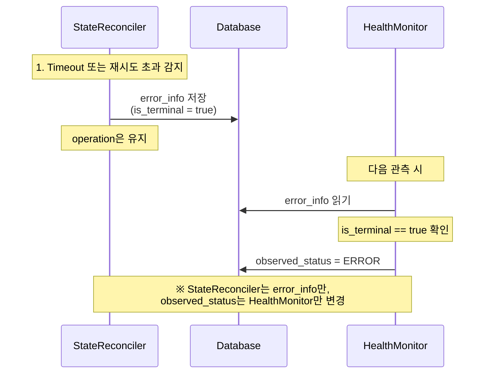
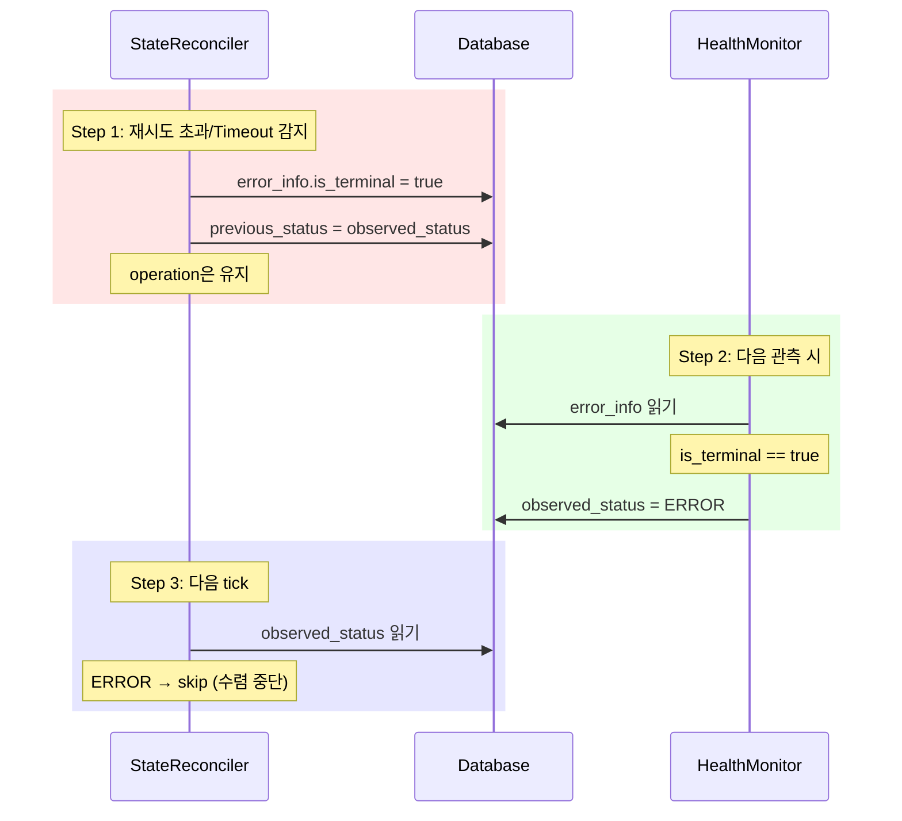
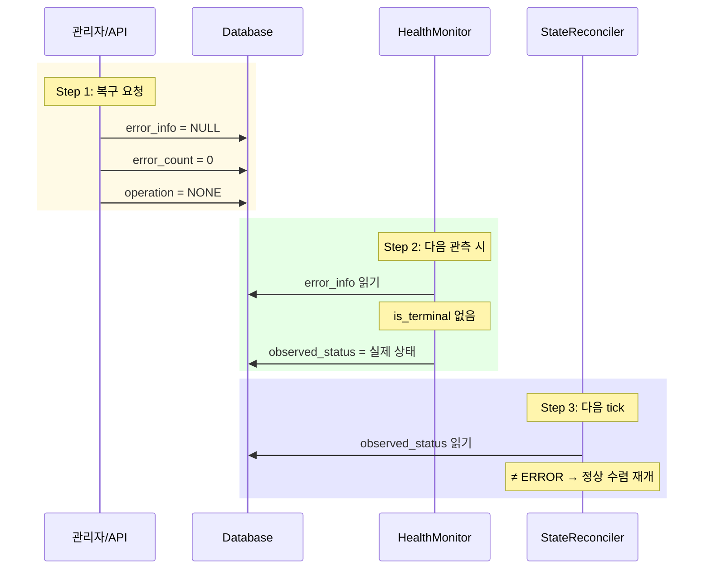

# Error Handling (M2)

> [README.md](./README.md)로 돌아가기

---

## 핵심 원칙

1. **ERROR는 fallback 상태** - 모든 예외는 궁극적으로 ERROR로 수렴
2. **구조화된 에러 정보** - reason + message + context + is_terminal
3. **자동 재시도 후 관리자 개입** - 3회 재시도, 초과 시 알림
4. **GC 보호** - ERROR 상태 workspace의 archive는 삭제하지 않음

---

## 크로스 컴포넌트 에러 처리



### 책임 분리

| 컴포넌트 | 역할 |
|---------|------|
| **StateReconciler** | error_info, error_count 설정, is_terminal 판정 |
| **HealthMonitor** | error_info.is_terminal 읽고 observed_status = ERROR 설정 |

### ERROR 판정 로직

```python
# HealthMonitor에서 실행
def compute_observed_status(container, volume, error_info, archive_key):
    # 1. Terminal error가 있으면 ERROR
    if error_info and error_info.get('is_terminal'):
        return ERROR

    # 2. 불변식 위반
    if container.exists and not volume.exists:
        return ERROR

    # 3. 정상 상태 계산
    if container.exists and container.running:
        return RUNNING
    if volume.exists:
        return STANDBY
    if archive_key:
        return PENDING

    # 4. DataLost
    return ERROR
```

---

## ErrorInfo 구조

```python
from typing import Literal
from dataclasses import dataclass
from datetime import datetime

ErrorReason = Literal[
    "Mismatch",       # 상태 불일치 (expected vs actual)
    "Unreachable",    # API/인프라 호출 실패
    "ActionFailed",   # 작업 실행 실패 (archive, restore 등)
    "Timeout",        # 작업 시간 초과
    "RetryExceeded",  # 재시도 한계 초과
    "DataLost",       # 데이터 손실/손상 (관리자 개입 필요)
]

@dataclass
class ErrorInfo:
    reason: ErrorReason    # 에러 유형
    message: str           # 사람이 읽는 메시지
    is_terminal: bool      # True면 HealthMonitor가 ERROR로 전환
    operation: str         # 실패한 operation (STARTING, STOPPING 등)
    error_count: int       # 연속 실패 횟수
    context: dict          # reason별 상세 정보
    occurred_at: datetime  # 발생 시간
```

### 설계 결정

| 항목 | 결정 | 이유 |
|------|------|------|
| 스키마 | 공통 필드 + context | 확장성, DB 변경 없이 reason 추가 가능 |
| reason 타입 | Literal (하이브리드) | 타입 안전 + 문자열 저장 + IDE 자동완성 |
| context | JSON dict | reason별 다른 구조, 자유로운 확장 |
| is_terminal | bool | HealthMonitor가 ERROR 판정하는 기준 |

---

## ErrorReason 정의

### Mismatch - 상태 불일치

관측(check) 결과가 예상과 다른 경우.

```python
ErrorInfo(
    reason="Mismatch",
    message="Volume should exist but not found",
    context={
        "expected": "volume_exists=True",
        "actual": "volume_exists=False"
    },
    occurred_at=datetime.utcnow()
)
```

| 필드 | 설명 |
|------|------|
| expected | DB/operation이 기대하는 상태 |
| actual | 관측된 실제 상태 |

### Unreachable - API 호출 실패

외부 시스템(K8s API, S3 등) 접근 실패.

```python
ErrorInfo(
    reason="Unreachable",
    message="K8s API connection refused",
    context={
        "endpoint": "k8s-api",
        "status_code": 503,
        "error": "connection refused"
    },
    occurred_at=datetime.utcnow()
)
```

| 필드 | 설명 |
|------|------|
| endpoint | 호출 대상 (k8s-api, s3, docker) |
| status_code | HTTP 상태 코드 (있는 경우) |
| error | 에러 메시지 |

### ActionFailed - 작업 실패

Actuator(provision, archive 등) 실행 실패.

```python
ErrorInfo(
    reason="ActionFailed",
    message="Archive job failed with exit code 1",
    context={
        "action": "archive",
        "exit_code": 1,
        "stderr": "disk full"
    },
    occurred_at=datetime.utcnow()
)
```

| 필드 | 설명 |
|------|------|
| action | 실패한 작업 (provision, restore, archive, delete_volume, start, delete) |
| exit_code | Job exit code (있는 경우) |
| stderr | 에러 출력 (있는 경우) |

### Timeout - 시간 초과

operation이 제한 시간 내 완료되지 않음.

```python
ErrorInfo(
    reason="Timeout",
    message="Operation ARCHIVING timed out after 1800s",
    context={
        "operation": "ARCHIVING",
        "elapsed_seconds": 1800,
        "limit_seconds": 1800
    },
    occurred_at=datetime.utcnow()
)
```

| 필드 | 설명 |
|------|------|
| operation | 타임아웃된 operation |
| elapsed_seconds | 경과 시간 |
| limit_seconds | 제한 시간 |

### DataLost - 데이터 손실

복구 불가능한 데이터 손상. 관리자 즉시 개입 필요.

```python
ErrorInfo(
    reason="DataLost",
    message="Archive checksum mismatch",
    is_terminal=True,  # 항상 terminal
    operation="RESTORING",
    error_count=0,
    context={
        "archive_key": "archives/abc/123/home.tar.gz",
        "detail": "checksum mismatch"
    },
    occurred_at=datetime.utcnow()
)
```

| 필드 | 설명 |
|------|------|
| archive_key | 손상된 archive 경로 |
| detail | 손상 상세 (checksum mismatch, file not found 등) |

### RetryExceeded - 재시도 한계 초과

최대 재시도 횟수 도달 후 여전히 실패.

```python
ErrorInfo(
    reason="RetryExceeded",
    message="Operation STARTING failed after 3 retries",
    is_terminal=True,
    operation="STARTING",
    error_count=3,
    context={
        "max_retries": 3,
        "last_error": "Container failed to start: OOMKilled"
    },
    occurred_at=datetime.utcnow()
)
```

| 필드 | 설명 |
|------|------|
| max_retries | 최대 재시도 횟수 |
| last_error | 마지막 실패 에러 메시지 |

---

## 에러 처리 정책

### 재시도 정책

| reason | 재시도 | is_terminal | 관리자 호출 | 근거 |
|--------|--------|-------------|------------|------|
| Mismatch | 3회 | 3회 초과 시 | 3회 초과 시 | 일시적 불일치 가능 |
| Unreachable | 3회 | 3회 초과 시 | 3회 초과 시 | 네트워크 일시 장애 |
| ActionFailed | 3회 | 3회 초과 시 | 3회 초과 시 | 일시적 리소스 부족 |
| Timeout | 0회 | 즉시 | 즉시 | 반복해도 동일 결과 예상 |
| RetryExceeded | - | 항상 true | 즉시 | 이미 재시도 완료 |
| DataLost | 0회 | 즉시 | 즉시 | 재시도 무의미 |

### 재시도 로직 (StateReconciler에서 실행)

```python
MAX_RETRIES = 3
RETRY_BACKOFF = timedelta(seconds=30)

async def handle_operation_failure(ws: Workspace, error: Exception):
    """Operation 실패 시 재시도 또는 terminal error 설정

    Note: observed_status는 변경하지 않음 (HealthMonitor 역할)
    """
    reason = classify_error(error)
    max_retries = get_max_retries(reason)

    new_error_count = ws.error_count + 1

    if new_error_count < max_retries:
        # 재시도 가능: error_info 저장 (is_terminal = false)
        await db.execute("""
            UPDATE workspaces
            SET error_count = $1,
                error_info = $2
            WHERE id = $3
        """, new_error_count, {
            "reason": reason,
            "message": str(error),
            "is_terminal": False,
            "operation": ws.operation,
            "error_count": new_error_count,
            "context": get_error_context(error),
            "occurred_at": datetime.utcnow().isoformat()
        }, ws.id)
        # 다음 tick에서 자동 재시도
    else:
        # 재시도 한계 초과: terminal error 설정
        await set_terminal_error(ws, "RetryExceeded", error, new_error_count)
        await notify_admin(ws)

async def set_terminal_error(ws: Workspace, reason: str, error: Exception, error_count: int):
    """Terminal error 설정 → HealthMonitor가 ERROR로 전환"""
    await db.execute("""
        UPDATE workspaces
        SET error_count = $1,
            error_info = $2,
            previous_status = observed_status
        WHERE id = $3
    """, error_count, {
        "reason": reason,
        "message": str(error),
        "is_terminal": True,
        "operation": ws.operation,
        "error_count": error_count,
        "context": get_error_context(error),
        "occurred_at": datetime.utcnow().isoformat()
    }, ws.id)

def get_max_retries(reason: str) -> int:
    return {
        "Mismatch": 3,
        "Unreachable": 3,
        "ActionFailed": 3,
        "Timeout": 0,
        "DataLost": 0,
    }.get(reason, 3)
```

### GC 동작

**ERROR 상태 workspace는 GC에서 보호됩니다.**

| 상태 | GC 동작 | 이유 |
|------|---------|------|
| ERROR | pass (삭제 안 함) | 복구 시 archive 필요할 수 있음 |
| DELETED | 삭제 대상 | soft-delete된 workspace |

> **상세**: [components/archive-gc.md](./components/archive-gc.md) 참조

---

## ERROR 전환

### ERROR 전환 흐름



### set_terminal_error() (StateReconciler)

```python
async def set_terminal_error(ws: Workspace, reason: str, error: Exception, error_count: int):
    """Terminal error 설정

    Note:
      - observed_status는 건드리지 않음 (HealthMonitor 역할)
      - operation은 유지 (op_id 기반 GC 보호)
      - previous_status = observed_status는 SQL에서 원자적으로 읽기/저장
    """
    # PostgreSQL UPDATE는 원자적: observed_status 읽기와 previous_status 저장이 동시에 발생
    # HealthMonitor가 동시에 observed_status를 변경해도 UPDATE 시점의 값이 저장됨
    await db.execute("""
        UPDATE workspaces
        SET error_count = $1,
            error_info = $2,
            previous_status = observed_status  -- 원자적 읽기/저장
        WHERE id = $3
    """, error_count, {
        "reason": reason,
        "message": str(error),
        "is_terminal": True,
        "operation": ws.operation,
        "error_count": error_count,
        "context": get_error_context(error),
        "occurred_at": datetime.utcnow().isoformat()
    }, ws.id)
```

> **동시성 안전성**: PostgreSQL의 `previous_status = observed_status`는 UPDATE 실행 시점의 값을 원자적으로 읽어 저장합니다.
> HealthMonitor가 동시에 observed_status를 변경해도 정확한 이전 상태가 보존됩니다.

### ERROR 관련 컬럼

| 컬럼 | Writer | 타입 | 설명 |
|------|--------|------|------|
| observed_status | HealthMonitor | str | ERROR 상태 (is_terminal 기반 설정) |
| previous_status | StateReconciler | str | ERROR 전 상태 (복구 시 사용) |
| error_info | StateReconciler | JSONB | ErrorInfo (is_terminal 포함) |
| error_count | StateReconciler | int | 연속 실패 횟수 |
| op_id | StateReconciler | str | ERROR에서도 유지 (GC 보호) |

---

## ERROR 복구

### 복구 흐름



### recover_from_error() (API/관리자)

```python
async def recover_from_error(ws: Workspace):
    """ERROR 상태에서 복구 (관리자 호출)

    Note:
      - error_info만 초기화
      - observed_status는 HealthMonitor가 다음 관측에서 재계산
      - op_id는 유지 (이미 업로드된 archive 재사용)
    """
    if ws.observed_status != "ERROR":
        return

    await db.execute("""
        UPDATE workspaces
        SET error_info = NULL,
            error_count = 0,
            operation = 'NONE'
        WHERE id = $1
    """, ws.id)

    # HealthMonitor에 즉시 관측 요청
    await redis.publish("monitor:trigger", ws.id)
```

### 복구 시나리오

| reason | 복구 방법 |
|--------|----------|
| Mismatch | 자동 복구 불가 → 관리자 확인 후 수동 트리거 |
| Unreachable | 인프라 복구 후 수동 복구 트리거 |
| ActionFailed | 원인 해결 후 수동 복구 트리거 |
| Timeout | 리소스 확장 또는 timeout 조정 후 수동 복구 |
| RetryExceeded | 근본 원인 해결 후 수동 복구 |
| DataLost | 백업 복원 또는 새 workspace 생성 권장 |

> **중요: ERROR 상태에서의 operation**
>
> - ERROR 전환 시 `operation`은 NONE으로 리셋되지 **않습니다** (op_id 기반 GC 보호)
> - 복구 시 `operation = 'NONE'`으로 명시적 리셋이 필요합니다
> - 이 리셋이 없으면 StateReconciler가 정상 수렴을 재개할 수 없습니다
>
> **자동 복구 경로는 없습니다**: 관리자가 문제를 해결하고 `recover_from_error()` API를 호출해야 합니다.

---

## 에러 코드 매핑

기존 에러 코드를 ErrorReason으로 매핑합니다.

| 기존 코드 | ErrorReason | context 예시 |
|----------|-------------|-------------|
| ARCHIVE_NOT_FOUND | DataLost | `{"detail": "archive not found"}` |
| S3_ACCESS_ERROR | Unreachable | `{"endpoint": "s3"}` |
| CHECKSUM_MISMATCH | DataLost | `{"detail": "checksum mismatch"}` |
| TAR_EXTRACT_FAILED | ActionFailed | `{"action": "restore"}` |
| VOLUME_CREATE_FAILED | ActionFailed | `{"action": "provision"}` |
| CONTAINER_START_FAILED | ActionFailed | `{"action": "start"}` |
| K8S_API_ERROR | Unreachable | `{"endpoint": "k8s-api"}` |

---

## 참조

- [states.md](./states.md) - ERROR 상태 정의
- [components/state-reconciler.md](./components/state-reconciler.md) - 재시도 로직, timeout
- [components/health-monitor.md](./components/health-monitor.md) - ERROR 판정 (is_terminal)
- [storage.md](./storage.md) - Operation 플로우, 에러 처리
- [components/archive-gc.md](./components/archive-gc.md) - ERROR 상태 GC 보호
