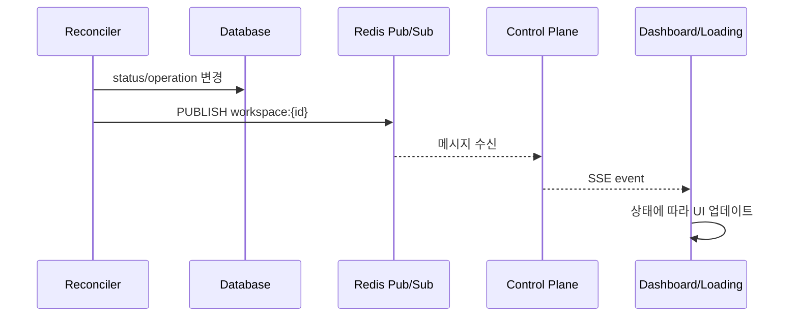

# SSE Events (M2)

> [README.md](./README.md)로 돌아가기

---

## 개요

상태 변경 시 UI(대시보드, 로딩 페이지)에 실시간 알림을 전달합니다.

---

## 이벤트 전달 흐름



---

## SSE 엔드포인트

```
GET /api/v1/workspaces/{id}/events
Accept: text/event-stream
```

### 연결 유지
- 클라이언트가 연결 유지
- 서버에서 주기적 heartbeat (30초)
- 연결 끊김 시 클라이언트 재연결

---

## 이벤트 타입

### state_changed

상태 또는 operation 변경 시 발행.

```
event: state_changed
data: {"workspace_id": "abc123", "status": "WARM", "operation": "STARTING", "desired_state": "RUNNING"}
```

| 필드 | 타입 | 설명 |
|------|------|------|
| workspace_id | string | 워크스페이스 ID |
| status | string | 현재 상태 |
| operation | string | 진행 중인 작업 |
| desired_state | string | 목표 상태 |

### error

에러 발생 시 발행.

```
event: error
data: {"workspace_id": "abc123", "error_message": "Container start failed", "error_count": 1}
```

| 필드 | 타입 | 설명 |
|------|------|------|
| workspace_id | string | 워크스페이스 ID |
| error_message | string | 에러 메시지 |
| error_count | int | 연속 실패 횟수 |

### heartbeat

연결 유지용 (30초마다).

```
event: heartbeat
data: {"timestamp": "2024-01-15T10:30:00Z"}
```

---

## 발행 시점

| 상황 | 이벤트 |
|------|--------|
| operation 시작 | state_changed (operation != NONE) |
| operation 완료 | state_changed (operation = NONE, status 변경) |
| 에러 발생 | error |
| 에러 복구 | state_changed |

---

## Redis Pub/Sub 채널

```
채널: workspace:{workspace_id}
메시지: JSON (이벤트 데이터)
```

### Reconciler 발행 예시

```python
async def publish_state_change(workspace: Workspace):
    message = {
        "event": "state_changed",
        "data": {
            "workspace_id": workspace.id,
            "status": workspace.status.value,
            "operation": workspace.operation.value,
            "desired_state": workspace.desired_state.value
        }
    }
    await redis.publish(f"workspace:{workspace.id}", json.dumps(message))
```

### API 구독 예시

```python
async def sse_events(workspace_id: str):
    pubsub = redis.pubsub()
    await pubsub.subscribe(f"workspace:{workspace_id}")

    async for message in pubsub.listen():
        if message["type"] == "message":
            event = json.loads(message["data"])
            yield f"event: {event['event']}\ndata: {json.dumps(event['data'])}\n\n"
```

---

## 클라이언트 사용법

### JavaScript

```javascript
const eventSource = new EventSource('/api/v1/workspaces/{id}/events');

eventSource.addEventListener('state_changed', (e) => {
  const data = JSON.parse(e.data);
  console.log(`Status: ${data.status}, Operation: ${data.operation}`);

  if (data.status === 'RUNNING' && data.operation === 'NONE') {
    // 워크스페이스 준비 완료 → 리다이렉트
    window.location.href = `/w/${data.workspace_id}/`;
  }
});

eventSource.addEventListener('error', (e) => {
  if (e.data) {
    const data = JSON.parse(e.data);
    alert(`Error: ${data.error_message}`);
  }
});

eventSource.addEventListener('heartbeat', () => {
  // 연결 유지 확인
});
```

### 로딩 페이지 예시

```html
<div id="loading">
  <h1>Workspace 시작 중...</h1>
  <p id="status">상태: 준비 중</p>
  <div class="spinner"></div>
</div>

<script>
const es = new EventSource('/api/v1/workspaces/{id}/events');

es.addEventListener('state_changed', (e) => {
  const data = JSON.parse(e.data);
  document.getElementById('status').textContent =
    `상태: ${data.status} (${data.operation || '대기'})`;

  if (data.status === 'RUNNING' && data.operation === 'NONE') {
    window.location.reload();
  }
});
</script>
```

---

## 에러 처리

### 연결 실패
- EventSource 자동 재연결 (기본 동작)
- 지수 백오프 권장

### 메시지 유실
- 클라이언트는 현재 상태를 REST API로 조회 가능
- SSE는 실시간 알림 용도, 상태 동기화는 API

---

## 참조

- [states.md](./states.md) - 상태 정의
- [api.md](./api.md) - REST API
