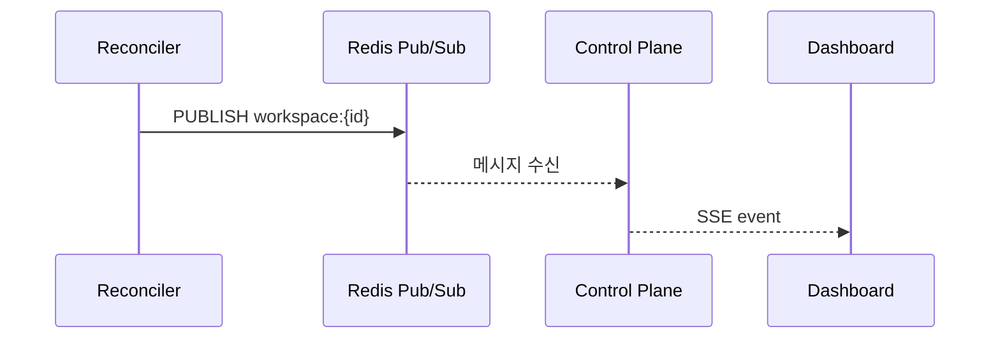

# SSE Events (M2)

> [README.md](./README.md)로 돌아가기

---

## 개요

상태 변경 시 UI(대시보드, 로딩 페이지)에 실시간 알림을 전달합니다.

---

## 이벤트 전달 흐름



---

## SSE 엔드포인트

```
GET /api/v1/workspaces/{id}/events
Accept: text/event-stream
```

| 항목 | 값 |
|------|---|
| 연결 | 클라이언트 유지 |
| Heartbeat | 30초 주기 |
| 재연결 | 클라이언트 자동 재연결 |

---

## Redis Pub/Sub

| 항목 | 값 |
|------|---|
| 채널 | `workspace:{workspace_id}` |
| 메시지 | JSON (이벤트 데이터) |

---

## 이벤트 타입

### state_changed

상태 또는 operation 변경 시 발행.

| 필드 | 타입 | 설명 |
|------|------|------|
| workspace_id | string | 워크스페이스 ID |
| status | string | 현재 상태 |
| operation | string | 진행 중인 작업 |
| desired_state | string | 목표 상태 |

### error

에러 발생 시 발행.

| 필드 | 타입 | 설명 |
|------|------|------|
| workspace_id | string | 워크스페이스 ID |
| error_message | string | 에러 메시지 |
| error_count | int | 연속 실패 횟수 |

### heartbeat

연결 유지용 (30초마다).

| 필드 | 타입 | 설명 |
|------|------|------|
| timestamp | string | ISO 8601 |

---

## 발행 시점

| 상황 | 이벤트 |
|------|--------|
| operation 시작 | state_changed |
| operation 완료 | state_changed |
| 에러 발생 | error |
| 에러 복구 | state_changed |

---

## 에러 처리

| 상황 | 처리 |
|------|------|
| 연결 실패 | EventSource 자동 재연결 |
| 메시지 유실 | REST API로 현재 상태 조회 |

> SSE는 실시간 알림 용도, 상태 동기화는 REST API

---

## 참조

- [states.md](./states.md) - 상태 정의
