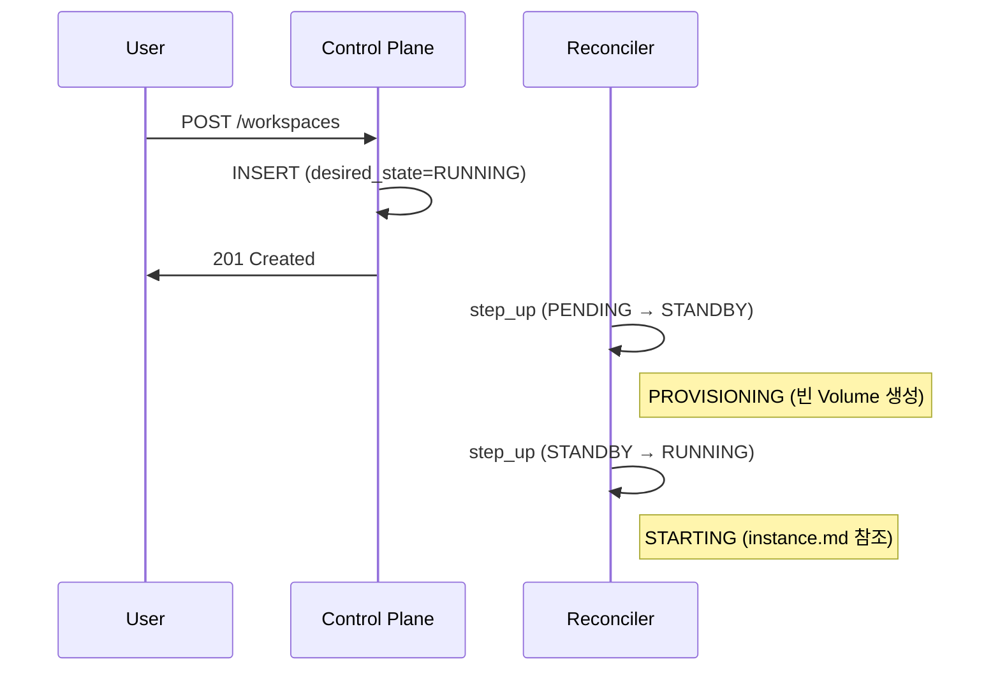
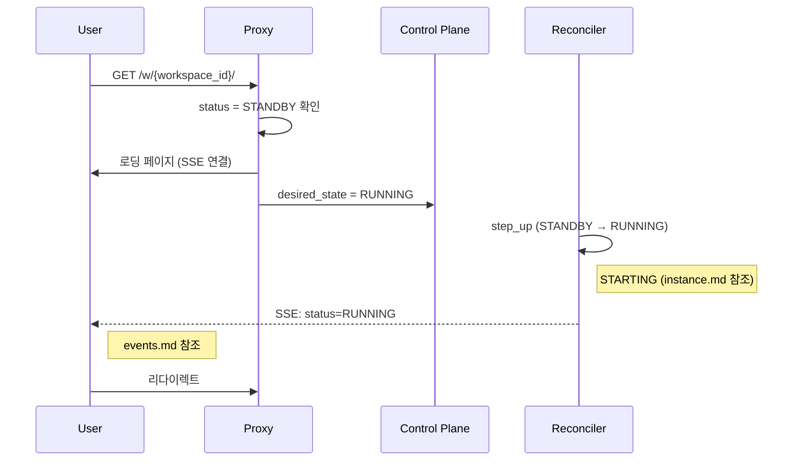
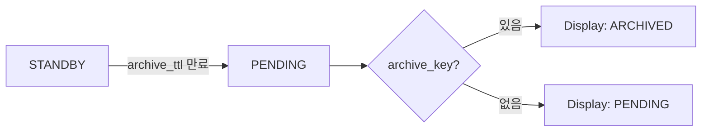
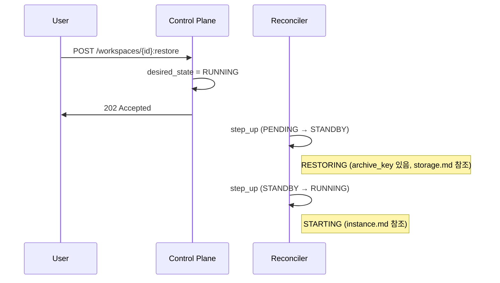
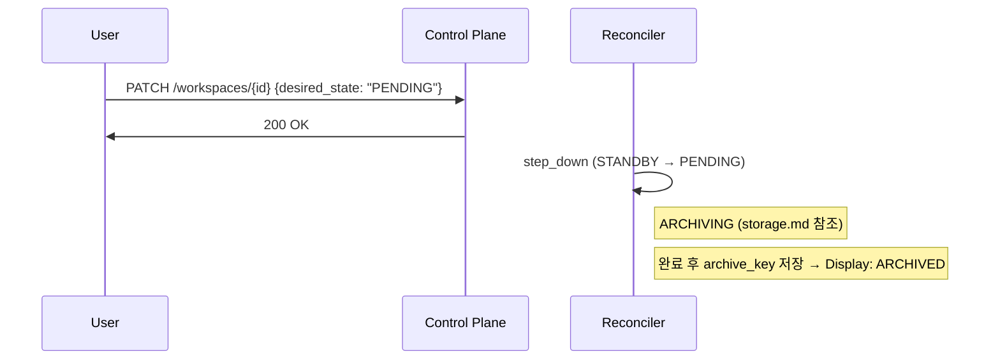
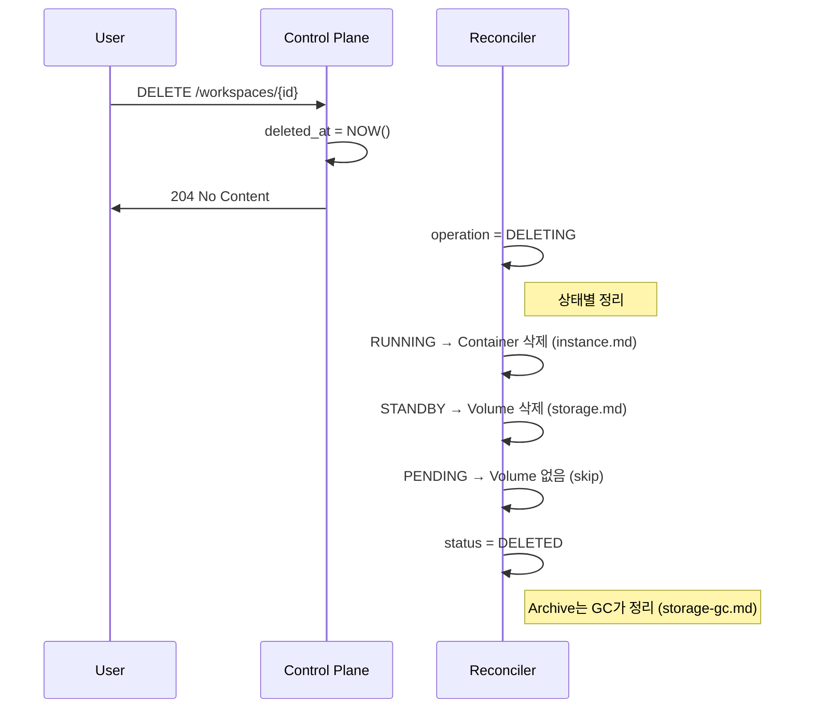
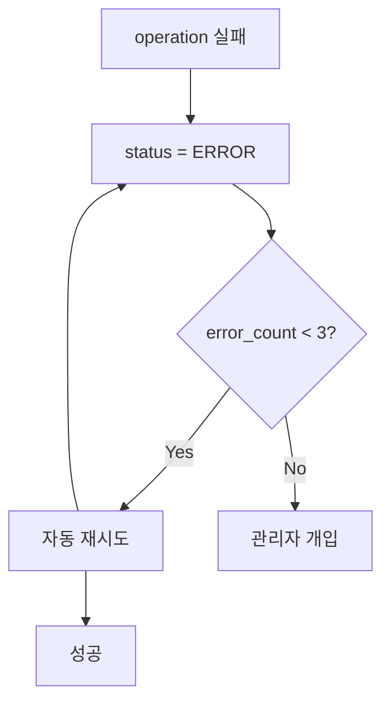

# 주요 플로우 (M2)

> [README.md](./README.md)로 돌아가기

---

## 개요

사용자 시나리오별 플로우를 정의합니다. 세부 동작은 레이어 문서를 참조하세요:

| 레이어 | 문서 | 설명 |
|--------|------|------|
| State Transitions | [states.md](./states.md) | 상태 전환 규칙 |
| Storage | [storage.md](./storage.md) | archive/restore |
| Instance | [instance.md](./instance.md) | 컨테이너 시작/정지 |
| Events | [events.md](./events.md) | SSE 이벤트 |

---

## 1. Workspace 생성

사용자가 새 워크스페이스를 생성하면 RUNNING까지 자동 전환.



### 상태 변화

```
PENDING → STANDBY → RUNNING
```

> 새 워크스페이스는 archive_key가 없으므로 PROVISIONING 실행

---

## 2. Auto-wake (STANDBY → RUNNING)

프록시가 STANDBY 상태 접속을 감지하면 자동으로 시작.



> **Note**: PENDING(ARCHIVED) 상태에서는 auto-wake 없음. 수동 복원 필요.

---

## 3. TTL 기반 자동 전환

> 상세 활동 감지 메커니즘은 [activity.md](./activity.md) 참조

### 3.1 RUNNING → STANDBY

| 조건 | 값 |
|------|-----|
| 트리거 | WebSocket 연결 없음 후 5분 |
| 감지 방식 | Redis 기반 (ws_conn, idle_timer) |
| standby_ttl 기본값 | 300초 (5분) |


Reconciler가 step_down 실행 → [instance.md](./instance.md) STOPPING 참조

### 3.2 STANDBY → PENDING (ARCHIVED)

| 조건 | 값 |
|------|-----|
| 트리거 | `last_access_at + archive_ttl_seconds` 경과 |
| 감지 방식 | DB 기반 |
| archive_ttl 기본값 | 86400초 (1일) |



Reconciler가 step_down 실행 → [storage.md](./storage.md) ARCHIVING 참조

---

## 4. Manual Restore (ARCHIVED → RUNNING)

사용자가 아카이브된 워크스페이스를 복원.



> PENDING 상태에서 archive_key가 있으면 RESTORING, 없으면 PROVISIONING

---

## 5. Manual Stop (RUNNING → STANDBY)

사용자가 워크스페이스를 정지.


---

## 6. Manual Archive (STANDBY → ARCHIVED)

사용자가 워크스페이스를 아카이브.



> desired_state="PENDING" + ARCHIVING 완료 → archive_key 생성 → Display: ARCHIVED

---

## 7. Workspace 삭제



> Volume/Container만 즉시 삭제, Archive는 GC가 나중에 정리

---

## 8. 에러 복구



---

## 참조

- [states.md](./states.md) - 상태 전환 규칙
- [storage.md](./storage.md) - 스토리지 동작
- [instance.md](./instance.md) - 인스턴스 동작
- [events.md](./events.md) - SSE 이벤트
