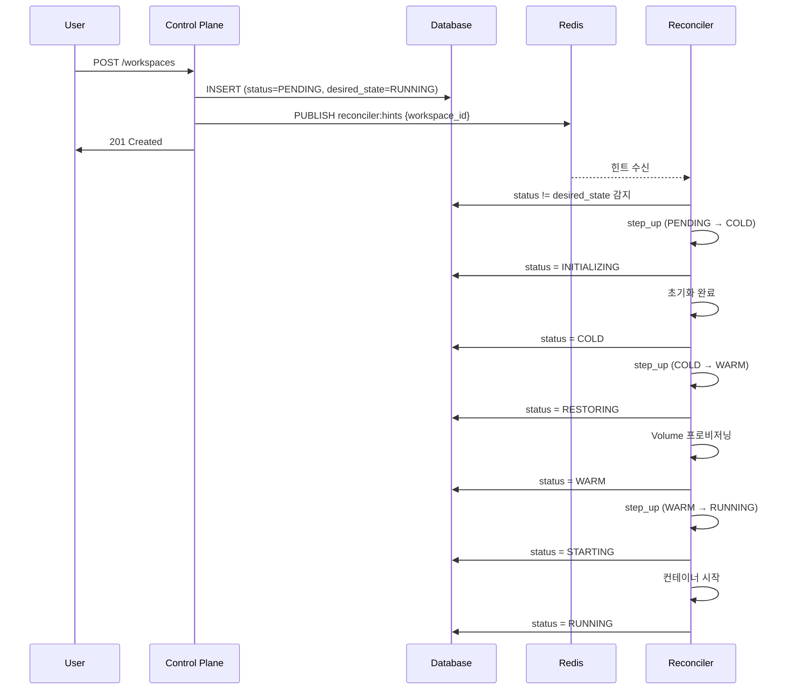
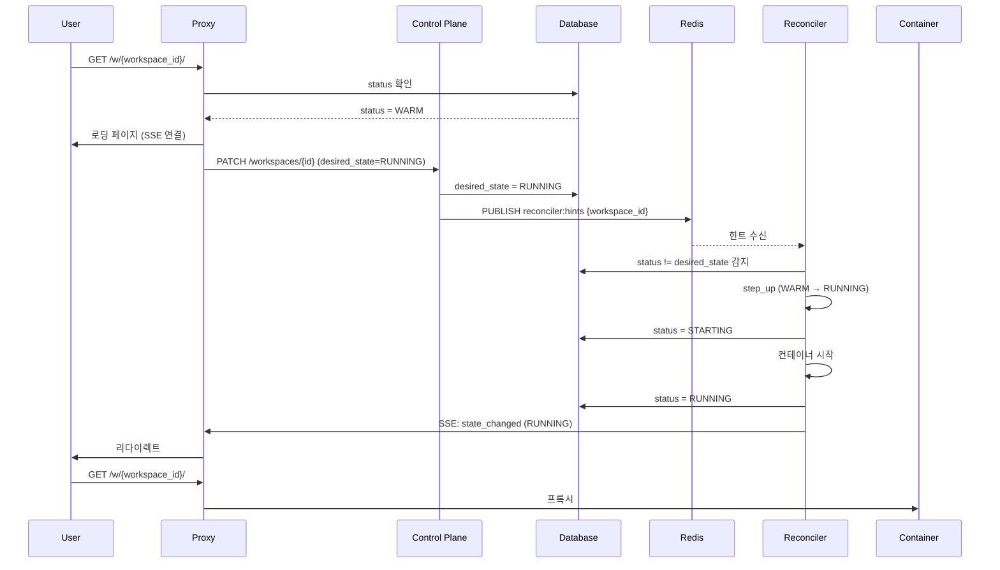
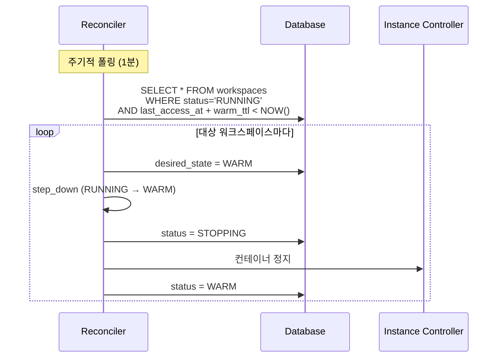
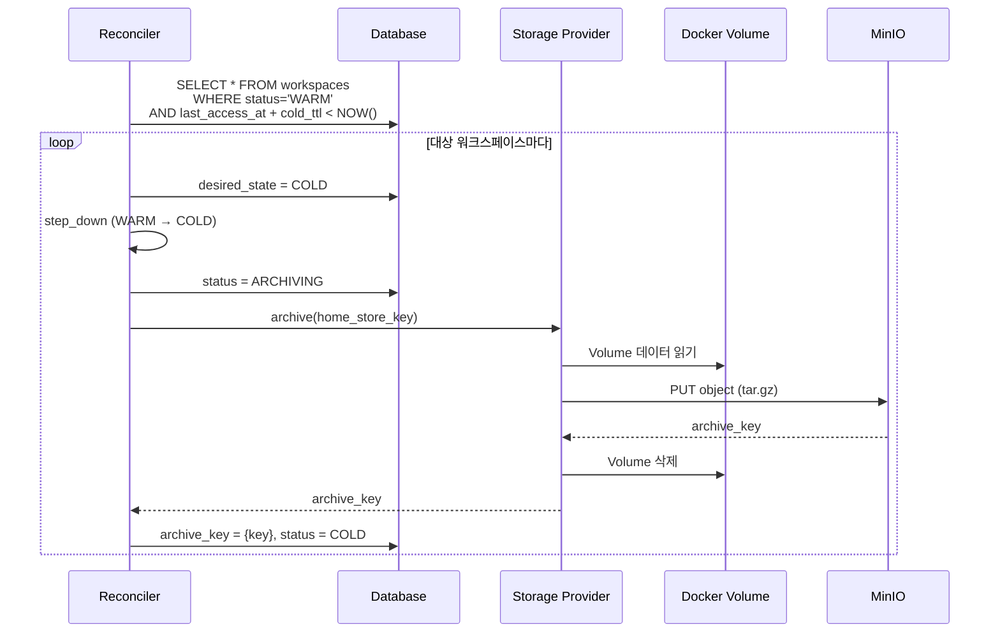
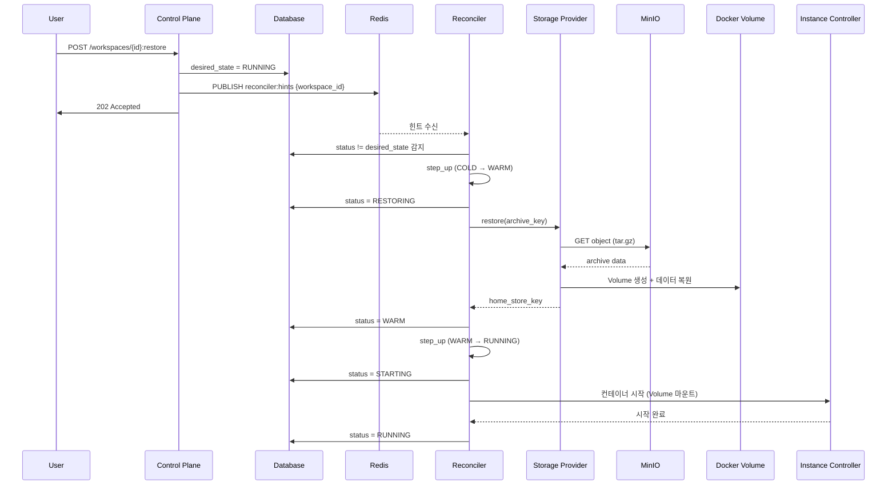
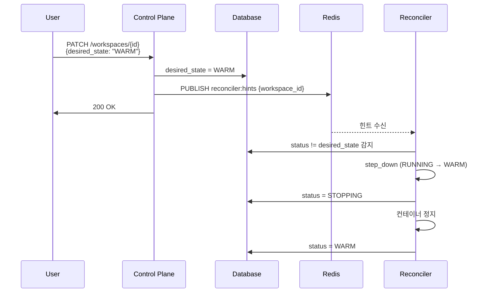
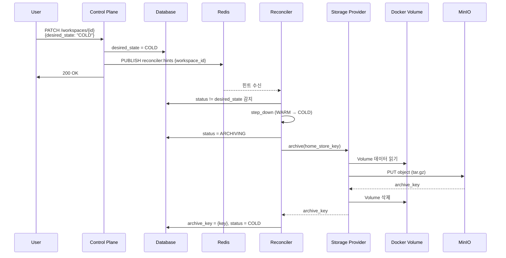
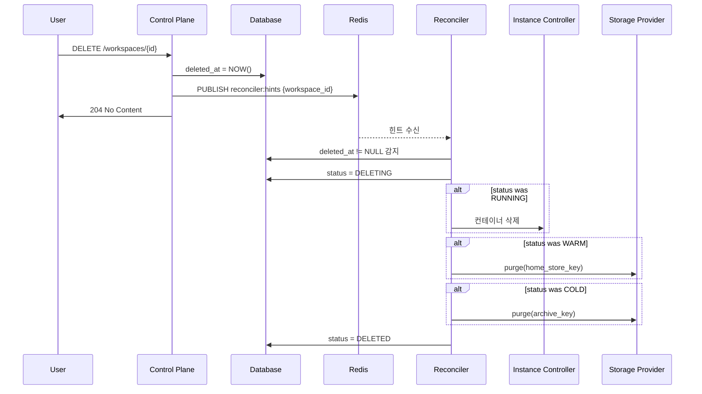
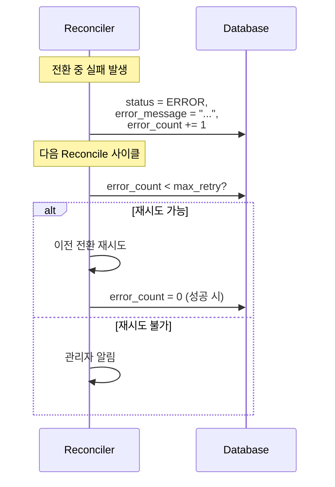
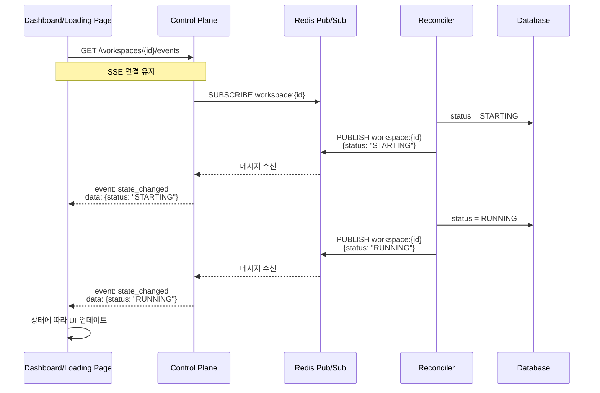

# 주요 플로우 (M2)

> [README.md](./README.md)로 돌아가기

---

## 개요

M2의 핵심 플로우를 정의합니다. 모든 상태 전환은 Reconciler를 통해 이루어집니다.

---

## 1. Workspace 생성

### 시퀀스



### 상태 변화

```
PENDING → INITIALIZING → COLD → RESTORING → WARM → STARTING → RUNNING
```

---

## 2. Auto-wake (WARM → RUNNING)

### 트리거
- 프록시가 WARM 상태의 워크스페이스 접속 감지

### 시퀀스



### 로딩 페이지

```html
<!-- 로딩 페이지 예시 -->
<div class="loading">
  <h1>Workspace 시작 중...</h1>
  <p>잠시만 기다려주세요.</p>
  <div class="spinner"></div>
</div>

<script>
const es = new EventSource('/api/v1/workspaces/{id}/events');
es.onmessage = (e) => {
  const data = JSON.parse(e.data);
  if (data.status === 'RUNNING') {
    window.location.reload();
  }
};
</script>
```

---

## 3. TTL 기반 상태 전환

### 3.1 RUNNING → WARM (idle timeout)



### 3.2 WARM → COLD (archive timeout)



---

## 4. Manual Restore (COLD → RUNNING)

### 시퀀스



---

## 5. Manual Stop (RUNNING → WARM)

### 시퀀스



---

## 6. Manual Archive (WARM → COLD)

### 시퀀스



---

## 7. Workspace 삭제

### 시퀀스



---

## 8. 에러 복구

### 시퀀스



### 에러 상태 해제 조건

| 조건 | 동작 |
|------|------|
| error_count < 3 | 자동 재시도 |
| error_count >= 3 | 관리자 개입 필요, 수동 해제 |

---

## 9. SSE 이벤트 (실시간 상태 알림)

### 개요

UI(대시보드, 로딩 페이지)가 상태 변경을 실시간으로 확인할 수 있도록 SSE(Server-Sent Events) 제공.

### 시퀀스



### SSE 엔드포인트

```
GET /api/v1/workspaces/{id}/events
Accept: text/event-stream
```

### 이벤트 타입

| 이벤트 | 데이터 | 설명 |
|--------|--------|------|
| `state_changed` | `{workspace_id, status, desired_state}` | 상태 변경 |
| `error` | `{workspace_id, error_message, error_count}` | 에러 발생 |
| `progress` | `{workspace_id, phase, progress_pct}` | 진행 상황 (선택) |

### 예시

```
event: state_changed
data: {"workspace_id": "abc123", "status": "STARTING", "desired_state": "RUNNING"}

event: state_changed
data: {"workspace_id": "abc123", "status": "RUNNING", "desired_state": "RUNNING"}

event: error
data: {"workspace_id": "abc123", "error_message": "Container start failed", "error_count": 1}
```

### 클라이언트 코드

```javascript
const eventSource = new EventSource('/api/v1/workspaces/{id}/events');

eventSource.addEventListener('state_changed', (e) => {
  const data = JSON.parse(e.data);
  console.log(`Status: ${data.status}`);

  if (data.status === 'RUNNING') {
    // 로딩 페이지 → 워크스페이스로 리다이렉트
    window.location.href = `/w/${data.workspace_id}/`;
  }
});

eventSource.addEventListener('error', (e) => {
  const data = JSON.parse(e.data);
  alert(`Error: ${data.error_message}`);
});
```

### 구현 방식

| 컴포넌트 | 역할 |
|----------|------|
| Reconciler | 상태 변경 시 Redis PUBLISH |
| API Server | Redis SUBSCRIBE → SSE 전달 |
| Redis | Pub/Sub 채널 (`workspace:{id}`) |

---

## 참조

- [states.md](./states.md) - 상태 정의
- [api.md](./api.md) - API 스펙
- [ADR-006: Reconciler 패턴](../adr/006-reconciler-pattern.md)
