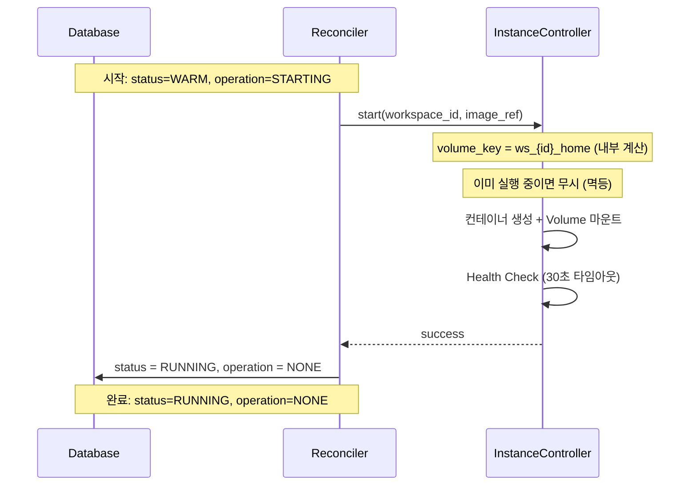
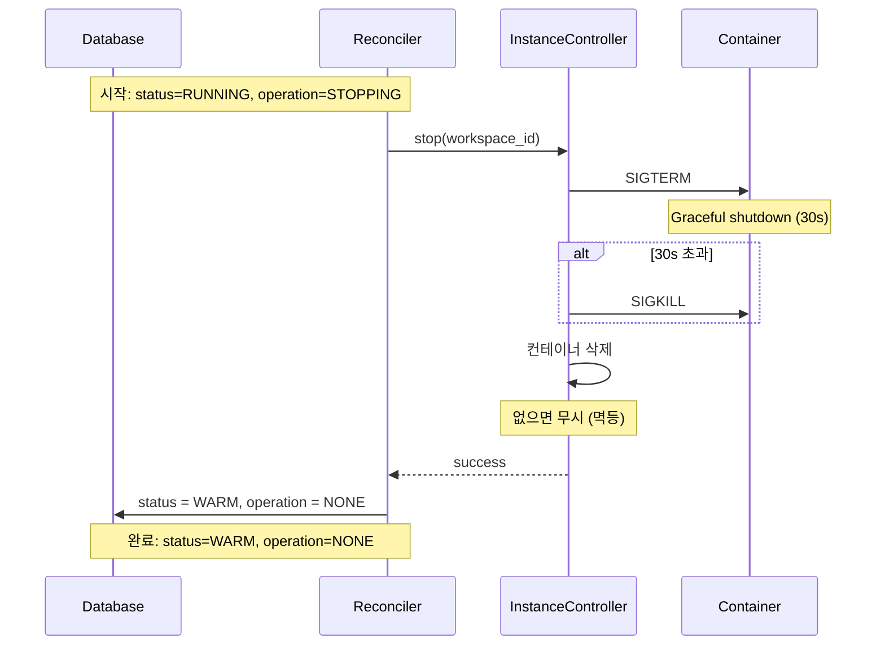
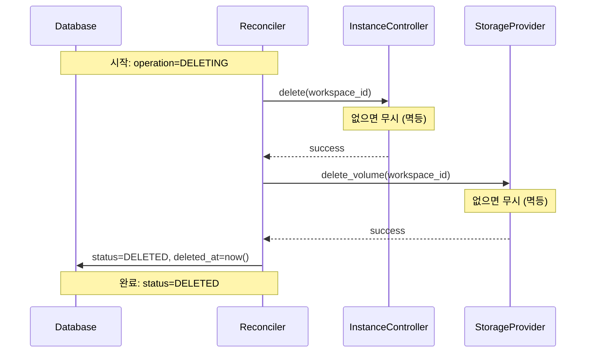

# Instance Operations (M2)

> [README.md](./README.md)로 돌아가기

---

## 핵심 원칙

1. **InstanceController는 컨테이너만 관리** - Volume 생성/삭제는 StorageProvider
2. **Volume은 내부 계산** - `ws_{workspace_id}_home` (외부 파라미터 아님)
3. **모든 메서드 멱등** - 이미 실행 중이면 무시, 없으면 무시
4. **Graceful Shutdown** - SIGTERM → 30초 대기 → SIGKILL
5. **DELETING은 Container → Volume 순서** - Volume 먼저 삭제하면 Container mount 실패

---

## Storage 의존성

Instance는 Storage가 제공하는 Volume을 **사용**만 합니다.

```
┌─────────────────────────────────────────────────┐
│                  Lifecycle                       │
├─────────────────────────────────────────────────┤
│  Volume 생성   →   Container 사용   →   Container 삭제   →   Volume 삭제  │
│  (Storage)          (Instance)          (Instance)          (Storage)    │
└─────────────────────────────────────────────────┘
```

| 리소스 | 생성 | 사용 | 삭제 |
|--------|------|------|------|
| Volume | StorageProvider.provision | InstanceController.start | StorageProvider.delete_volume |
| Container | InstanceController.start | - | InstanceController.delete |

### 상태별 리소스 존재

| status | Container | Volume |
|--------|-----------|--------|
| PENDING | - | - |
| COLD | - | - |
| WARM | - | ✅ |
| RUNNING | ✅ | ✅ |

> **전제 조건**: STARTING 전에 Volume이 반드시 존재해야 함 (RESTORING에서 생성)

---

## InstanceController 인터페이스

```python
class InstanceController(ABC):
    """Instance 작업 추상 인터페이스

    백엔드별 구현:
    - LocalDockerInstance: Docker 컨테이너
    - K8sInstance: Pod

    핵심 원칙:
    - workspace_id만 받음 (volume_key는 내부 계산)
    - 모든 작업은 멱등
    """

    @abstractmethod
    async def start(self, workspace_id: str, image_ref: str) -> None:
        """컨테이너 시작 (멱등).

        Args:
            workspace_id: 워크스페이스 ID
            image_ref: 컨테이너 이미지 (예: "codercom/code-server:latest")

        내부 계산:
            volume_key = ws_{workspace_id}_home
            container_name = ws_{workspace_id}

        멱등성: 이미 실행 중이면 무시

        Raises:
            InstanceError: 시작 실패 시
        """

    @abstractmethod
    async def stop(self, workspace_id: str, timeout: int = 30) -> None:
        """컨테이너 정지 후 삭제 (멱등).

        Args:
            workspace_id: 워크스페이스 ID
            timeout: Graceful shutdown 대기 시간 (초)

        멱등성: 이미 정지/없으면 무시

        Raises:
            InstanceError: 정지 실패 시
        """

    @abstractmethod
    async def delete(self, workspace_id: str) -> None:
        """컨테이너 강제 삭제 (멱등).

        Args:
            workspace_id: 워크스페이스 ID

        멱등성: 존재하지 않으면 무시

        Raises:
            InstanceError: 삭제 실패 시
        """

    @abstractmethod
    async def exists(self, workspace_id: str) -> bool:
        """컨테이너 존재 여부 확인.

        Args:
            workspace_id: 워크스페이스 ID

        Returns:
            True: 컨테이너 실행 중
            False: 컨테이너 없거나 정지됨

        Health Check에서 사용.
        """
```

### 백엔드별 용어

| 추상 개념 | local-docker | k8s |
|----------|-------------|-----|
| Container | Docker Container | Pod |
| Volume Mount | Docker Volume | PVC Mount |
| Image | Docker Image | Container Image |

---

## 네이밍 규칙

모든 Instance 관련 식별자의 네이밍 패턴입니다.

| 항목 | 형식 | 예시 |
|------|------|------|
| container_name | `ws_{workspace_id}` | `ws_abc123` |
| volume_key | `ws_{workspace_id}_home` | `ws_abc123_home` |
| mount_path | `/home/coder` | `/home/coder` |

> **Volume은 workspace당 1개 고정** - Storage와 동일한 규칙

### 컨테이너 라벨 (K8s/Docker)

```yaml
labels:
  codehub.io/workspace-id: "abc123"
```

---

## 멱등성

모든 InstanceController 메서드는 멱등합니다.

| 메서드 | 이미 상태 | 동작 |
|--------|---------|------|
| start() | 실행 중 | 무시 (성공 반환) |
| stop() | 정지/없음 | 무시 (성공 반환) |
| delete() | 없음 | 무시 (성공 반환) |
| exists() | - | 현재 상태 반환 |

### 재시도 안전성

```
T1: Reconciler-1이 start() 호출
T2: 크래시
T3: Reconciler-2가 start() 재호출
    → 이미 실행 중 → 무시 (멱등)
```

---

## STARTING (WARM → RUNNING)

Volume을 마운트하고 컨테이너 시작.

### 전제 조건
- `status = WARM, operation = STARTING`
- Volume (`ws_{workspace_id}_home`)이 존재

### 동작



### Reconciler pseudo-code

```python
def reconcile_starting(ws):
    """STARTING Reconciler - 멱등"""

    # 이미 완료 체크
    if ws.status == RUNNING and ws.operation == NONE:
        return

    # 컨테이너 시작 (멱등: 이미 실행 중이면 무시)
    instance.start(ws.id, ws.image_ref)

    # 완료
    ws.status = RUNNING
    ws.operation = NONE
    db.update(ws)
```

### 컨테이너 설정

```yaml
# 기본 설정
name: ws_${workspace_id}
image: ${image_ref}
volumes:
  - ws_${workspace_id}_home:/home/coder:rw
ports:
  - "${dynamic_port}:8080"
environment:
  - HOME=/home/coder
restart: "no"
```

### Health Check
1. 컨테이너 상태 확인 (docker inspect / kubectl get pod)
2. HTTP 헬스체크 (8080 포트, 선택)
3. 타임아웃: 30초

---

## STOPPING (RUNNING → WARM)

컨테이너를 graceful하게 정지.

### 전제 조건
- `status = RUNNING, operation = STOPPING`
- 컨테이너가 실행 중

### 동작



### Reconciler pseudo-code

```python
def reconcile_stopping(ws):
    """STOPPING Reconciler - 멱등"""

    # 이미 완료 체크
    if ws.status == WARM and ws.operation == NONE:
        return

    # 컨테이너 정지 + 삭제 (멱등: 없으면 무시)
    instance.stop(ws.id)

    # 완료
    ws.status = WARM
    ws.operation = NONE
    db.update(ws)
```

### Graceful Shutdown
1. SIGTERM 전송
2. 30초 대기 (사용자 프로세스 종료 시간)
3. 타임아웃 시 SIGKILL
4. 컨테이너 제거

---

## DELETING

컨테이너와 Volume 모두 삭제.

### 전제 조건
- `operation = DELETING`
- 모든 status에서 가능

### 삭제 순서 (중요)

```
1. 컨테이너 삭제 (Instance) - 먼저
2. Volume 삭제 (Storage) - 나중
```

> **왜 이 순서?**: Volume 먼저 삭제하면 실행 중인 컨테이너의 mount가 끊어져 예기치 않은 동작 발생

### 동작



### Reconciler pseudo-code

```python
def reconcile_deleting(ws):
    """DELETING Reconciler - Instance + Storage"""

    # 이미 완료 체크
    if ws.status == DELETED:
        return

    # 1. 컨테이너 삭제 (멱등) - 먼저
    instance.delete(ws.id)

    # 2. Volume 삭제 (멱등) - 나중
    storage.delete_volume(ws.id)

    # 3. soft-delete
    ws.status = DELETED
    ws.deleted_at = now()
    ws.operation = NONE
    db.update(ws)
```

### 삭제 대상

| 리소스 | 삭제 주체 | 타이밍 |
|--------|----------|--------|
| Container | InstanceController | 즉시 |
| Volume | StorageProvider | Container 삭제 후 |
| Archive | GC | 1시간 후 (soft-delete 감지) |

---

## 에러 코드

InstanceController가 발생시키는 에러 코드입니다.

| 코드 | 설명 | 복구 주체 |
|------|------|----------|
| `IMAGE_PULL_FAILED` | 이미지 다운로드 실패 | Reconciler 자동 재시도 |
| `PORT_CONFLICT` | 포트 충돌 | Reconciler 자동 재시도 (다른 포트) |
| `HEALTH_CHECK_FAILED` | 헬스체크 타임아웃 | Reconciler 자동 재시도 |
| `CONTAINER_CREATE_FAILED` | 컨테이너 생성 실패 | 관리자 개입 |
| `VOLUME_NOT_FOUND` | Volume 없음 (전제 조건 위반) | 관리자 개입 |

### 에러 처리 흐름

```
InstanceController 예외 발생
    ↓
Reconciler가 ERROR 상태로 전환
    ↓
├── error_count < 3 → 자동 재시도
└── error_count >= 3 → 관리자 개입
```

---

## 리소스 제한 (선택)

```yaml
# 기본 제한 (설정 가능)
resources:
  limits:
    cpus: "2"
    memory: "4g"
  reservations:
    cpus: "0.5"
    memory: "512m"
```

---

## 백엔드별 구현

| 항목 | Docker | K8s |
|------|--------|-----|
| 컨테이너 생성 | `docker run` | Pod 생성 |
| 정지 | `docker stop` + `docker rm` | Pod 삭제 (graceful) |
| 강제 삭제 | `docker rm -f` | Pod 삭제 (--grace-period=0) |
| 존재 확인 | `docker inspect` | `kubectl get pod` |
| Volume 마운트 | `-v volume:/path` | PVC mount |
| Health Check | HTTP probe | readinessProbe |

---

## 참조

- [states.md](./states.md) - 상태 전환 규칙
- [storage.md](./storage.md) - StorageProvider 인터페이스
- [storage-operations.md](./storage-operations.md) - DELETING 전체 플로우
