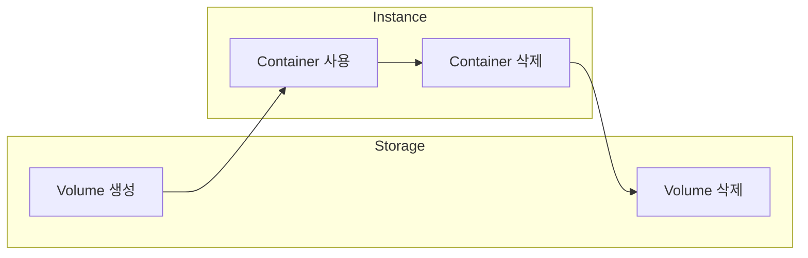
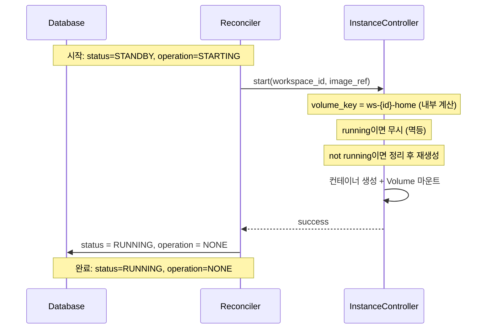
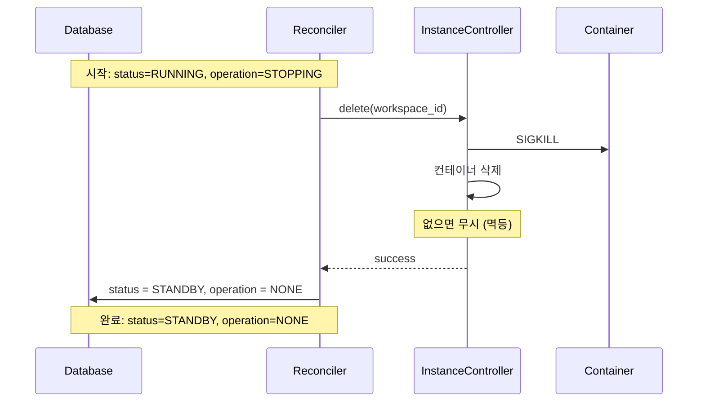
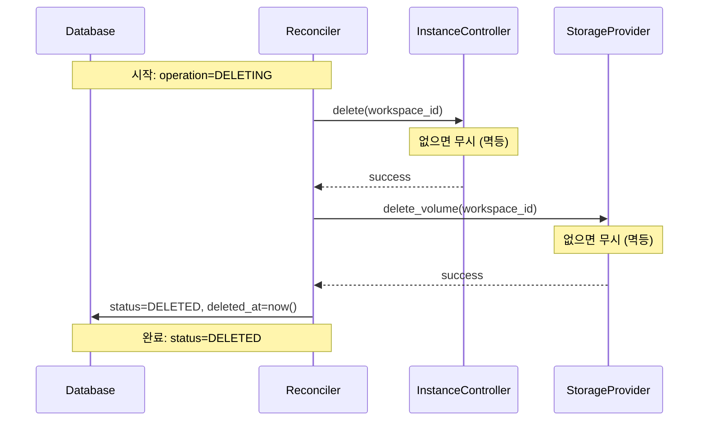

# Instance Operations (M2)

> [README.md](./README.md)로 돌아가기

---

## 핵심 원칙

1. **InstanceController는 컨테이너만 관리** - Volume 생성/삭제는 StorageProvider
2. **InstanceController는 DB를 모름** - Reconciler가 DB 관리
3. **Volume은 내부 계산** - `ws-{workspace_id}-home` (외부 파라미터 아님)
4. **리소스 레벨 멱등성** - 컨테이너 존재 여부로 직접 체크 (DB 아님)
5. **즉시 종료** - SIGKILL 직접 전송 (Volume 유지로 데이터 안전)
6. **DELETING은 Container → Volume 순서** - Volume 먼저 삭제하면 Container mount 실패
7. **계약 기반 추상화** - K8s 내부 상태(Pending, ContainerCreating 등)를 노출하지 않음

### 추상화 철학

```
K8s 내부 (숨김):
  Pending → ContainerCreating → Running(phase) → Ready(condition)

우리 추상화 (노출):
  status=STANDBY, operation=STARTING → start() → status=RUNNING, operation=NONE
```

- K8s와 우리 상태가 다르지만 **1:1 매핑하지 않음**
- InstanceController가 **복잡성을 캡슐화**
- 계약만 충족하면 내부 구현은 자유

---

## 동시성 안전

Instance 작업은 Storage와 동일하게 **workspace당 operation은 동시에 1개만** 실행됩니다.

- `operation != 'NONE'`이면 다른 작업 시작 불가
- Reconciler Optimistic Locking으로 동시 실행 방지
- InstanceController 자체는 stateless (리소스 레벨 멱등성으로 안전)

### 동시성 보호 레벨

1. **DB 레벨**: Optimistic Locking으로 operation 선점
   - 같은 workspace에 대해 1개 Reconciler만 작업

2. **리소스 레벨**: 멱등성으로 수렴
   - 크래시 후 재시도 시 이미 생성된 리소스는 무시
   - 이름 충돌은 정상 수렴 과정 (에러 아님)

```
T1: Reconciler-1이 start(ws-abc123) 실행
T2: 크래시 발생
T3: Reconciler-2가 start(ws-abc123) 재실행
T4: 이미 컨테이너 존재 → 무시 (멱등)
T5: 완료 (자연 수렴)
```

> 상세: [storage.md](./storage.md#동시성-안전) 참조

---

## 불변식 (Invariants)

```
- STARTING 전에 Volume이 반드시 존재 (PROVISIONING 또는 RESTORING에서 생성)
- Container 삭제 → Volume 삭제 순서 (역순 금지)
- Container는 workspace당 1개 (ws-{workspace_id})
- 모든 InstanceController 메서드는 멱등
```

---

## Storage 의존성

Instance는 Storage가 제공하는 Volume을 **사용**만 합니다.



| 리소스 | 생성 | 사용 | 삭제 |
|--------|------|------|------|
| Volume | StorageProvider.provision | InstanceController.start | StorageProvider.delete_volume |
| Container | InstanceController.start | - | InstanceController.delete |

### 상태별 리소스 존재

| status | Container | Volume |
|--------|-----------|--------|
| PENDING | - | - |
| STANDBY | - | ✅ |
| RUNNING | ✅ | ✅ |

> **전제 조건**: STARTING 전에 Volume이 반드시 존재해야 함 (PROVISIONING 또는 RESTORING에서 생성)

---

## InstanceController 인터페이스

```python
class InstanceController(ABC):
    """Instance 작업 추상 인터페이스

    백엔드별 구현:
    - LocalDockerInstance: Docker 컨테이너
    - K8sInstance: Pod

    핵심 원칙:
    - workspace_id만 받음 (volume_key는 내부 계산)
    - 모든 작업은 멱등
    """

    @abstractmethod
    async def start(self, workspace_id: str, image_ref: str) -> None:
        """컨테이너 시작 후 트래픽 수신 가능 상태까지 대기 (멱등).

        Args:
            workspace_id: 워크스페이스 ID
            image_ref: 컨테이너 이미지 (예: "codercom/code-server:latest")

        내부 계산:
            volume_key = ws-{workspace_id}-home
            container_name = ws-{workspace_id}

        계약:
            성공 반환 = 트래픽 수신 가능 상태 (is_running() == True)
            K8s: Pod Ready까지 대기 (Pending/ContainerCreating 내부 처리)

        멱등성:
            - running이면 무시 (성공 반환)
            - not running (없거나 stopped) → 정리 후 재생성

        Raises:
            InstanceError: 시작 실패 시
        """

    @abstractmethod
    async def delete(self, workspace_id: str) -> None:
        """컨테이너 즉시 종료 후 삭제 (멱등).

        Args:
            workspace_id: 워크스페이스 ID

        즉시 종료: SIGKILL 직접 전송 (graceful 없음)
        멱등성: 존재하지 않으면 무시

        STOPPING, DELETING 모두 이 메서드 사용.

        Raises:
            InstanceError: 삭제 실패 시
        """

    @abstractmethod
    async def is_running(self, workspace_id: str) -> bool:
        """컨테이너가 트래픽을 받을 수 있는 상태인지 확인.

        Args:
            workspace_id: 워크스페이스 ID

        Returns:
            True: 트래픽 수신 가능
            False: 없거나 준비 안 됨

        계약:
            "프록시가 이 컨테이너로 요청을 보내도 되는가?"
            K8s phase=Running이지만 Ready=false인 경우 → False 반환

        백엔드 구현:
            Docker: state.Running == true
            K8s: containerStatuses[*].ready == true
        """
```

### 백엔드별 용어

| 추상 개념 | local-docker | k8s |
|----------|-------------|-----|
| Container | Docker Container | Pod |
| Volume Mount | Docker Volume | PVC Mount |
| Image | Docker Image | Container Image |

---

## 네이밍 규칙

> ⚠️ **강한 가정**: 아래 패턴은 프로젝트 전체에서 동일하게 사용되는 불변 규칙입니다.
> Storage, Instance 모두 내부에서 동일 패턴으로 계산합니다.

모든 Instance 관련 식별자의 네이밍 패턴입니다.

| 항목 | 형식 | 예시 |
|------|------|------|
| container_name | `ws-{workspace_id}` | `ws-abc123` |
| volume_key | `ws-{workspace_id}-home` | `ws-abc123-home` |
| mount_path | `/home/coder` | `/home/coder` |

> **K8s DNS-1123 호환**: 하이픈(`-`) 사용, 언더스코어(`_`) 사용 금지

> **Volume은 workspace당 1개 고정** - Storage와 동일한 규칙
> **패턴 변경 시**: Storage + Instance 동시 수정 필수

### 컨테이너 라벨 (K8s/Docker)

```yaml
labels:
  codehub.io/workspace-id: "abc123"
```

---

## 멱등성

모든 InstanceController 메서드는 멱등합니다.

| 메서드 | 이미 상태 | 동작 |
|--------|---------|------|
| start() | running | 무시 (성공 반환) |
| start() | not running | 정리 후 재생성 |
| delete() | 없음 | 무시 (성공 반환) |
| is_running() | - | 현재 상태 반환 |

### 재시도 안전성

```
T1: Reconciler-1이 start() 호출
T2: 크래시
T3: Reconciler-2가 start() 재호출
    → 이미 실행 중 → 무시 (멱등)
```

---

## STARTING (STANDBY → RUNNING)

Volume을 마운트하고 컨테이너 시작.

### 전제 조건
- `status = STANDBY, operation = STARTING`
- Volume (`ws-{workspace_id}-home`)이 존재

### 동작



### Reconciler pseudo-code

```python
def reconcile_starting(ws):
    """STARTING Reconciler - 멱등"""

    # 이미 완료 체크
    if ws.status == RUNNING and ws.operation == NONE:
        return

    # 컨테이너 시작 (멱등: running이면 무시, not running이면 정리 후 재생성)
    instance.start(ws.id, ws.image_ref)

    # 완료
    ws.status = RUNNING
    ws.operation = NONE
    db.update(ws)
```

### start() 내부 pseudo-code

```python
async def start(self, workspace_id: str, image_ref: str) -> None:
    """컨테이너 시작 (Archive Job 패턴)"""

    if self.is_running(workspace_id):
        return  # running이면 skip

    # not running (없거나 stopped) → 정리 후 생성
    self._remove_if_exists(workspace_id)
    self._create_container(workspace_id, image_ref)
```

### 컨테이너 설정

```yaml
# 기본 설정
name: ws-${workspace_id}
image: ${image_ref}
volumes:
  - ws-${workspace_id}-home:/home/coder:rw
expose:
  - "8080"  # 프록시가 컨테이너 내부 포트로 직접 연결
environment:
  - HOME=/home/coder
restart: "no"
```

> **포트 매핑 불필요**: 프록시가 workspace_id로 동적 라우팅 (Docker: container network, K8s: Service/Pod IP)

### 타임아웃 설정

| 단계 | 타임아웃 | 설명 |
|------|---------|------|
| startup_timeout | 300초 (5분) | 이미지 pull + 컨테이너 생성 |
| health_check_timeout | 30초 | 컨테이너 running 상태 확인 |

> **image pull**: 첫 실행 시 이미지 다운로드 포함, 캐시 있으면 빠름
>
> **M2 단순화**: running = healthy (HTTP probe는 나중에 확장)

---

## STOPPING (RUNNING → STANDBY)

컨테이너를 즉시 종료.

### 전제 조건
- `status = RUNNING, operation = STOPPING`

> 컨테이너가 없어도 delete()는 멱등 (무시하고 성공)

### 동작



### Reconciler pseudo-code

```python
def reconcile_stopping(ws):
    """STOPPING Reconciler - 멱등"""

    # 이미 완료 체크
    if ws.status == STANDBY and ws.operation == NONE:
        return

    # 컨테이너 즉시 종료 + 삭제 (멱등: 없으면 무시)
    instance.delete(ws.id)

    # 완료
    ws.status = STANDBY
    ws.operation = NONE
    db.update(ws)
```

### 즉시 종료 이유
- **Volume 유지**: 데이터는 Volume에 저장, STOPPING 후에도 유지
- **IDE 자동 저장**: code-server는 자동 저장 기능 있음
- **TTL 트리거**: 사용자 부재 시 발생 (WebSocket 종료 후 5분)
- **M2 단순화**: 복잡한 graceful 로직 불필요

---

## DELETING

컨테이너와 Volume 모두 삭제.

### 전제 조건
- `operation = DELETING`
- 모든 status에서 가능

### 삭제 순서 (중요)

```
1. 컨테이너 삭제 (Instance) - 먼저
2. Volume 삭제 (Storage) - 나중
```

> **왜 이 순서?**: Volume 먼저 삭제하면 실행 중인 컨테이너의 mount가 끊어져 예기치 않은 동작 발생

### 동작



### Reconciler pseudo-code

```python
def reconcile_deleting(ws):
    """DELETING Reconciler - Instance + Storage"""

    # 이미 완료 체크
    if ws.status == DELETED:
        return

    # 1. 컨테이너 삭제 (멱등) - 먼저
    instance.delete(ws.id)

    # 2. Volume 삭제 (멱등) - 나중
    storage.delete_volume(ws.id)

    # 3. soft-delete
    ws.status = DELETED
    ws.deleted_at = now()
    ws.operation = NONE
    db.update(ws)
```

### 삭제 대상

| 리소스 | 삭제 주체 | 타이밍 |
|--------|----------|--------|
| Container | InstanceController | 즉시 |
| Volume | StorageProvider | Container 삭제 후 |
| Archive | GC | 2시간 후 (soft-delete 감지) |

---

## 에러 코드

InstanceController가 발생시키는 에러 코드입니다.

| 코드 | 설명 | 복구 주체 |
|------|------|----------|
| `IMAGE_PULL_FAILED` | 이미지 다운로드 실패 | Reconciler 자동 재시도 |
| `HEALTH_CHECK_FAILED` | 헬스체크 타임아웃 | Reconciler 자동 재시도 |
| `CONTAINER_CREATE_FAILED` | 컨테이너 생성 실패 | 관리자 개입 |
| `VOLUME_NOT_FOUND` | Volume 없음 (전제 조건 위반) | 관리자 개입 |

### 에러 유형별 처리

| 유형 | 예시 | 처리 |
|------|------|------|
| 수렴 과정 | 이름 충돌, 이미 존재 | 재시도로 자연 수렴 |
| 일시적 실패 | 네트워크, 타임아웃 | 자동 재시도 (error_count < 3) |
| 영구적 실패 | 이미지 없음, 권한 없음 | ERROR 상태 → 관리자 개입 |

### 에러 처리 흐름

```
InstanceController 예외 발생
    ↓
Reconciler가 ERROR 상태로 전환
    ↓
├── error_count < 3 → 자동 재시도
└── error_count >= 3 → 관리자 개입
```

---

## 리소스 제한 (선택)

```yaml
# 기본 제한 (설정 가능)
resources:
  limits:
    cpus: "2"
    memory: "4g"
  reservations:
    cpus: "0.5"
    memory: "512m"
```

---

## 백엔드별 구현

| 항목 | Docker | K8s |
|------|--------|-----|
| 컨테이너 생성 (start) | `docker run` + 시작 대기 | Pod 생성 + Ready 대기 |
| 컨테이너 삭제 (delete) | `docker rm -f` | Pod 삭제 (--grace-period=0) |
| 트래픽 수신 가능 (is_running) | `state.Running == true` | `containerStatuses[*].ready == true` |
| Volume 마운트 | `-v volume:/path` | PVC mount |

> **K8s 주의**: `phase == Running`은 불충분. Ready condition을 체크해야 함.

---

## 참조

- [reconciler.md](./reconciler.md) - Reconciler 알고리즘 (is_running 센서 사용)
- [states.md](./states.md) - 상태 전환 규칙
- [storage.md](./storage.md) - StorageProvider 인터페이스
- [storage-operations.md](./storage-operations.md) - DELETING 전체 플로우
