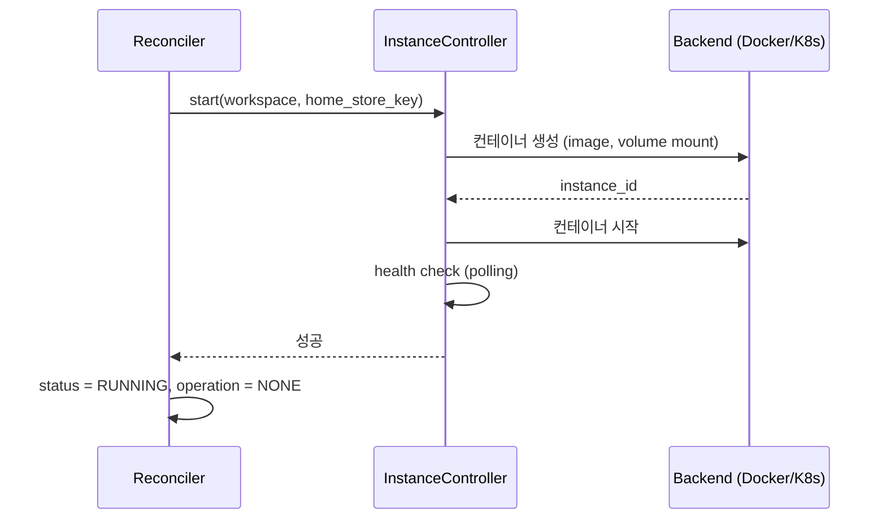
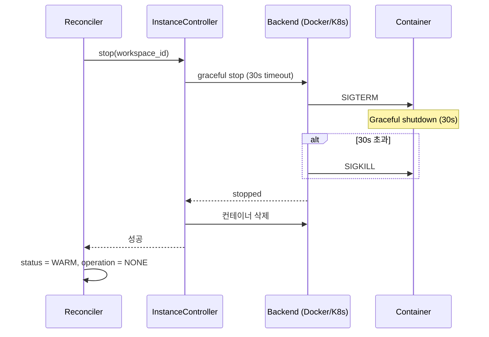
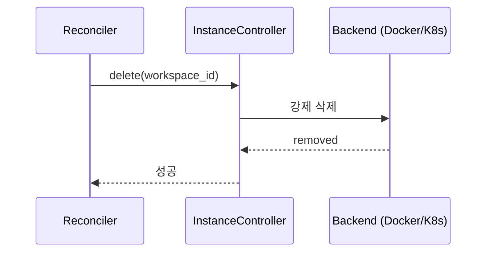

# Instance Operations (M2)

> [README.md](./README.md)로 돌아가기

---

## 개요

상태 전환 중 Instance(컨테이너) 관련 동작을 정의합니다.

| operation | Instance 동작 |
|-----------|--------------|
| STARTING | start (컨테이너 시작) |
| STOPPING | stop (컨테이너 정지) |
| DELETING | delete (컨테이너 삭제) |

### 백엔드별 용어

| 개념 | local-docker | k8s |
|------|-------------|-----|
| Container | Docker Container | Pod |
| Volume Mount | Docker Volume | PVC Mount |
| Image | Docker Image | Container Image |

---

## STARTING (WARM → RUNNING)

Volume을 마운트하고 컨테이너 시작.

### 전제 조건
- `status = WARM, operation = STARTING`
- `home_store_key` (Volume)가 존재

### 동작



### 인터페이스

```python
async def start(
    workspace_id: str,
    image_ref: str,
    home_store_key: str
) -> str:
    """
    컨테이너 시작.

    Args:
        workspace_id: 워크스페이스 ID
        image_ref: 컨테이너 이미지 (예: "codercom/code-server:latest")
        home_store_key: 마운트할 Docker Volume

    Returns:
        container_id: 생성된 컨테이너 ID

    Raises:
        InstanceError: 시작 실패 시
    """
```

### 컨테이너 설정

```yaml
# 기본 설정
image: ${image_ref}
volumes:
  - ${home_store_key}:/home/coder:rw
ports:
  - "${dynamic_port}:8080"
environment:
  - HOME=/home/coder
restart: "no"
```

### Health Check
1. 컨테이너 상태 확인 (docker inspect)
2. HTTP 헬스체크 (8080 포트, 선택)
3. 타임아웃: 30초

### 실패 처리
- 이미지 pull 실패 → ERROR 상태, 재시도
- 포트 충돌 → ERROR 상태, 다른 포트 할당 후 재시도
- Health check 실패 → ERROR 상태, 컨테이너 정리 후 재시도

---

## STOPPING (RUNNING → WARM)

컨테이너를 graceful하게 정지.

### 전제 조건
- `status = RUNNING, operation = STOPPING`
- 컨테이너가 실행 중

### 동작



### 인터페이스

```python
async def stop(
    workspace_id: str,
    timeout: int = 30
) -> None:
    """
    컨테이너 정지.

    Args:
        workspace_id: 워크스페이스 ID
        timeout: Graceful shutdown 대기 시간 (초)

    Raises:
        InstanceError: 정지 실패 시
    """
```

### Graceful Shutdown
1. SIGTERM 전송
2. 30초 대기 (사용자 프로세스 종료 시간)
3. 타임아웃 시 SIGKILL
4. 컨테이너 제거 (docker rm)

### 실패 처리
- 정지 실패 → SIGKILL 강제 종료
- 제거 실패 → 로그 기록, 수동 정리 필요

---

## DELETING (delete)

컨테이너 강제 삭제.

### 동작



### 인터페이스

```python
async def delete(workspace_id: str) -> None:
    """
    컨테이너 강제 삭제.
    존재하지 않으면 무시 (멱등).

    Raises:
        InstanceError: 삭제 실패 시
    """
```

### 멱등성
- 이미 삭제된 컨테이너는 무시
- 실행 중이면 강제 종료 후 삭제

---

## 컨테이너 네이밍

```
container_name: ws_{workspace_id}
```

### 예시
- workspace_id: `abc123`
- container_name: `ws_abc123`

---

## 리소스 제한 (선택)

```yaml
# 기본 제한 (설정 가능)
resources:
  limits:
    cpus: "2"
    memory: "4g"
  reservations:
    cpus: "0.5"
    memory: "512m"
```

---

## 참조

- [states.md](./states.md) - 상태 전환 규칙
- [storage.md](./storage.md) - 스토리지 동작
