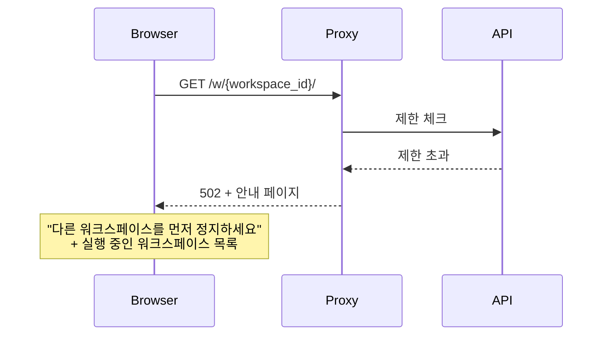
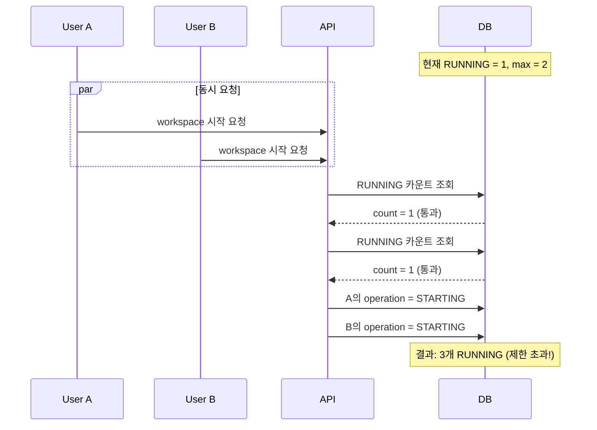
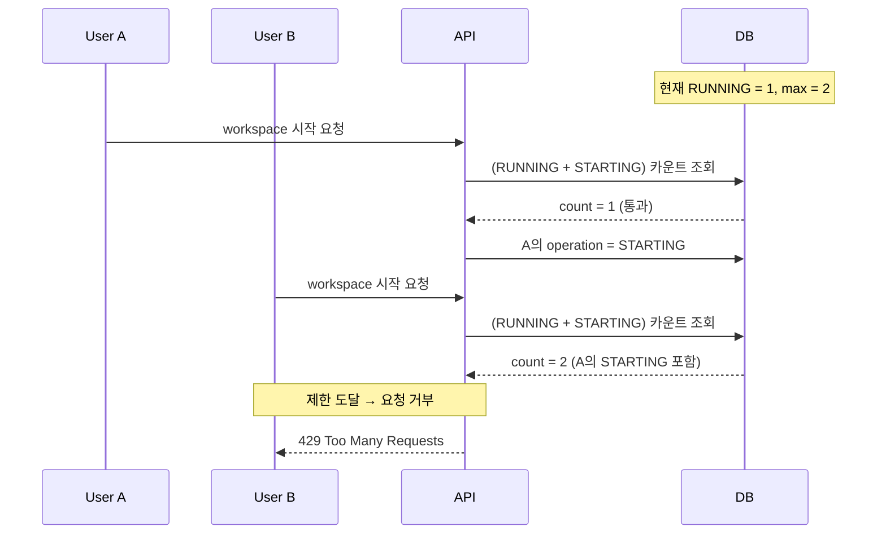

# RUNNING 워크스페이스 제한 (M2)

> [README.md](./README.md)로 돌아가기

---

## 개요

리소스 관리를 위해 동시에 실행 가능한 워크스페이스 수를 제한합니다.

---

## 제한 유형

| 제한 | 기본값 | 설명 |
|------|--------|------|
| `max_running_per_user` | 2 | 사용자당 동시 RUNNING 워크스페이스 수 |
| `max_running_global` | 100 | 시스템 전체 동시 RUNNING 워크스페이스 수 |

---

## 설정

### 환경 변수

```bash
MAX_RUNNING_PER_USER=2
MAX_RUNNING_GLOBAL=100
```

### 향후 확장 (선택)

```sql
-- users 테이블에 사용자별 제한 추가 가능
ALTER TABLE users ADD COLUMN max_running_workspaces INT DEFAULT 2;
```

---

## 체크 시점

| 시점 | 동작 |
|------|------|
| API: desired_state = RUNNING | 제한 체크 후 설정 |
| Proxy: Auto-wake 트리거 | 제한 체크 후 진행 |

---

## 제한 초과 시 동작

### API 응답

```http
HTTP/1.1 429 Too Many Requests
Content-Type: application/json

{
  "error": "workspace_limit_exceeded",
  "message": "동시 실행 가능한 워크스페이스 수를 초과했습니다.",
  "details": {
    "limit_type": "per_user",
    "current": 2,
    "max": 2,
    "running_workspaces": [
      {"id": "abc123", "name": "my-project-1"},
      {"id": "def456", "name": "my-project-2"}
    ]
  }
}
```

### Auto-wake 시



### 안내 페이지 내용

```html
<h1>워크스페이스를 시작할 수 없습니다</h1>
<p>동시에 실행 가능한 워크스페이스 수(2개)를 초과했습니다.</p>

<h2>실행 중인 워크스페이스</h2>
<ul>
  <li>my-project-1 <button>정지</button></li>
  <li>my-project-2 <button>정지</button></li>
</ul>

<p>위 워크스페이스 중 하나를 정지한 후 다시 시도하세요.</p>
```

---

## 구현

### 제한 체크 함수

```python
async def can_start_workspace(user_id: str) -> tuple[bool, str, dict]:
    """
    워크스페이스 시작 가능 여부 체크.

    IMPORTANT: RUNNING 상태뿐 아니라 STARTING operation도 카운트에 포함.
    이는 동시 요청 시 초과 할당을 방지합니다.

    Returns:
        (allowed, error_message, details)
    """
    # 사용자당 제한 체크
    # Note: STARTING operation 포함으로 race condition 방지
    user_running = await db.fetch_val("""
        SELECT COUNT(*) FROM workspaces
        WHERE owner_user_id = :user_id
          AND (observed_status = 'RUNNING' OR operation = 'STARTING')
          AND deleted_at IS NULL
    """, {"user_id": user_id})

    if user_running >= MAX_RUNNING_PER_USER:
        running_list = await get_running_workspaces(user_id)
        return False, "사용자 제한 초과", {
            "limit_type": "per_user",
            "current": user_running,
            "max": MAX_RUNNING_PER_USER,
            "running_workspaces": running_list
        }

    # 전역 제한 체크
    global_running = await db.fetch_val("""
        SELECT COUNT(*) FROM workspaces
        WHERE (observed_status = 'RUNNING' OR operation = 'STARTING')
          AND deleted_at IS NULL
    """)

    if global_running >= MAX_RUNNING_GLOBAL:
        return False, "시스템 제한 초과", {
            "limit_type": "global",
            "current": global_running,
            "max": MAX_RUNNING_GLOBAL
        }

    return True, "", {}
```

### Race Condition 방지

#### 문제: RUNNING만 체크 시 동시 요청으로 초과 할당 가능



#### 해결: RUNNING + STARTING 모두 카운트 + 트랜잭션



> **중요: 트랜잭션 요구사항**
>
> `can_start_workspace()` 체크와 `operation = 'STARTING'` 설정은
> **반드시 같은 트랜잭션 내에서** 수행되어야 합니다.
>
> ```python
> async with db.transaction():
>     # 1. 제한 체크
>     allowed, msg, details = await can_start_workspace(user_id)
>     if not allowed:
>         raise LimitExceeded(msg, details)
>
>     # 2. operation 설정 (체크와 같은 트랜잭션)
>     await db.execute("""
>         UPDATE workspaces
>         SET operation = 'STARTING', op_started_at = NOW(), ...
>         WHERE id = $1 AND operation = 'NONE'
>     """, workspace_id)
> ```
>
> 트랜잭션 없이 분리 실행 시:
> - SELECT와 UPDATE 사이에 다른 요청이 끼어들 수 있음
> - STARTING 카운트 체크 후 UPDATE 전에 다른 workspace가 STARTING으로 전환 가능

### API 엔드포인트

```python
@router.patch("/workspaces/{workspace_id}")
async def update_workspace(
    workspace_id: str,
    body: UpdateWorkspaceRequest,
    user: User = Depends(get_current_user)
):
    if body.desired_state == "RUNNING":
        allowed, message, details = await can_start_workspace(user.id)
        if not allowed:
            raise HTTPException(
                status_code=429,
                detail={
                    "error": "workspace_limit_exceeded",
                    "message": message,
                    "details": details
                }
            )

    # 계속 진행...
```

### Proxy Auto-wake

```python
async def handle_auto_wake(workspace_id: str, user_id: str):
    """STANDBY 상태 워크스페이스 접근 시 Auto-wake 처리"""

    allowed, message, details = await can_start_workspace(user_id)
    if not allowed:
        return render_limit_exceeded_page(details)

    # desired_state = RUNNING 설정
    await set_desired_state(workspace_id, "RUNNING")

    # 로딩 페이지 표시
    return render_loading_page(workspace_id)
```

---

## 인덱스

```sql
-- 사용자별 RUNNING + STARTING 워크스페이스 조회 최적화
CREATE INDEX idx_workspaces_user_active
ON workspaces (owner_user_id, observed_status, operation)
WHERE deleted_at IS NULL;

-- 전역 RUNNING + STARTING 카운트 최적화
CREATE INDEX idx_workspaces_active
ON workspaces (observed_status, operation)
WHERE deleted_at IS NULL;
```

> **참고**: `observed_status`와 `operation` 모두 인덱싱하여 복합 조건 최적화

---

## 참조

- [schema.md](./schema.md) - 설정 값
- [states.md](./states.md) - 상태 정의
