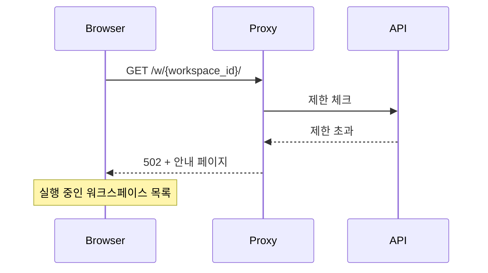

# RUNNING 워크스페이스 제한 (M2)

> [README.md](./README.md)로 돌아가기

---

## 개요

리소스 관리를 위해 동시에 실행 가능한 워크스페이스 수를 제한합니다.

---

## 제한 유형

| 제한 | 기본값 | 설명 |
|------|--------|------|
| max_running_per_user | 2 | 사용자당 동시 RUNNING 워크스페이스 수 |
| max_running_global | 100 | 시스템 전체 동시 RUNNING 워크스페이스 수 |

---

## 불변식

1. **카운트 기준**: `observed_status = RUNNING` 카운트
2. **Soft Limit**: 정확한 enforcement 아님, 근사치 허용
3. **우선순위**: per_user 제한을 먼저 체크, 통과 시 global 체크

> Race condition으로 인해 제한보다 약간 초과될 수 있음 (허용)

---

## 체크 시점

| 시점 | 동작 |
|------|------|
| API: desired_state = RUNNING | 제한 체크 후 설정 |
| Proxy: Auto-wake 트리거 | 제한 체크 후 진행 |

---

## 제한 초과 시 동작

| 상황 | 응답 | 상세 |
|------|------|------|
| API 요청 | 429 Too Many Requests | error: workspace_limit_exceeded |
| Auto-wake | 502 + 안내 페이지 | 실행 중인 워크스페이스 목록 표시 |

### Auto-wake 흐름

---

## 에러 응답

| 필드 | 값 |
|------|---|
| error | workspace_limit_exceeded |
| limit_type | per_user / global |
| current | 현재 카운트 |
| max | 제한 값 |
| running_workspaces | 실행 중인 워크스페이스 목록 (per_user만) |

---

## 참조

- [schema.md](./schema.md) - 컬럼 소유권
- [states.md](./states.md) - 상태 정의
