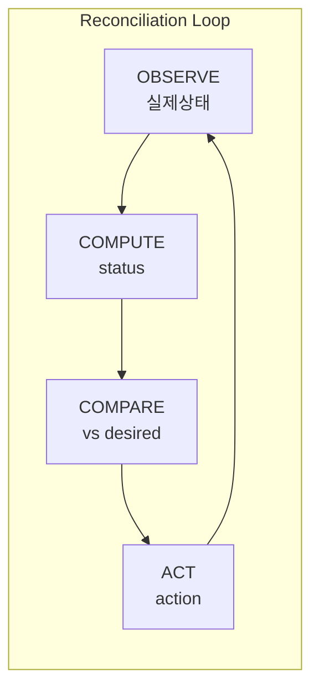
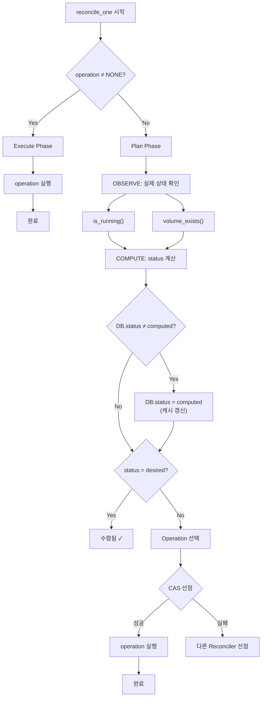

# Reconciler 알고리즘 (M2)

> [README.md](./README.md)로 돌아가기

---

## 개요

Reconciler는 **Level-Triggered Control** 패턴으로 워크스페이스 상태를 `desired_state`로 수렴시킵니다.

### 역할 분리

| 주체 | 역할 | 설정하는 값 |
|------|------|------------|
| **API** | 사용자 의도 반영 | `desired_state` |
| **Reconciler** | 실제 상태를 desired_state로 수렴 | `status`, `operation` |

```
API: desired_state = RUNNING 설정
         ↓
Reconciler: status ≠ desired_state 감지
         ↓
Reconciler: operation 실행하여 수렴
         ↓
결과: status = RUNNING (수렴 완료)
```

### 핵심 원칙

| 원칙 | 설명 |
|------|------|
| **DB status는 캐시** | 실제 리소스 상태가 진실의 원천 |
| **Level-Triggered** | 이벤트가 아닌 현재 상태를 관찰 |
| **Plan/Execute** | Plan: observe+claim, Execute: operation 실행 |
| **멱등성** | 같은 상태에서 몇 번 실행해도 같은 결과 |
| **워크스페이스별 독립** | 병렬 처리 가능 |

### 책임 범위

| 구분 | Reconciler 역할 |
|------|----------------|
| ✅ | status → desired_state 수렴 |
| ❌ | desired_state 변경 (TTL Manager) |
| ❌ | Archive 정리 (Archive GC) |

> **핵심**: Reconciler는 `desired_state`를 **READ**만 합니다.
> `desired_state` 변경은 API 또는 TTL Manager가 담당.

### Level-Triggered vs Edge-Triggered

| 방식 | 동작 | 장단점 |
|------|------|--------|
| Edge-Triggered | "컨테이너가 죽었다" 이벤트 → 재시작 | 이벤트 놓치면 복구 불가 |
| **Level-Triggered** | "컨테이너가 없다" 상태 관찰 → 생성 | 이벤트 놓쳐도 다음 루프에서 발견 |

---

## Reconciler가 사용하는 DB 컬럼

### 핵심 컬럼 (Reconciliation Loop)

| 컬럼 | R/W | 용도 |
|------|-----|------|
| **status** | R/W | 현재 Active 상태 (관측 결과로 갱신) |
| **operation** | R/W | 진행 중인 작업 (선점/완료 시 변경) |
| **desired_state** | R | 목표 상태 (API가 설정, Reconciler는 읽기만) |
| **deleted_at** | R | 삭제 여부 (DELETING 최우선 판단) |

### Archive 관련

| 컬럼 | R/W | 용도 |
|------|-----|------|
| **archive_key** | R/W | Object Storage 경로 (RESTORING 판단, ARCHIVING 결과 저장) |
| **op_id** | R/W | 작업 ID (ARCHIVING 멱등성 보장) |

### 에러 관련

| 컬럼 | R/W | 용도 |
|------|-----|------|
| **error_count** | R/W | 연속 실패 횟수 |
| **error_message** | W | 에러 상세 메시지 |
| **previous_status** | W | ERROR 전환 시 복구용 |

---

## 용어 정의

### Control Loop (OBSERVE → COMPUTE → COMPARE → ACT)

K8s Controller 패턴을 따릅니다.



| 단계 | 설명 | 구현 |
|------|------|------|
| **OBSERVE** | 실제 리소스 상태 관측 | `is_running()`, `volume_exists()` |
| **COMPUTE** | 관측 결과를 status로 변환 | 상태 결정 테이블 |
| **COMPARE** | status vs desired_state 비교 | `status ≠ desired_state` |
| **ACT** | 차이 해소를 위한 동작 수행 | Operation 실행 |

### 관측 메서드

실제 리소스 존재 여부를 확인하는 메서드입니다.

| 메서드 | 역할 | 반환 |
|--------|------|------|
| `is_running()` | Container 존재/실행 여부 | bool |
| `volume_exists()` | Volume 존재 여부 | bool |

> **Note**: Archive 존재 여부는 DB의 `archive_key` 컬럼으로 판단 (관측 메서드 호출 불필요)

### 관측 기반 완료 판단

Operation 완료는 **동작 메서드 반환이 아닌 관측 조건**으로 판단합니다.

```
동작 메서드 성공 반환 ≠ Operation 완료
관측 조건 충족 = Operation 완료
```

---

## 상태 결정 (COMPUTE)

관측 결과를 Active status로 변환합니다.

| container | volume | → status | Display (archive_key 있으면) |
|-----------|--------|----------|------------------------------|
| ✓ | ✓ | RUNNING | RUNNING |
| ✗ | ✓ | STANDBY | STANDBY |
| ✗ | ✗ | PENDING | ARCHIVED |

> **참고**: container=✓, volume=✗는 불가능 (컨테이너가 volume을 마운트)

---

## Operation 선택 (COMPARE → ACT)

현재 status와 desired_state를 비교하여 다음 operation을 결정합니다.

### 우선순위

| 순위 | 조건 | Operation |
|------|------|-----------|
| 1 | `deleted_at ≠ NULL` | DELETING |
| 2 | `status ≠ desired_state` | 아래 테이블 참조 |
| 3 | `status = desired_state` | NONE (수렴됨) |

### Operation 선택 테이블

| status | desired_state | archive_key | → Operation |
|--------|---------------|-------------|-------------|
| PENDING | STANDBY | NULL | PROVISIONING |
| PENDING | STANDBY | 있음 | RESTORING |
| PENDING | RUNNING | NULL | PROVISIONING |
| PENDING | RUNNING | 있음 | RESTORING |
| STANDBY | RUNNING | - | STARTING |
| STANDBY | PENDING | - | ARCHIVING |
| RUNNING | STANDBY | - | STOPPING |
| RUNNING | PENDING | - | STOPPING |
| * | (동일) | - | NONE |

> **단계적 전환**: RUNNING → PENDING 요청 시, STOPPING → ARCHIVING 순서로 진행 (한 번에 한 단계)

---

## Operation별 동작

각 Operation이 수행하는 동작과 완료 조건입니다.

| Operation | 호출 메서드 | 완료 조건 | 결과 status | DB 변경 |
|-----------|------------|----------|-------------|---------|
| PROVISIONING | `provision()` | `volume_exists()` | STANDBY | status, operation=NONE |
| RESTORING | `provision()` + `restore()` | `volume_exists()` | STANDBY | status, operation=NONE |
| STARTING | `start()` | `is_running()` | RUNNING | status, operation=NONE |
| STOPPING | `delete()` | `!is_running()` | STANDBY | status, operation=NONE |
| ARCHIVING | `archive()` + `delete_volume()` | `!volume_exists()` | PENDING | status, operation=NONE, archive_key, op_id=NULL |
| DELETING | `delete()` + `delete_volume()` | `!is_running() ∧ !volume_exists()` | DELETED | deleted_at=now() |

### ARCHIVING 특수 처리

| 단계 | 동작 | 멱등성 보장 |
|------|------|------------|
| 1 | op_id 확보 (없으면 생성) | DB에 저장 후 진행 |
| 2 | expected_key 계산 | `archives/{ws_id}/{op_id}/home.tar.gz` |
| 3 | archive_key ≠ expected_key면 업로드 | HEAD 체크로 skip |
| 4 | delete_volume() | 멱등 |
| 5 | 완료 시 op_id = NULL | 재사용 방지 |

---

## Reconcile 흐름

### Plan/Execute 구조

| Phase | 조건 | 동작 |
|-------|------|------|
| **Execute** | `operation ≠ NONE` | operation 실행 → 완료 시 operation=NONE |
| **Plan** | `operation = NONE` | 관측 → 선점 → 실행 |

> **핵심**: operation이 있으면 스킵하지 않고 **실행**합니다.

### Plan Phase 단계

| 단계 | 입력 | 출력 | 동작 |
|------|------|------|------|
| 1. OBSERVE | workspace_id | ActualState | `is_running()`, `volume_exists()` 호출 |
| 2. COMPUTE | ActualState | status | 상태 결정 테이블 적용 |
| 3. DB 갱신 | status | - | status 변경 시 DB 업데이트 |
| 4. COMPARE | status, desired | bool | `status ≠ desired`면 전환 필요 |
| 5. CHOOSE | status, desired, ws | operation | Operation 선택 테이블 적용 |
| 6. CLAIM | operation | bool | CAS로 선점 시도 (실패 시 skip) |
| 7. EXECUTE | operation | - | Operation별 동작 실행 |

---

## 전체 플로우차트



---

## 케이스별 시나리오

### 시나리오 1: 새 워크스페이스 시작 (API: desired=RUNNING)

```
초기: status=PENDING, desired=RUNNING, archive_key=NULL

Loop 1: PENDING → STANDBY
  - OBSERVE: container=✗, volume=✗ → PENDING
  - COMPARE: PENDING ≠ RUNNING
  - CHOOSE: PROVISIONING (archive_key=NULL)
  - 실행: provision() → volume 생성
  - 결과: status=STANDBY

Loop 2: STANDBY → RUNNING
  - OBSERVE: container=✗, volume=✓ → STANDBY
  - COMPARE: STANDBY ≠ RUNNING
  - CHOOSE: STARTING
  - 실행: start() → container 시작
  - 결과: status=RUNNING

Loop 3: 수렴 확인
  - COMPARE: RUNNING = RUNNING ✓
```

### 시나리오 2: Archive 복원 (API: desired=RUNNING)

```
초기: status=PENDING, desired=RUNNING, archive_key=있음 (Display: ARCHIVED)

Loop 1: PENDING → STANDBY
  - CHOOSE: RESTORING (archive_key 있음)
  - 실행: provision() + restore()
  - 결과: status=STANDBY

Loop 2: STANDBY → RUNNING
  - CHOOSE: STARTING
  - 결과: status=RUNNING ✓
```

### 시나리오 3: 컨테이너 Crash 자동 복구

```
초기: status=RUNNING, desired=RUNNING
이벤트: Container OOM Kill

Loop N (1분 후):
  - OBSERVE: container=✗, volume=✓ → STANDBY
  - DB 갱신: status=STANDBY
  - COMPARE: STANDBY ≠ RUNNING
  - CHOOSE: STARTING
  - 결과: status=RUNNING (자동 복구 ✓)
```

### 시나리오 4: TTL 만료 Archive (시스템: desired=PENDING)

```
초기: status=STANDBY, desired=STANDBY
트리거: archive_ttl 만료 → desired=PENDING 변경

Loop 1: STANDBY → PENDING
  - COMPARE: STANDBY ≠ PENDING
  - CHOOSE: ARCHIVING
  - 실행: op_id 생성 → archive() → delete_volume()
  - 결과: status=PENDING, archive_key=생성됨 (Display: ARCHIVED)
```

### 시나리오 5: Reconciler Crash 복구

```
초기: status=STANDBY, operation=STARTING (Crash 중 stuck)

Loop N (재시작 후):
  - operation=STARTING → Execute Phase 진입
  - 실행: start() (멱등)
  - 결과: status=RUNNING, operation=NONE ✓
```

---

## 성능 분석

### 스펙 조건

| 항목 | 값 | 설명 |
|------|-----|------|
| 폴링 주기 | 1분 | 기본 폴링 간격 |
| 힌트 | Redis Pub/Sub | 변경 즉시 처리 |
| 동시성 | max 10 | 동시 execute 제한 |

### 관측 시간

| 관측 메서드 | Docker | K8s |
|------------|--------|-----|
| is_running() | 10ms | 50ms |
| volume_exists() | 5ms | 50ms |
| **합계** | **15ms** | **100ms** |

### 시간 복잡도

| Phase | 시간 | M=10, Docker | M=100, K8s |
|-------|------|--------------|------------|
| Plan (observe) | M × 2 × T_observe | 300ms | 20s |
| Execute | ceil(M/10) × T_execute | 30s | 300s |
| **총 주기** | - | **~30s ✓** | **~320s (5분)** |

> **Note**: K8s 대규모 환경(M=100+)은 M3 범위에서 최적화

---

## 수렴 보장

### 조건

| 조건 | 설명 |
|------|------|
| 멱등성 | 같은 상태에서 같은 action |
| 단방향 진행 | 한 단계씩 이동 (ordered state) |
| 무한 재시도 | 실패해도 다음 루프에서 재시도 |
| 관찰 기반 | 이벤트 놓쳐도 상태로 복구 |
| Plan/Execute | operation이 stuck되지 않음 |

### 에러 처리

| 상황 | 동작 |
|------|------|
| action 실패 (재시도 가능) | operation 유지, 다음 루프에서 재시도 |
| action 실패 (max_retries 초과) | ERROR 상태 전환, 관리자 개입 |
| 관측 실패 | 이전 status 유지, 재시도 |
| DataLost | 즉시 ERROR 전환, 관리자 개입 |

> **상세**: [error.md](./error.md) - ErrorInfo 구조, 재시도 정책

---

## 관련 컴포넌트

Reconciler와 함께 Control Plane을 구성하는 컴포넌트입니다.

| 컴포넌트 | 역할 | 실행 모델 | 문서 |
|----------|------|----------|------|
| **TTL Manager** | TTL 만료 → desired_state 변경 | 주기적 (1분), DB Lock | [activity.md](./activity.md) |
| **Archive GC** | orphan archive 정리 | 주기적 (2시간), DB Lock | [storage-gc.md](./storage-gc.md) |

> **분리 이유**: Reconciler는 `desired_state`를 READ만, TTL Manager가 WRITE 담당

---

## Timeout 처리

operation이 예상보다 오래 걸리면 ERROR 전환합니다.

| Operation | Timeout | 이유 |
|-----------|---------|------|
| PROVISIONING | 5분 | PVC 생성 대기 |
| RESTORING | 30분 | Archive 다운로드 + 복원 |
| ARCHIVING | 30분 | 압축 + 업로드 |
| STARTING | 5분 | Container 시작 |
| STOPPING | 5분 | Container 정지 |
| DELETING | 10분 | Container + Volume 삭제 |

---

## 참조

- [states.md](./states.md) - 상태 정의, 전환 규칙
- [error.md](./error.md) - ERROR 상태, ErrorInfo, 재시도 정책
- [instance.md](./instance.md) - InstanceController 인터페이스 (is_running)
- [storage.md](./storage.md) - StorageProvider 인터페이스, Operation 플로우
- [activity.md](./activity.md) - TTL Manager (desired_state 변경)
- [storage-gc.md](./storage-gc.md) - Archive GC
- [ADR-007: Reconciler 구현 전략](../adr/007-reconciler-implementation.md) - Leader Election, Hints
