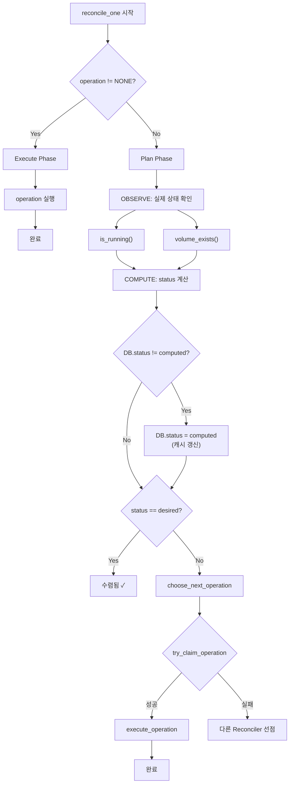

# Reconciler 알고리즘 (M2)

> [README.md](./README.md)로 돌아가기

---

## 개요

Reconciler는 **Level-Triggered Control** 패턴과 **Plan/Execute 구조**로 워크스페이스 상태를 desired_state로 수렴시킵니다.

### 핵심 원칙

1. **DB status는 캐시** - 실제 리소스 상태가 진실의 원천
2. **Level-Triggered** - 이벤트가 아닌 현재 상태를 관찰
3. **Plan/Execute** - Plan Phase: observe+claim, Execute Phase: operation 실행
4. **멱등성** - 같은 상태에서 몇 번 실행해도 같은 결과
5. **워크스페이스별 독립** - 병렬 처리 가능

### Level-Triggered vs Edge-Triggered

| 방식 | 동작 | 장단점 |
|------|------|--------|
| Edge-Triggered | "컨테이너가 죽었다" 이벤트 → 재시작 | 이벤트 놓치면 복구 불가 |
| **Level-Triggered** | "컨테이너가 없다" 상태 관찰 → 생성 | 이벤트 놓쳐도 다음 루프에서 발견 |

---

## 수학적 기반: Closed-Loop Control

### 제어 이론 매핑

```
┌─────────────────────────────────────────────────────────────────┐
│                    Reconciliation Loop                           │
│                                                                   │
│   ┌──────────┐    ┌──────────┐    ┌──────────┐    ┌──────────┐  │
│   │ OBSERVE  │ →  │ COMPUTE  │ →  │ COMPARE  │ →  │   ACT    │  │
│   │ 실제상태   │    │ status   │    │ vs desired│    │ action   │  │
│   └──────────┘    └──────────┘    └──────────┘    └──────────┘  │
│        ↑                                               │         │
│        └───────────────────────────────────────────────┘         │
└─────────────────────────────────────────────────────────────────┘
```

| 제어 이론 | 우리 시스템 |
|----------|------------|
| Plant (제어 대상) | Container, Volume |
| Sensor (관측) | `is_running()`, `volume_exists()` |
| Reference (목표) | `desired_state` |
| Controller (제어) | Reconciler |
| Actuator (실행) | `instance.start()`, `instance.delete()`, `storage.provision()`, `storage.restore()`, `storage.archive()`, `storage.delete_volume()` |

> **Note**: Archive 존재 여부는 DB의 `archive_key` 컬럼으로 판단 (센서 호출 불필요)

---

## Plan/Execute 구조

### 왜 분리하는가?

기존 "operation 스킵" 방식의 문제:

```python
# 버그가 있는 설계
if ws.operation != "NONE":
    return  # 스킵 → 아무도 operation을 실행하지 않음!
```

Plan/Execute 해결:

```python
# Execute Phase: operation이 있으면 "실행" (스킵 아님!)
if ws.operation != "NONE":
    await execute_operation(ws)
    return

# Plan Phase: operation이 없으면 "관찰 + 선점"
...
```

### 핵심 차이점

| 항목 | 기존 (버그) | Plan/Execute |
|------|------------|--------------|
| operation != NONE | return (스킵) | execute_operation() 호출 |
| 작업 실행 주체 | 없음 (stuck) | Reconciler가 직접 실행 |
| 완료 처리 | 없음 | observe → 조건 충족 시 NONE |
| 에러 처리 | 없음 | error_count++, 재시도 |

---

## 핵심 함수

### observe_actual_state()

실제 리소스 상태를 확인합니다 (DB 아님!).

```python
@dataclass
class ActualState:
    container_running: bool  # InstanceController.is_running()
    volume_exists: bool      # StorageProvider.volume_exists()

async def observe_actual_state(workspace_id: str) -> ActualState:
    """실제 리소스 존재 여부 확인.

    센서 호출:
        - InstanceController.is_running(workspace_id)
        - StorageProvider.volume_exists(workspace_id)

    Note: Archive 존재 여부는 DB archive_key로 판단 (센서 불필요)
    """
    return ActualState(
        container_running=await instance_controller.is_running(workspace_id),
        volume_exists=await storage_provider.volume_exists(workspace_id),
    )
```

### compute_status()

관찰된 실제 상태를 Active status로 변환합니다.

```python
def compute_status(actual: ActualState) -> WorkspaceStatus:
    """실제 상태 → Active status 변환.

    레벨 기준 (활성 리소스):
        RUNNING (Lv 20): container + volume
        STANDBY (Lv 10): volume only
        PENDING (Lv 0):  nothing active

    Note: has_archive 여부는 DB archive_key로 판단 (별도 축)
    """
    if actual.container_running and actual.volume_exists:
        return RUNNING
    elif actual.volume_exists:
        return STANDBY
    else:
        return PENDING
```

### 상태 결정 테이블

| container | volume | → Active status | Display (if archive_key) |
|-----------|--------|-----------------|-------------------------|
| ✓ | ✓ | RUNNING | RUNNING |
| ✗ | ✓ | STANDBY | STANDBY |
| ✗ | ✗ | PENDING | ARCHIVED (if has_archive) |

> **참고**: container=✓, volume=✗는 불가능 (컨테이너가 volume을 마운트)

### choose_next_operation()

현재 상태와 목표 상태로 다음 operation을 결정합니다.

```python
def choose_next_operation(observed: str, desired: str, ws: Workspace) -> str:
    """현재 상태와 목표 상태로 다음 operation 결정.

    Args:
        observed: compute_status()로 계산된 현재 Active 상태
        desired: 목표 상태 (desired_state)
        ws: 워크스페이스 (archive_key, deleted_at 참조용)

    Returns:
        다음 operation (NONE이면 전환 불필요)
    """

    # DELETING은 최우선
    if ws.deleted_at is not None:
        return "DELETING"

    # step_up 방향
    if observed == "PENDING":
        if desired in ("STANDBY", "RUNNING"):
            if ws.archive_key is not None:
                return "RESTORING"      # Archive → Volume
            else:
                return "PROVISIONING"   # 빈 Volume 생성

    elif observed == "STANDBY":
        if desired == "RUNNING":
            return "STARTING"
        elif desired == "PENDING":
            return "ARCHIVING"

    # step_down 방향
    elif observed == "RUNNING":
        if desired in ("STANDBY", "PENDING"):
            return "STOPPING"

    return "NONE"  # 전환 불필요
```

### choose_next_operation 테이블

| observed | desired | archive_key | → operation |
|----------|---------|-------------|-------------|
| PENDING | STANDBY/RUNNING | NULL | PROVISIONING |
| PENDING | STANDBY/RUNNING | 있음 | RESTORING |
| STANDBY | RUNNING | - | STARTING |
| STANDBY | PENDING | - | ARCHIVING |
| RUNNING | STANDBY/PENDING | - | STOPPING |
| * | (동일) | - | NONE |

---

## 메인 루프 (Plan/Execute)

### reconcile_one() 상세

```python
async def reconcile_one(workspace: Workspace):
    """단일 워크스페이스 reconcile (Plan/Execute).

    Execute Phase: operation이 있으면 실행
    Plan Phase: operation이 없으면 관찰 + 선점
    """

    # ===== Execute Phase: operation 실행 =====
    if workspace.operation != "NONE":
        await execute_operation(workspace)
        return

    # ===== Plan Phase: 관찰 + 선점 =====

    # 1. OBSERVE: 실제 상태 확인
    actual = await observe_actual_state(workspace.id)

    # 2. COMPUTE: status 계산
    observed_status = compute_status(actual)

    # 3. DB 갱신 (캐시 업데이트)
    if workspace.status != observed_status:
        await db.update_status(workspace.id, observed_status)
        workspace.status = observed_status
        logger.info(f"Status updated: {workspace.id} → {observed_status}")

    # 4. 수렴 확인
    if observed_status == workspace.desired_state:
        return  # 수렴됨, 할 일 없음

    # 5. 다음 operation 결정
    next_op = choose_next_operation(observed_status, workspace.desired_state, workspace)
    if next_op == "NONE":
        return

    # 6. operation 선점 (CAS - Optimistic Locking)
    claimed = await db.try_claim_operation(workspace.id, next_op)
    if not claimed:
        return  # 다른 Reconciler가 선점

    # 7. 선점 성공 → 실행
    workspace.operation = next_op
    await execute_operation(workspace)
```

### execute_operation()

operation을 멱등하게 실행하고 완료 시 NONE으로 전환합니다.

```python
async def execute_operation(ws: Workspace):
    """operation을 멱등하게 실행."""
    try:
        if ws.operation == "PROVISIONING":
            await storage.provision(ws.id)
            actual = await observe_actual_state(ws.id)
            if actual.volume_exists:
                await db.finish_operation(ws.id, status="STANDBY", operation="NONE")

        elif ws.operation == "RESTORING":
            await storage.provision(ws.id)  # Volume 먼저 생성
            await storage.restore(ws.id, ws.archive_key)
            actual = await observe_actual_state(ws.id)
            if actual.volume_exists:
                await db.finish_operation(ws.id, status="STANDBY", operation="NONE")

        elif ws.operation == "STARTING":
            await instance.start(ws.id, ws.image_ref)
            actual = await observe_actual_state(ws.id)
            if actual.container_running and actual.volume_exists:
                await db.finish_operation(ws.id, status="RUNNING", operation="NONE")

        elif ws.operation == "STOPPING":
            await instance.delete(ws.id)
            actual = await observe_actual_state(ws.id)
            if not actual.container_running and actual.volume_exists:
                await db.finish_operation(ws.id, status="STANDBY", operation="NONE")

        elif ws.operation == "ARCHIVING":
            # op_id 확보 (멱등성)
            if ws.op_id is None:
                ws.op_id = uuid()
                await db.update_op_id(ws.id, ws.op_id)

            # Archive 업로드 (expected_key와 비교하여 skip 판단)
            # Note: archive_key is None 조건 대신 expected_key 비교 사용
            #       → RESTORING 후에도 새 아카이브 생성 보장
            expected_key = f"archives/{ws.id}/{ws.op_id}/home.tar.gz"
            if ws.archive_key != expected_key:
                archive_key = await storage.archive(ws.id, ws.op_id)
                await db.update_archive_key(ws.id, archive_key)

            # Volume 삭제
            await storage.delete_volume(ws.id)

            actual = await observe_actual_state(ws.id)
            if not actual.volume_exists:
                await db.finish_operation(
                    ws.id, status="PENDING", operation="NONE", op_id=None
                )

        elif ws.operation == "DELETING":
            await instance.delete(ws.id)
            await storage.delete_volume(ws.id)
            actual = await observe_actual_state(ws.id)
            if not actual.container_running and not actual.volume_exists:
                await db.mark_deleted(ws.id)

    except Exception as e:
        # ErrorInfo 생성 및 에러 처리
        error_info = create_error_info(e, ws.operation)
        await handle_error(ws, error_info)
        logger.error(f"Operation failed: {ws.id} {ws.operation} - {e}")
        # error_count < max_retries면 operation 유지 → 다음 루프에서 재시도
        # 상세: error.md 참조
```

---

## 케이스별 시나리오

### 시나리오 1: 새 워크스페이스 시작 (PENDING → RUNNING)

```
초기 상태:
  DB: status=PENDING, operation=NONE, desired_state=RUNNING, archive_key=NULL
  실제: container=✗, volume=✗

Loop 1:
  1. operation=NONE → Plan Phase 진입
  2. OBSERVE: container=✗, volume=✗
  3. COMPUTE: → PENDING
  4. COMPARE: PENDING != RUNNING
  5. choose_next_operation(PENDING, RUNNING, archive_key=NULL) → PROVISIONING
  6. try_claim_operation(PROVISIONING) → 성공
  7. execute_operation(PROVISIONING):
     - provision() 호출 → Volume 생성
     - observe: volume=✓
     - finish_operation(status=STANDBY, operation=NONE)

Loop 2:
  1. operation=NONE → Plan Phase 진입
  2. OBSERVE: container=✗, volume=✓
  3. COMPUTE: → STANDBY
  4. COMPARE: STANDBY != RUNNING
  5. choose_next_operation(STANDBY, RUNNING) → STARTING
  6. execute_operation(STARTING):
     - start() 호출 → Container 시작
     - finish_operation(status=RUNNING, operation=NONE)

Loop 3:
  1. operation=NONE → Plan Phase 진입
  2. OBSERVE: container=✓, volume=✓
  3. COMPUTE: → RUNNING
  4. COMPARE: RUNNING == RUNNING ✓
  5. 수렴됨, 종료

결과: ✅ 성공 (PENDING → STANDBY → RUNNING)
```

### 시나리오 2: Archive에서 복원 (ARCHIVED → RUNNING)

```
초기 상태:
  DB: status=PENDING, archive_key="archives/ws-123/.../home.tar.gz", desired_state=RUNNING
  실제: container=✗, volume=✗, archive=✓
  Display: ARCHIVED

Loop 1:
  1. Plan Phase 진입
  2. OBSERVE: container=✗, volume=✗
  3. COMPUTE: → PENDING
  4. COMPARE: PENDING != RUNNING
  5. choose_next_operation(PENDING, RUNNING, archive_key 있음) → RESTORING
  6. execute_operation(RESTORING):
     - provision() → Volume 생성
     - restore() → Archive → Volume
     - finish_operation(status=STANDBY)

Loop 2:
  1. COMPUTE: → STANDBY
  2. choose_next_operation → STARTING
  3. execute_operation(STARTING)

Loop 3:
  1. RUNNING == RUNNING ✓

결과: ✅ 성공 (ARCHIVED → STANDBY → RUNNING)
```

### 시나리오 3: 컨테이너 Crash 복구

```
초기 상태:
  DB: status=RUNNING, desired_state=RUNNING
  실제: container=✓, volume=✓

이벤트: Container OOM Kill (외부에서 삭제됨)

Loop N (1분 후):
  1. Plan Phase 진입 (operation=NONE)
  2. OBSERVE: container=✗, volume=✓
  3. COMPUTE: → STANDBY (container 없음!)
  4. DB 갱신: status=STANDBY (RUNNING에서 변경)
  5. COMPARE: STANDBY != RUNNING
  6. choose_next_operation → STARTING
  7. execute_operation(STARTING) → Container 재시작

Loop N+1:
  1. RUNNING == RUNNING ✓

결과: ✅ 자동 복구 성공
```

### 시나리오 4: TTL 만료로 Archive (STANDBY → ARCHIVED)

```
초기 상태:
  DB: status=STANDBY, desired_state=STANDBY
  실제: container=✗, volume=✓

트리거: archive_ttl 만료 (1일 경과)
  → TTL 체커가 desired_state=PENDING으로 변경

Loop 1:
  1. Plan Phase 진입
  2. OBSERVE: container=✗, volume=✓
  3. COMPUTE: → STANDBY
  4. COMPARE: STANDBY != PENDING
  5. choose_next_operation(STANDBY, PENDING) → ARCHIVING
  6. execute_operation(ARCHIVING):
     - op_id 생성
     - archive() → Volume → Archive
     - delete_volume()
     - finish_operation(status=PENDING)

Loop 2:
  1. COMPUTE: → PENDING
  2. PENDING == PENDING ✓
  3. Display: ARCHIVED (archive_key 있으므로)

결과: ✅ 성공 (STANDBY → ARCHIVED)
```

### 시나리오 5: Crash 중 재시도

```
초기 상태:
  DB: status=STANDBY, operation=STARTING, desired_state=RUNNING
  실제: container=✗, volume=✓
  (이전 루프에서 STARTING 중 Reconciler 크래시)

Loop N (재시작 후):
  1. operation=STARTING → Execute Phase 진입 (스킵 아님!)
  2. execute_operation(STARTING):
     - start() 호출 → Container 시작 (멱등)
     - observe: container=✓, volume=✓
     - finish_operation(status=RUNNING, operation=NONE)

Loop N+1:
  1. Plan Phase 진입
  2. RUNNING == RUNNING ✓

결과: ✅ 크래시 복구 성공
```

---

## 전체 플로우차트



---

## 성능 분석

### 스펙 조건

| 항목 | 값 | 설명 |
|------|-----|------|
| **폴링 주기** | 1분 (60초) | 기본 폴링 간격 |
| **힌트** | Redis Pub/Sub | 변경 즉시 처리 |
| **동시성** | Semaphore max 10 | 동시 execute 제한 |

### 변수 정의

| 변수 | 의미 | 예상값 |
|------|------|--------|
| N | 총 워크스페이스 수 | 100~1000 |
| M | reconcile 필요한 ws 수 | N × 0.1 (10%) |
| T_sensor | 센서 호출 시간 | Docker: 15ms, K8s: 100ms |
| T_execute | 실제 작업 시간 | 1~60초 |

### 센서 호출 시간 (예상)

| 센서 | Docker | K8s |
|------|--------|-----|
| is_running() | 10ms | 50ms |
| volume_exists() | 5ms | 50ms |
| **합계** | **15ms** | **100ms** |

### 현재 구조 (reconcile_one 내 Plan+Execute 혼합)

```
매 주기 (1분):
  workspaces = get_to_reconcile()     # O(1) - DB 인덱스 쿼리

  for ws in workspaces:               # M개 (병렬, max 10)
    if ws.operation != NONE:
      execute_operation(ws)           # T_execute
    else:
      observe()                       # 2 × T_sensor
      compute_status()                # O(1)
      choose_next_operation()         # O(1)
      try_claim()                     # O(1) DB CAS
      execute_operation()             # T_execute
```

### 시간 복잡도

| Phase | 시간 | M=10, Docker | M=100, K8s |
|-------|------|--------------|------------|
| Plan (observe) | M × 2 × T_sensor | 10 × 30ms = 300ms | 100 × 200ms = 20s |
| Execute | ceil(M/10) × T_execute | 1 × 30s = 30s | 10 × 30s = 300s |
| **총 주기 시간** | - | **~30s ✓** | **~320s (5분!)** |

### M2 적용: 현재 구조 유지

Docker 환경 (M=10~50)에서는 현재 구조로 충분:
- Plan Phase: 300ms~1.5s
- 1분 폴링 주기 내 처리 가능

> **Note**: K8s 대규모 환경(M=100+)에서는 Plan Phase 병렬화 또는 센서 캐싱 검토 필요 (M3 범위)

---

## 수렴 보장

### 조건

| 조건 | 설명 |
|------|------|
| **멱등성** | 같은 상태에서 같은 action |
| **단방향 진행** | 한 단계씩 이동 (ordered state) |
| **무한 재시도** | 실패해도 다음 루프에서 다시 시도 |
| **관찰 기반** | 이벤트 놓쳐도 상태로 복구 |
| **Plan/Execute** | operation이 stuck되지 않음 |

### 에러 처리

> **상세 스펙**: [error.md](./error.md) - ErrorInfo 구조, 재시도 정책, 복구 시나리오

| 상황 | 동작 |
|------|------|
| action 실패 (재시도 가능) | operation 유지, 다음 루프에서 재시도 |
| action 실패 (max_retries 초과) | ERROR 상태 전환, 관리자 개입 |
| 센서 실패 | 이전 status 유지, 재시도 |
| DataLost | 즉시 ERROR 전환, 관리자 개입 |

```python
# 에러 처리 흐름 (상세: error.md)
async def handle_error(ws: Workspace, error_info: ErrorInfo):
    max_retries = get_max_retries(error_info.reason)
    if ws.error_count < max_retries:
        await db.bump_error_count(ws.id, error_info)
    else:
        await transition_to_error(ws, error_info)
        await notify_admin(ws, error_info)
```

---

## GC 통합

### 왜 Reconciler에서 GC를 실행하는가?

| 프로세스 | Leader Election 필요 | 이유 |
|---------|---------------------|------|
| Reconciler | ✅ | 동시에 같은 ws 처리 방지 |
| GC | ✅ | 동시 삭제 판단 일관성 |

둘 다 싱글 인스턴스로 실행되어야 하므로, **동일 프로세스에서 실행**하는 것이 합리적입니다.

### main_loop 구조

```python
class Reconciler:
    def __init__(self):
        self.gc_interval = 7200  # 2시간
        self.last_gc_time = 0

    async def main_loop(self):
        while True:
            # 1. Workspace reconciliation (매 루프, ~1분)
            workspaces = await db.get_to_reconcile()
            for ws in workspaces:
                await self.reconcile_one(ws)

            # 2. Archive GC (2시간마다)
            if self._should_run_gc():
                await self._run_gc()

            await asyncio.sleep(60)

    def _should_run_gc(self) -> bool:
        return time.time() - self.last_gc_time >= self.gc_interval

    async def _run_gc(self):
        """Archive GC 실행. 상세: storage-gc.md 참조"""
        self.last_gc_time = time.time()
        await gc.cleanup_orphan_archives()
```

### 타임라인

```
0:00 - reconcile workspaces
0:01 - reconcile workspaces
...
2:00 - reconcile workspaces + GC 실행
2:01 - reconcile workspaces
...
4:00 - reconcile workspaces + GC 실행
```

> **상세**: [storage-gc.md](./storage-gc.md#gc와-reconciler-통합) 참조

---

## Timeout 처리

### operation stuck 방지

operation이 예상보다 오래 걸리는 경우 (예: K8s PVC Terminating stuck):

```python
async def check_operation_timeout(ws: Workspace):
    """operation timeout 체크.

    operation_started_at + timeout 경과 시 ERROR 전환.
    """
    if ws.operation == "NONE":
        return

    timeout_seconds = get_operation_timeout(ws.operation)
    elapsed = (now() - ws.operation_started_at).total_seconds()

    if elapsed > timeout_seconds:
        await transition_to_error(ws, ErrorInfo(
            reason="Timeout",
            message=f"Operation {ws.operation} timed out after {timeout_seconds}s",
            context={
                "operation": ws.operation,
                "elapsed_seconds": int(elapsed),
                "limit_seconds": timeout_seconds
            },
            occurred_at=datetime.utcnow()
        ))
```

### operation별 timeout

| operation | timeout | 이유 |
|-----------|---------|------|
| PROVISIONING | 5분 | PVC 생성 대기 |
| RESTORING | 30분 | Archive 다운로드 + 복원 |
| ARCHIVING | 30분 | 압축 + 업로드 |
| STARTING | 5분 | Container 시작 |
| STOPPING | 5분 | Container 정지 |
| DELETING | 10분 | Container + Volume 삭제 |

---

## 참조

- [states.md](./states.md) - 상태 정의, 전환 규칙
- [error.md](./error.md) - ERROR 상태, ErrorInfo, 재시도 정책
- [instance.md](./instance.md) - InstanceController 인터페이스 (is_running)
- [storage.md](./storage.md) - StorageProvider 인터페이스 (volume_exists)
- [storage-operations.md](./storage-operations.md) - operation별 상세 플로우
- [storage-gc.md](./storage-gc.md) - Archive GC, Reconciler 통합
- [ADR-007: Reconciler 구현 전략](../adr/007-reconciler-implementation.md) - 인프라 결정 (Leader Election, Hints)
