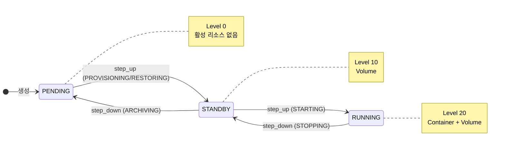
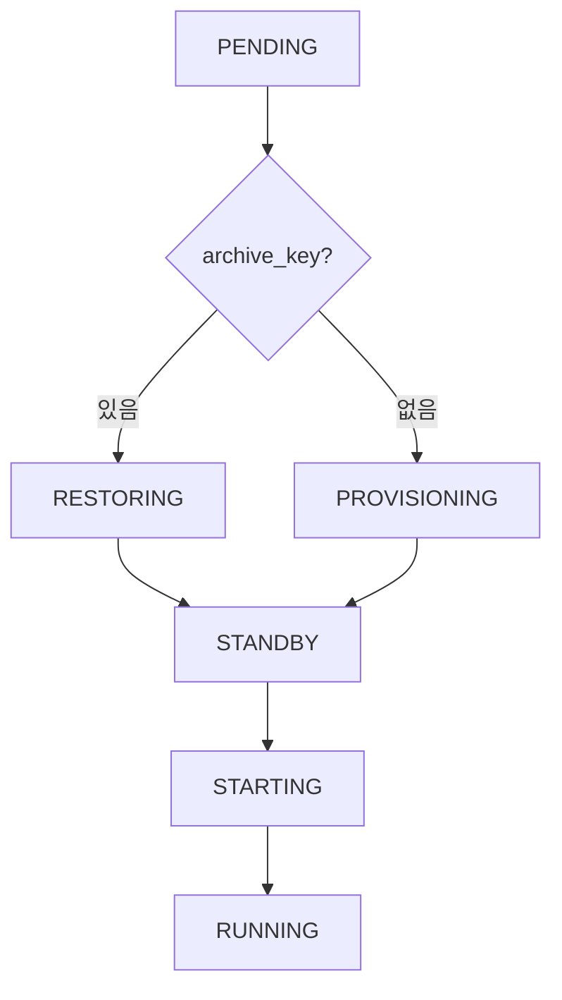
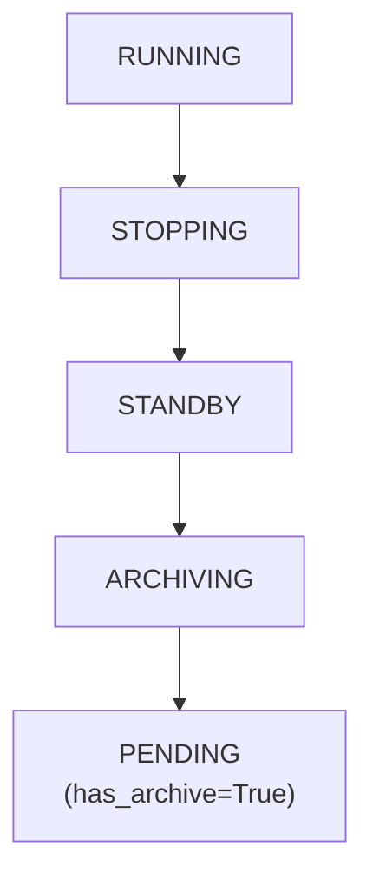
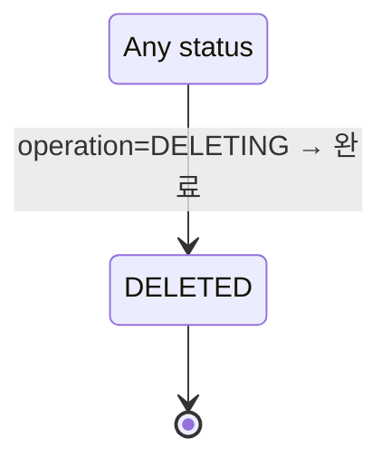
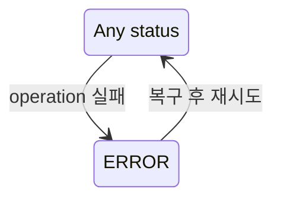
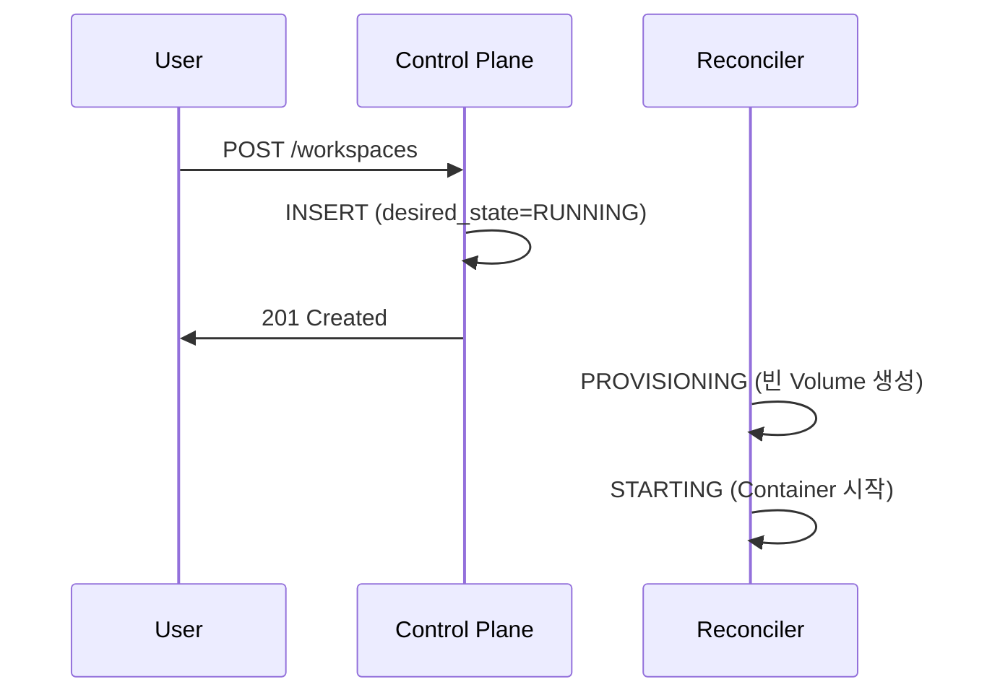
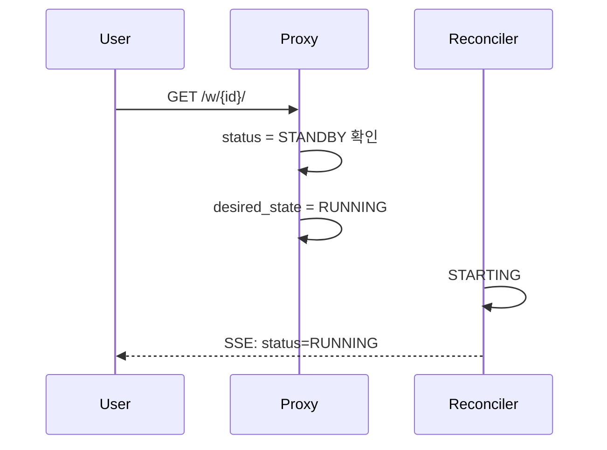
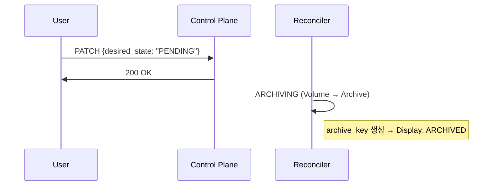
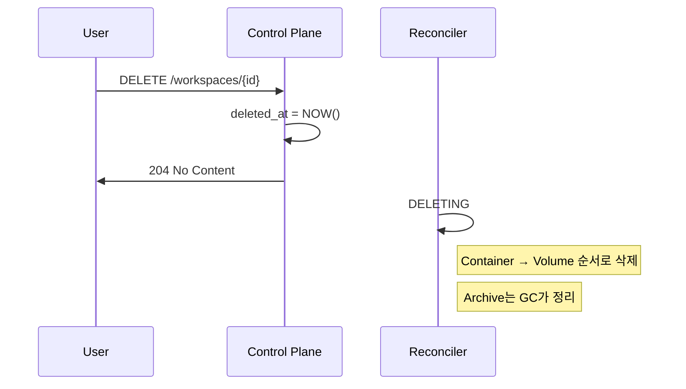

# Workspace 상태 (M2)

> [README.md](./README.md)로 돌아가기

---

## 핵심 원칙

**Active 상태와 Archive 속성을 분리**하여 모순 없는 상태 모델을 구축합니다.

1. **Active (Ordered)**: 활성 리소스 존재 여부 → `PENDING < STANDBY < RUNNING`
2. **Archive (Flag)**: 아카이브 존재 여부 → `has_archive: bool`
3. **Display**: 사용자에게 표시되는 파생 상태 → `ARCHIVED = PENDING + has_archive`

---

## 상태 모델: status + operation + archive_key

```python
class WorkspaceStatus(Enum):
    """Active 상태 (Ordered) - 활성 리소스 존재 여부"""
    PENDING = 0    # 활성 리소스 없음
    STANDBY = 10   # Volume만 존재
    RUNNING = 20   # Container + Volume
    ERROR = -1     # 오류 (레벨 없음)
    DELETED = -2   # 삭제됨 (레벨 없음)

class WorkspaceOperation(Enum):
    """진행 중인 작업"""
    NONE = "NONE"              # 작업 없음
    PROVISIONING = "PROVISIONING"  # PENDING → STANDBY (빈 Volume)
    RESTORING = "RESTORING"    # PENDING(has_archive) → STANDBY
    STARTING = "STARTING"      # STANDBY → RUNNING
    STOPPING = "STOPPING"      # RUNNING → STANDBY
    ARCHIVING = "ARCHIVING"    # STANDBY → PENDING + has_archive
    DELETING = "DELETING"      # * → DELETED
```

### Active 상태 (status)

활성 리소스 존재 여부를 나타냅니다. **레벨은 활성 리소스 기준**입니다.

| 상태 | 레벨 | Container | Volume | 설명 |
|------|------|-----------|--------|------|
| PENDING | 0 | - | - | 활성 리소스 없음 |
| STANDBY | 10 | - | ✅ | Volume만 존재 |
| RUNNING | 20 | ✅ | ✅ | 컨테이너 실행 중 |
| ERROR | -1 | (이전 상태) | (이전 상태) | 전환 실패, 복구 필요 |
| DELETED | -2 | - | - | 소프트 삭제됨 |

```
레벨:    0           10         20
       PENDING → STANDBY → RUNNING
               ←         ←
```

### Archive 속성

Archive는 **별도 축**으로, status와 독립적입니다.

| 속성 | 판단 기준 | 설명 |
|------|----------|------|
| `has_archive` | `archive_key != NULL` | Object Storage에 아카이브 존재 |

### 파생 상태 (Display)

UI/API에서 사용자에게 표시하는 상태입니다.

| 조건 | Display 상태 | 설명 |
|------|-------------|------|
| status=PENDING, has_archive=True | **ARCHIVED** | 아카이브됨 (복원 가능) |
| status=PENDING, has_archive=False | PENDING | 새 워크스페이스 |
| status=STANDBY | STANDBY | Volume 준비됨 |
| status=RUNNING | RUNNING | 실행 중 |

```python
def get_display_status(workspace):
    """UI/API용 파생 상태 계산"""
    if workspace.status == "PENDING" and workspace.archive_key is not None:
        return "ARCHIVED"
    return workspace.status
```

### 왜 이 모델인가?

기존 모델의 문제점:

```
기존: COLD는 status (레벨 10)
  → PENDING(Lv0) → COLD(Lv10)로 step_up 필요
  → INITIALIZING 작업이 Archive를 생성해야 함
  → 하지만 새 워크스페이스는 Archive가 없음
  → 모순! (COLD에 도달 불가)

신규: ARCHIVED는 파생 상태 (PENDING + has_archive)
  → Archive는 ARCHIVING 작업으로만 생성
  → PENDING → STANDBY는 PROVISIONING (Archive 불필요)
  → 모순 해결!
```

---

## 작업 (operation)

전환 진행 중을 나타냅니다. API에서 직접 설정할 수 없습니다.

| 작업 | 전환 | 설명 |
|------|------|------|
| NONE | - | 작업 없음 (안정 상태) |
| PROVISIONING | PENDING → STANDBY | 빈 Volume 생성 |
| RESTORING | PENDING(has_archive) → STANDBY | Archive → Volume 복원 |
| STARTING | STANDBY → RUNNING | 컨테이너 시작 |
| STOPPING | RUNNING → STANDBY | 컨테이너 정지 |
| ARCHIVING | STANDBY → PENDING + has_archive | Volume → Archive |
| DELETING | * → DELETED | 전체 삭제 |

### 상태 표현 예시

| status | operation | archive_key | 의미 | Display |
|--------|-----------|-------------|------|---------|
| PENDING | NONE | NULL | 새 워크스페이스, 대기 중 | PENDING |
| PENDING | NONE | 있음 | 아카이브됨 | ARCHIVED |
| PENDING | PROVISIONING | NULL | 빈 Volume 생성 중 | PENDING |
| PENDING | RESTORING | 있음 | Archive에서 복원 중 | ARCHIVED |
| STANDBY | NONE | 있음/없음 | Volume 준비됨 | STANDBY |
| STANDBY | STARTING | - | 컨테이너 시작 중 | STANDBY |
| STANDBY | ARCHIVING | - | 아카이브 진행 중 | STANDBY |
| RUNNING | NONE | - | 실행 중 | RUNNING |
| RUNNING | STOPPING | - | 정지 진행 중 | RUNNING |
| ERROR | NONE | - | 오류 발생 (복구 필요) | ERROR |

---

## 상태 다이어그램

### 정상 흐름 (Active status 전환)



### step_up 분기



### step_down 흐름



### 삭제 흐름



### 에러 흐름



---

## 상태 × 액션 매트릭스

### desired_state 설정

desired_state는 **Active 상태 (PENDING, STANDBY, RUNNING)** 만 설정 가능합니다.

| 현재 status | Display | → PENDING | → STANDBY | → RUNNING | Delete |
|-------------|---------|-----------|-----------|-----------|--------|
| PENDING | PENDING | - | ✓ | ✓ | ✓ |
| PENDING | ARCHIVED | - | ✓ | ✓ | ✓ |
| STANDBY | STANDBY | ✓ | - | ✓ | ✓ |
| RUNNING | RUNNING | ✓ | ✓ | - | ✓ |
| 전이 중 | * | 409 | 409 | 409 | 409 |
| ERROR | ERROR | 복구 후 | 복구 후 | 복구 후 | ✓ |
| DELETED | DELETED | 404 | 404 | 404 | 404 |

> **참고**: desired_state=PENDING은 "아카이브 후 대기"를 의미합니다.

> ⚠️ **주의: 경쟁 조건**
>
> `desired_state` 변경은 여러 소스에서 발생할 수 있습니다:
> - API (사용자 요청)
> - TTL Manager (자동 전환)
> - Proxy (Auto-wake)
>
> 현재 설계는 마지막 쓰기가 우선(Last-Write-Wins)입니다. 사용자 의도가 TTL Manager에 의해 덮어쓰여질 수 있습니다.
> 상세: [activity.md](./activity.md#known-issues)

### 프록시 접속

| status | archive_key | Display | 동작 |
|--------|-------------|---------|------|
| RUNNING | - | RUNNING | ✅ 정상 연결 |
| STANDBY | - | STANDBY | 로딩 페이지 → Auto-wake → 연결 |
| PENDING | 있음 | ARCHIVED | 502 + "복원 필요" 안내 (수동 복원) |
| PENDING | 없음 | PENDING | 502 + "시작 필요" 안내 |
| ERROR | - | ERROR | 502 + "오류 발생" 안내 |

> **핵심**: STANDBY는 Auto-wake 가능, ARCHIVED는 수동 복원 필요

---

## TTL 기반 자동 전환

> **상세**: [activity.md](./activity.md) - TTL Manager가 담당

| 전환 | 트리거 | TTL Manager 동작 |
|------|--------|-----------------|
| RUNNING → STANDBY | standby_ttl 만료 (5분) | `desired_state = STANDBY` |
| STANDBY → ARCHIVED | archive_ttl 만료 (1일) | `desired_state = PENDING` |

### Auto-wake

| status | 프록시 접속 시 |
|--------|--------------|
| STANDBY | `desired_state = RUNNING` → 자동 시작 |
| ARCHIVED | 502 + 수동 복원 안내 |

---

## ERROR 상태

> **상세 스펙**: [error.md](./error.md) - ErrorInfo 구조, 복구 시나리오, 재시도 정책

### 개요

ERROR는 operation 실패 시 전환되는 상태입니다.

| 항목 | 설명 |
|------|------|
| 전환 조건 | operation 실패 (재시도 횟수 초과) |
| 복구 방법 | 자동 재시도 또는 관리자 개입 |
| GC 동작 | 보호 (archive 삭제 안 함) |

### ERROR 관련 컬럼

| 컬럼 | 타입 | 설명 |
|------|------|------|
| previous_status | str | ERROR 전 상태 (복구 시 사용) |
| error_info | JSON | ErrorInfo (reason, message, context, occurred_at) |
| error_count | int | 연속 실패 횟수 (3회 초과 시 관리자 개입) |
| op_id | str | ERROR에서도 유지 (GC 보호, 재시도 시 재사용) |

> **상세 스펙**: [error.md](./error.md#error-전환) - 전환 함수, 복구 프로세스

---

## Reconciler 동작

> **상세**: [components/state-reconciler.md](./components/state-reconciler.md) - Operation 선택, Plan/Execute 구조

### Operation 선택 (요약)

| status | desired | archive_key | → Operation |
|--------|---------|-------------|-------------|
| PENDING | STANDBY/RUNNING | NULL | PROVISIONING |
| PENDING | STANDBY/RUNNING | 있음 | RESTORING |
| STANDBY | RUNNING | - | STARTING |
| STANDBY | PENDING | - | ARCHIVING |
| RUNNING | STANDBY/PENDING | - | STOPPING |
| * (deleted_at) | * | * | DELETING |

### 레벨 비교

| status | Level | 설명 |
|--------|-------|------|
| PENDING | 0 | 활성 리소스 없음 |
| STANDBY | 10 | Volume만 존재 |
| RUNNING | 20 | Container + Volume |
| ERROR/DELETED | -1 | 레벨 없음 |

---

## 주요 시나리오

### 새 Workspace 생성 → RUNNING



**상태 흐름**: `PENDING → STANDBY → RUNNING`

### Auto-wake (STANDBY → RUNNING)



### Manual Archive (STANDBY → ARCHIVED)



### Workspace 삭제



---

## 참조

- [components/state-reconciler.md](./components/state-reconciler.md) - StateReconciler (Plan/Execute, Level-Triggered)
- [components/health-monitor.md](./components/health-monitor.md) - HealthMonitor (상태 관측)
- [error.md](./error.md) - ERROR 상태 상세 (ErrorInfo, 복구, 재시도 정책)
- [activity.md](./activity.md) - TTL Manager (활동 감지, desired_state 변경)
- [schema.md](./schema.md) - TTL 관련 컬럼
- [limits.md](./limits.md) - RUNNING 제한
- [ADR-008: Ordered State Machine](../adr/008-ordered-state-machine.md)
- [ADR-009: Status와 Operation 분리](../adr/009-status-operation-separation.md)
