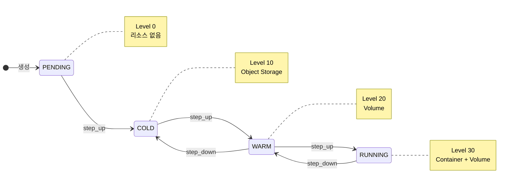
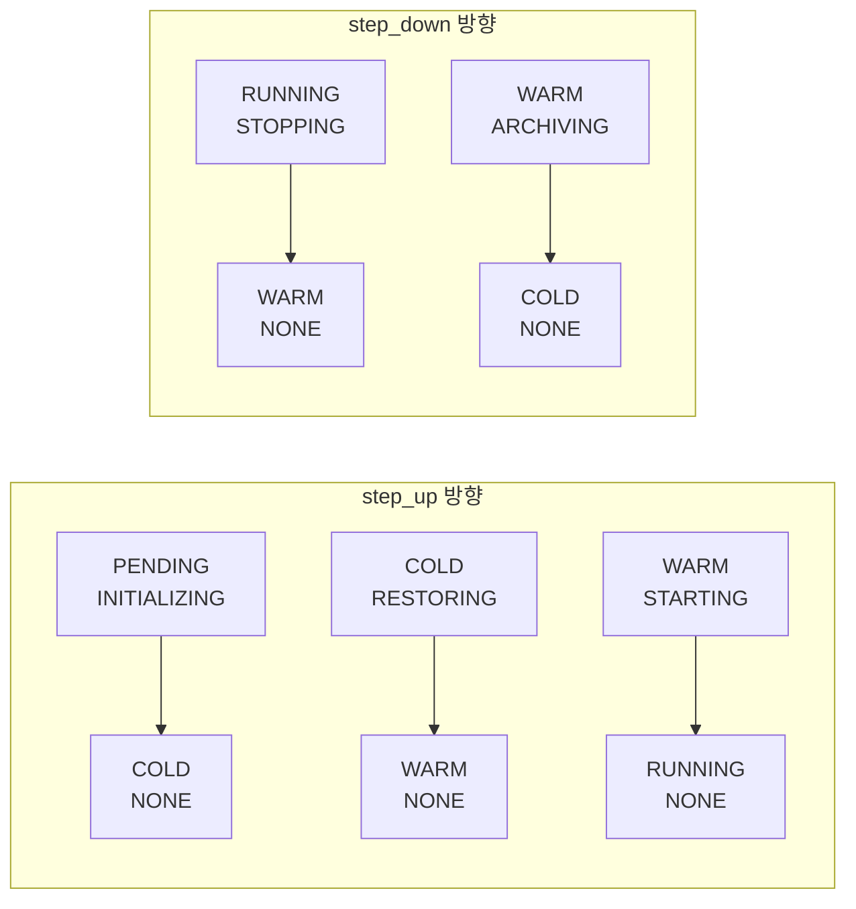
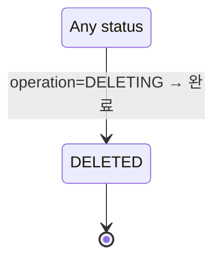
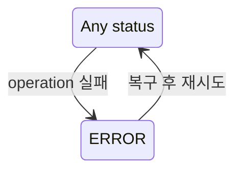
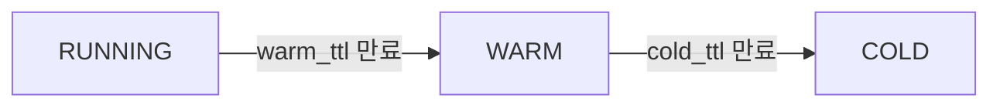
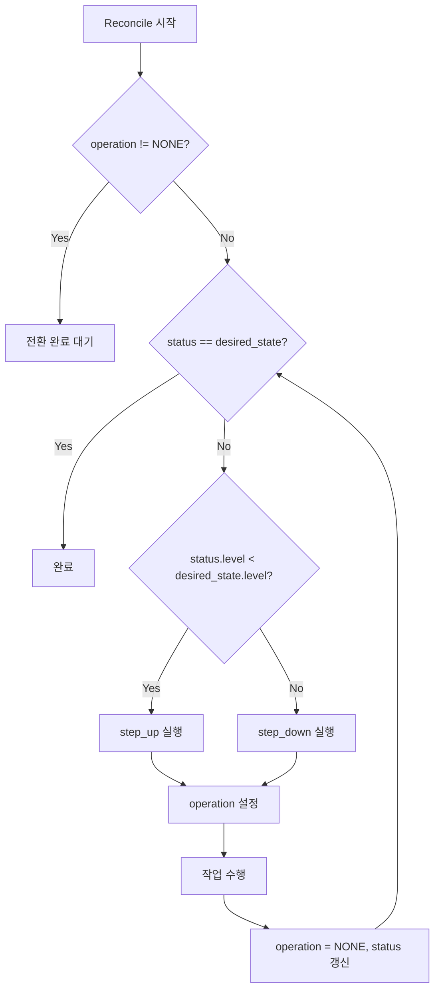

# Workspace 상태 (M2)

> [README.md](./README.md)로 돌아가기

---

## 개요

M2에서는 **Ordered State Machine** 패턴을 사용합니다. 상태에 순서(레벨)를 부여하고, 인접 상태로만 전환합니다.

> 상세 결정 배경은 [ADR-008: Ordered State Machine](../adr/008-ordered-state-machine.md) 참조

---

## 상태 모델: status + operation

M2에서는 전이 상태를 별도 컬럼(`operation`)으로 분리하여 상태 모델을 단순화합니다.

```python
class WorkspaceStatus(Enum):
    # 핵심 상태 (6개) - 리소스 존재 여부
    PENDING = 0    # 리소스 없음
    COLD = 10      # Object Storage
    WARM = 20      # Volume
    RUNNING = 30   # Container + Volume
    ERROR = -1     # 오류 (레벨 없음)
    DELETED = -2   # 삭제됨 (레벨 없음)

class WorkspaceOperation(Enum):
    # 진행 중인 작업 (7개)
    NONE = "NONE"              # 작업 없음
    INITIALIZING = "INITIALIZING"  # PENDING → COLD
    RESTORING = "RESTORING"    # COLD → WARM
    STARTING = "STARTING"      # WARM → RUNNING
    STOPPING = "STOPPING"      # RUNNING → WARM
    ARCHIVING = "ARCHIVING"    # WARM → COLD
    DELETING = "DELETING"      # * → DELETED
```

### 상태 (status)

리소스 존재 여부를 나타내는 핵심 상태입니다.

| 상태 | 레벨 | Container | Volume | Object Storage | 설명 |
|------|------|-----------|--------|----------------|------|
| PENDING | 0 | - | - | - | 최초 생성, 리소스 없음 |
| COLD | 10 | - | - | ✅ (또는 없음) | 아카이브됨 |
| WARM | 20 | - | ✅ | - | Volume만 존재 |
| RUNNING | 30 | ✅ | ✅ | - | 컨테이너 실행 중 |
| ERROR | -1 | (이전 상태) | (이전 상태) | (이전 상태) | 전환 실패, 복구 필요 |
| DELETED | -2 | - | - | - | 소프트 삭제됨 |

```
레벨:    0         10        20        30
       PENDING → COLD → WARM → RUNNING
               ←      ←      ←
```

### 작업 (operation)

전환 진행 중을 나타내는 상태입니다. API에서 직접 설정할 수 없습니다.

| 작업 | 전환 | 설명 |
|------|------|------|
| NONE | - | 작업 없음 (안정 상태) |
| INITIALIZING | PENDING → COLD | 최초 리소스 준비 중 |
| RESTORING | COLD → WARM | Object Storage에서 Volume으로 복원 중 |
| STARTING | WARM → RUNNING | 컨테이너 시작 중 |
| STOPPING | RUNNING → WARM | 컨테이너 정지 중 |
| ARCHIVING | WARM → COLD | Volume을 Object Storage로 아카이브 중 |
| DELETING | * → DELETED | 삭제 진행 중 |

### 상태 표현 예시

| status | operation | 의미 |
|--------|-----------|------|
| PENDING | NONE | 생성됨, 대기 중 |
| PENDING | INITIALIZING | 초기화 진행 중 |
| COLD | NONE | 아카이브됨 |
| COLD | RESTORING | 복원 진행 중 |
| WARM | NONE | Volume 준비됨 |
| WARM | STARTING | 컨테이너 시작 중 |
| WARM | ARCHIVING | 아카이브 진행 중 |
| RUNNING | NONE | 실행 중 |
| RUNNING | STOPPING | 정지 진행 중 |
| ERROR | NONE | 오류 발생 (복구 필요) |

### 장점

| 장점 | 설명 |
|------|------|
| **레벨 비교 단순화** | `status.level`로 직접 비교 가능 |
| **전이 중 명확** | `operation != NONE`이면 전환 진행 중 |
| **모순 방지** | `status = WARM, operation = STARTING` → "WARM이고 RUNNING으로 가는 중" |
| **Reconciler 단순화** | `status != desired_state` 비교가 직관적 |

---

## 상태 다이어그램

### 정상 흐름 (status 전환)



### 전환 중 상태 (status + operation)



### 삭제 흐름



### 에러 흐름



> **Note**: ERROR 상태에서는 `operation = NONE`이고, 이전 상태 정보는 별도 컬럼에 저장됩니다.

---

## 상태 × 액션 매트릭스

### desired_state 설정

| 현재 상태 | → COLD | → WARM | → RUNNING | Delete |
|-----------|--------|--------|-----------|--------|
| PENDING | ✓ (초기화 후) | ✓ | ✓ | ✓ |
| COLD | - | ✓ | ✓ | ✓ |
| WARM | ✓ | - | ✓ | ✓ |
| RUNNING | ✓ | ✓ | - | ✓ |
| 전이 상태 | 409 | 409 | 409 | 409 |
| ERROR | 복구 후 | 복구 후 | 복구 후 | ✓ |
| DELETED | 404 | 404 | 404 | 404 |

### 프록시 접속

| 상태 | 동작 |
|------|------|
| RUNNING | ✅ 정상 연결 |
| WARM | 로딩 페이지 → Auto-wake → 연결 |
| COLD | 502 + "복원 필요" 안내 |
| 그 외 | 502 |

---

## TTL 기반 자동 전환



| 전환 | 트리거 | 기본값 |
|------|--------|--------|
| RUNNING → WARM | `last_access_at + warm_ttl_seconds` 경과 | 30분 |
| WARM → COLD | `last_access_at + cold_ttl_seconds` 경과 | 1일 |

> TTL은 워크스페이스별로 설정 가능 (schema.md 참조)

---

## Reconciler 동작

### 수렴 알고리즘



### 레벨 비교 (단순화)

```python
# 기존 (복잡) - 전이 상태를 안정 상태에 매핑 필요
if status in (PENDING, INITIALIZING):
    current_level = 0
elif status in (COLD, RESTORING):
    current_level = 10
...

# 신규 (단순) - 직접 비교
current_level = status.level  # PENDING=0, COLD=10, WARM=20, RUNNING=30
is_transitioning = operation != NONE
```

### step_up 동작

| status | operation | 동작 |
|--------|-----------|------|
| PENDING | INITIALIZING | 메타데이터 초기화 |
| COLD | RESTORING | `archive_key` 있으면 restore, 없으면 provision |
| WARM | STARTING | 컨테이너 시작 |

### step_down 동작

| status | operation | 동작 |
|--------|-----------|------|
| RUNNING | STOPPING | 컨테이너 정지 |
| WARM | ARCHIVING | Volume을 Object Storage에 아카이브 |
| COLD | - | (일반적으로 사용 안 함) |

---

## 참조

- [ADR-008: Ordered State Machine](../adr/008-ordered-state-machine.md)
- [schema.md](./schema.md) - TTL 관련 컬럼
- [flows.md](./flows.md) - 상세 플로우
