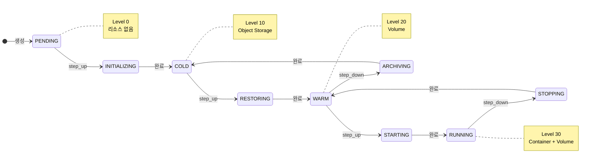
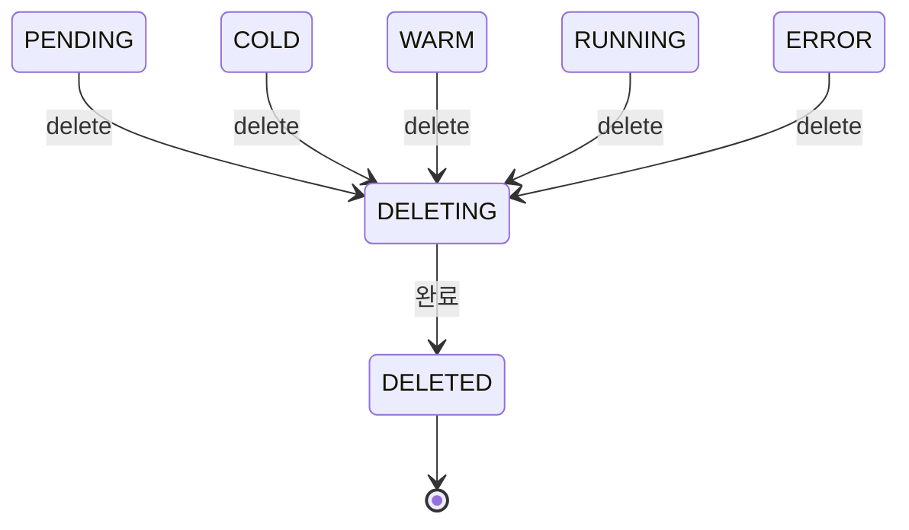
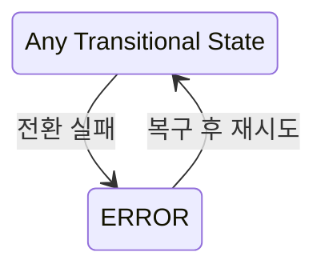
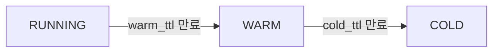
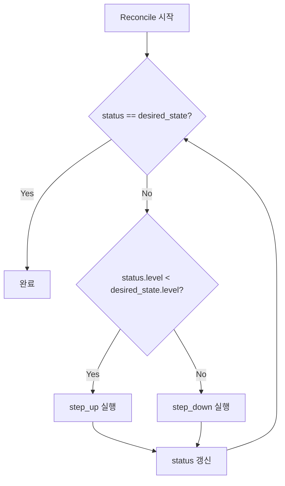

# Workspace 상태 (M2)

> [README.md](./README.md)로 돌아가기

---

## 개요

M2에서는 **Ordered State Machine** 패턴을 사용합니다. 상태에 순서(레벨)를 부여하고, 인접 상태로만 전환합니다.

> 상세 결정 배경은 [ADR-008: Ordered State Machine](../adr/008-ordered-state-machine.md) 참조

---

## 상태 정의

### 안정 상태 (Stable States)

Reconciler의 `desired_state`로 설정 가능한 상태입니다.

| 상태 | 레벨 | Container | Volume | Object Storage | 설명 |
|------|------|-----------|--------|----------------|------|
| PENDING | 0 | - | - | - | 최초 생성, 리소스 없음 |
| COLD | 10 | - | - | ✅ (또는 없음) | 아카이브됨 |
| WARM | 20 | - | ✅ | - | Volume만 존재 |
| RUNNING | 30 | ✅ | ✅ | - | 컨테이너 실행 중 |

```
레벨:    0         10        20        30
       PENDING → COLD → WARM → RUNNING
               ←      ←      ←
```

### 전이 상태 (Transitional States)

전환 진행 중을 나타내는 상태입니다. API에서 직접 설정할 수 없습니다.

| 상태 | 전환 | 설명 |
|------|------|------|
| INITIALIZING | PENDING → COLD | 최초 리소스 준비 중 |
| RESTORING | COLD → WARM | Object Storage에서 Volume으로 복원 중 |
| STARTING | WARM → RUNNING | 컨테이너 시작 중 |
| STOPPING | RUNNING → WARM | 컨테이너 정지 중 |
| ARCHIVING | WARM → COLD | Volume을 Object Storage로 아카이브 중 |
| DELETING | * → DELETED | 삭제 진행 중 |

### 예외 상태 (Exception States)

순서 체계 밖에서 별도 처리됩니다.

| 상태 | 설명 |
|------|------|
| ERROR | 전환 실패, 복구 필요 |
| DELETED | 소프트 삭제됨 |

---

## 상태 다이어그램

### 정상 흐름



### 삭제 흐름



### 에러 흐름



---

## 상태 × 액션 매트릭스

### desired_state 설정

| 현재 상태 | → COLD | → WARM | → RUNNING | Delete |
|-----------|--------|--------|-----------|--------|
| PENDING | ✓ (초기화 후) | ✓ | ✓ | ✓ |
| COLD | - | ✓ | ✓ | ✓ |
| WARM | ✓ | - | ✓ | ✓ |
| RUNNING | ✓ | ✓ | - | ✓ |
| 전이 상태 | 409 | 409 | 409 | 409 |
| ERROR | 복구 후 | 복구 후 | 복구 후 | ✓ |
| DELETED | 404 | 404 | 404 | 404 |

### 프록시 접속

| 상태 | 동작 |
|------|------|
| RUNNING | ✅ 정상 연결 |
| WARM | 로딩 페이지 → Auto-wake → 연결 |
| COLD | 502 + "복원 필요" 안내 |
| 그 외 | 502 |

---

## TTL 기반 자동 전환



| 전환 | 트리거 | 기본값 |
|------|--------|--------|
| RUNNING → WARM | `last_access_at + warm_ttl_seconds` 경과 | 30분 |
| WARM → COLD | `last_access_at + cold_ttl_seconds` 경과 | 7일 |

> TTL은 워크스페이스별로 설정 가능 (schema.md 참조)

---

## Reconciler 동작

### 수렴 알고리즘



### step_up 동작

| 현재 → 다음 | 동작 |
|-------------|------|
| PENDING → COLD | 메타데이터 초기화 |
| COLD → WARM | `archive_key` 있으면 restore, 없으면 provision |
| WARM → RUNNING | 컨테이너 시작 |

### step_down 동작

| 현재 → 다음 | 동작 |
|-------------|------|
| RUNNING → WARM | 컨테이너 정지 |
| WARM → COLD | Volume을 Object Storage에 아카이브 |
| COLD → PENDING | (일반적으로 사용 안 함) |

---

## 참조

- [ADR-008: Ordered State Machine](../adr/008-ordered-state-machine.md)
- [schema.md](./schema.md) - TTL 관련 컬럼
- [flows.md](./flows.md) - 상세 플로우
