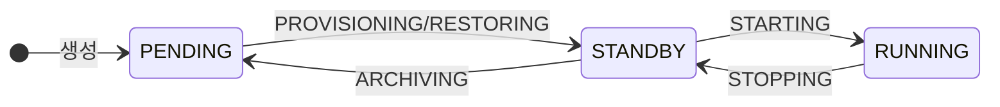
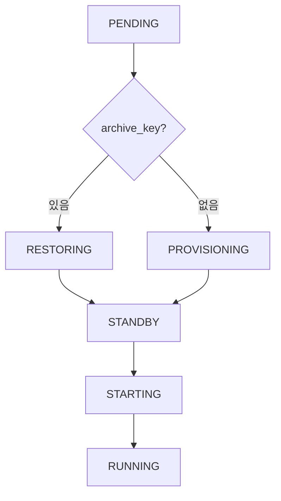
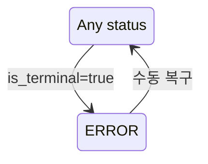
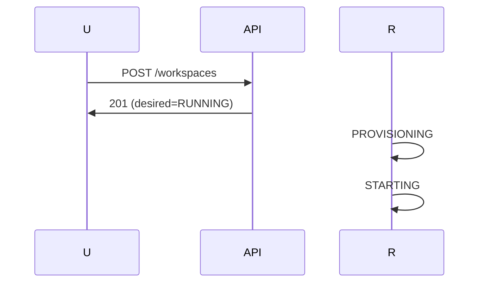
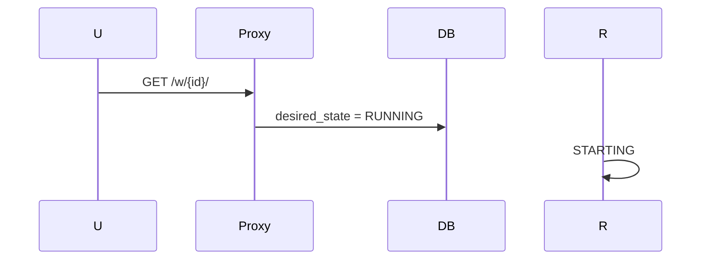
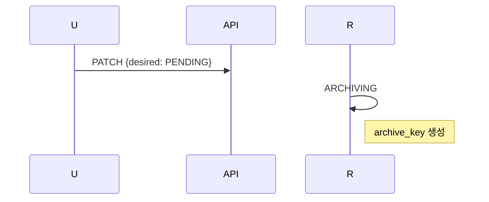

# Workspace 상태 (M2)

> [README.md](./README.md)로 돌아가기

---

## 핵심 원칙

**Ordered State Machine** + **Archive 속성 분리**

| 개념 | 설명 |
|------|------|
| Active (Ordered) | `PENDING(0) < STANDBY(10) < RUNNING(20)` |
| Archive (Flag) | `archive_key != NULL` → has_archive |
| Display (파생) | `PENDING + has_archive` → ARCHIVED |

---

## 상태 정의

### Active 상태 (status)

| 상태 | Level | Container | Volume | 설명 |
|------|-------|-----------|--------|------|
| PENDING | 0 | - | - | 활성 리소스 없음 |
| STANDBY | 10 | - | ✅ | Volume만 존재 |
| RUNNING | 20 | ✅ | ✅ | 컨테이너 실행 중 |
| ERROR | -1 | (유지) | (유지) | 전환 실패 |
| DELETED | -2 | - | - | Soft-delete |

### 파생 상태 (Display)

| 조건 | Display |
|------|---------|
| PENDING + archive_key | **ARCHIVED** |
| PENDING + !archive_key | PENDING |
| 그 외 | status 그대로 |

---

## Operation 정의

| Operation | 전환 | 설명 |
|-----------|------|------|
| NONE | - | 안정 상태 |
| PROVISIONING | PENDING → STANDBY | 빈 Volume 생성 |
| RESTORING | PENDING(has_archive) → STANDBY | Archive → Volume |
| STARTING | STANDBY → RUNNING | Container 시작 |
| STOPPING | RUNNING → STANDBY | Container 정지 |
| ARCHIVING | STANDBY → PENDING | Volume → Archive |
| DELETING | * → DELETED | 전체 삭제 |

### 상태 × Operation 조합

| status | operation | archive_key | 의미 |
|--------|-----------|-------------|------|
| PENDING | NONE | NULL | 새 workspace |
| PENDING | NONE | 있음 | ARCHIVED |
| PENDING | PROVISIONING | NULL | Volume 생성 중 |
| PENDING | RESTORING | 있음 | 복원 중 |
| STANDBY | NONE | - | Volume 준비됨 |
| STANDBY | STARTING | - | Container 시작 중 |
| STANDBY | ARCHIVING | - | 아카이브 중 |
| RUNNING | NONE | - | 실행 중 |
| RUNNING | STOPPING | - | 정지 중 |
| ERROR | (유지) | - | op_id 보호 위해 유지 |

---

## 상태 다이어그램

### 정상 흐름

### step_up 분기

### ERROR 흐름

---

## 불변식 (Invariants)

1. **Container → Volume**: Container 있으면 Volume 반드시 존재
2. **Non-preemptive**: `operation != NONE`이면 다른 operation 시작 불가
3. **Ordered Transition**: step_up/step_down은 인접 레벨만 가능
4. **ERROR 보호**: ERROR에서 operation 유지 (GC 보호)

---

## desired_state 설정

| 현재 status | → PENDING | → STANDBY | → RUNNING | Delete |
|-------------|-----------|-----------|-----------|--------|
| PENDING | - | ✓ | ✓ | ✓ |
| STANDBY | ✓ | - | ✓ | ✓ |
| RUNNING | ✓ | ✓ | - | ✓ |
| 전이 중 | 409 | 409 | 409 | 409 |
| ERROR | 복구 후 | 복구 후 | 복구 후 | ✓ |

---

## 프록시 접속 동작

| Display | 동작 |
|---------|------|
| RUNNING | 정상 연결 |
| STANDBY | Auto-wake → 연결 |
| ARCHIVED | 502 + "복원 필요" |
| PENDING | 502 + "시작 필요" |
| ERROR | 502 + "오류 발생" |

---

## TTL 자동 전환

| 전환 | 트리거 | TTL Manager 동작 |
|------|--------|-----------------|
| RUNNING → STANDBY | standby_ttl (5분) | `desired_state = STANDBY` |
| STANDBY → ARCHIVED | archive_ttl (1일) | `desired_state = PENDING` |

---

## ERROR 상태

| 항목 | 값 |
|------|---|
| 전환 조건 | `error_info.is_terminal = true` |
| 판정 주체 | HealthMonitor |
| 복구 | 관리자가 error_info 초기화 후 수동 트리거 |
| GC | 보호 (op_id 기반) |

> **상세**: [error.md](./error.md)

---

## Operation 선택 규칙

| status | desired | archive_key | → Operation |
|--------|---------|-------------|-------------|
| PENDING | STANDBY/RUNNING | NULL | PROVISIONING |
| PENDING | STANDBY/RUNNING | 있음 | RESTORING |
| STANDBY | RUNNING | - | STARTING |
| STANDBY | PENDING | - | ARCHIVING |
| RUNNING | STANDBY/PENDING | - | STOPPING |
| * | * | deleted_at | DELETING |

---

## 주요 시나리오

### 새 Workspace → RUNNING

### Auto-wake (STANDBY → RUNNING)

### Manual Archive

---

## Known Issues

1. **desired_state 경쟁**: API/TTL Manager/Proxy가 동시 변경 시 Last-Write-Wins
2. **순차 전이**: RUNNING → PENDING 직접 불가 (STOPPING → ARCHIVING)

---

## 참조

- [state-reconciler.md](./components/state-reconciler.md) - Level-Triggered Reconciliation
- [health-monitor.md](./components/health-monitor.md) - 상태 관측
- [error.md](./error.md) - ERROR 상태
- [activity.md](./activity.md) - TTL Manager
- [ADR-008](../adr/008-ordered-state-machine.md) - Ordered State Machine
