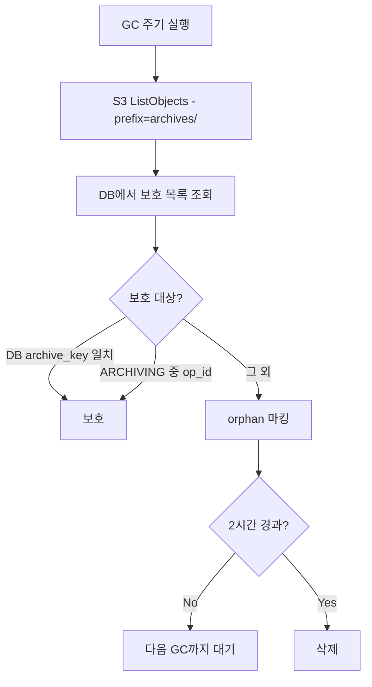

# Storage GC 시스템 (M2)

> [storage.md](./storage.md)로 돌아가기

---

## 개요

GC는 **Archive 정리**만 담당합니다.

| 리소스 | GC 필요 | 이유 |
|--------|---------|------|
| Volume | ❌ | workspace당 1개 고정, ARCHIVING/DELETING에서 삭제 |
| Archive | ✅ | op_id 변경 시 이전 버전이 orphan으로 남음 |

### DELETING vs GC

| 구분 | DELETING | GC |
|------|----------|-----|
| 트리거 | 사용자 삭제 요청 | 주기적 (Reconciler 내) |
| 대상 | **Volume만** | orphan Archive |
| 타이밍 | 즉시 | 2시간 지연 |
| 목적 | 컴퓨팅 리소스 해제 | 저장공간 회수 |

> **책임 분리**: DELETING은 Volume만 즉시 삭제. Archive는 GC가 soft-delete된 workspace를 감지하여 정리.

---

## Archive GC

### 왜 필요한가?

```
1차 Archive (op_id = aaa):
  → archives/ws123/aaa/home.tar.gz  ← DB에 저장됨

2차 Archive (op_id = bbb):
  → archives/ws123/bbb/home.tar.gz  ← DB 업데이트
  → archives/ws123/aaa/...          ← orphan (GC 대상)
```

**Orphan 발생 원인**: 크래시, 재시도, 부분 실패, 정상적인 재아카이브

### Orphan 판단 규칙

Archive가 **보호 대상이 아니면** orphan입니다.

| 조건 | 결과 | 이유 |
|------|------|------|
| `deleted_at != NULL` | 보호 안 함 → orphan | soft-deleted workspace |
| `archive_path == ws.archive_key` | 보호 | 현재 사용 중인 archive |
| `ws.op_id`가 있고 경로가 `archives/{id}/{op_id}/`로 시작 | 보호 | 진행 중/ERROR 상태 archive |
| 그 외 | orphan | 어떤 workspace도 참조하지 않음 |

> **Soft-Delete 처리**: `deleted_at != NULL`인 workspace의 archive는 보호하지 않음 → orphan으로 판단 → GC 대상

> **op_id 보호 이유**: ARCHIVING 중 archive 업로드 후 archive_key 저장 전에 ERROR 전환되면, operation=NONE이지만 유효한 archive가 존재. op_id만 있으면 보호하여 복구 시 재사용 가능.

> **ERROR 상태 보호**: ERROR 상태 workspace의 archive는 GC에서 보호됨. 상세: [error.md](./error.md#gc-동작)

### GC 프로세스



### 안전 지연

orphan 판단 후 **즉시 삭제하지 않고 2시간 대기** 후 삭제합니다.

| 항목 | 값 |
|------|---|
| 지연 시간 | 2시간 |
| 목적 | 진행 중인 작업 완료 대기 |
| 구현 | `first_orphan_detected` 타임스탬프 기록 |
| 조건 | 2시간 연속 orphan이면 삭제 |

> **왜 2시간?**: Archive Job timeout(30분) × 3회 재시도 + 여유. 크래시 후 재시도가 완료되기 전에 삭제 방지.

---

## GC와 Operation 동시성

GC와 workspace Operation은 **독립적으로 실행** 가능합니다.

### 구조적 분리

| 구분 | GC | Operation (Reconciler) |
|------|-----|------------------------|
| 실행 단위 | 전체 DB 스캔 (배치) | workspace 단위 |
| 트리거 | 주기적 (cron) | 상태 변경 시 |
| 락 범위 | 없음 (읽기 전용) | workspace당 operation 1개 |

### 동시 실행 시나리오

```
T1: GC가 DB 조회 (ws.archive_key = 'old')
T2: ARCHIVING이 archive_key = 'new' 저장
T3: GC가 S3 스캔 (T1 시점 스냅샷)
    → 'new'는 GC 대상에 없음 (T2 이후 생성)
T4: 다음 GC 사이클
    → 'new'는 DB에 있으므로 보호
    → 'old'는 orphan으로 삭제
```

### 안전성 보장

| 메커니즘 | 역할 |
|---------|------|
| op_id 보호 | 진행 중/ERROR 상태 archive 보호 |
| 2시간 지연 삭제 | 작업 완료 대기 |
| DB 스냅샷 | 일관된 보호 목록 |

> **결론**: GC와 Operation이 동시에 실행되어도 데이터 손실 없음.
> 최악의 경우 orphan 삭제가 다음 GC 사이클로 지연될 뿐.

---

## GC 실행 모델

GC는 **별도 프로세스**로 실행됩니다.

### 설계 원칙

| 항목 | 값 |
|------|-----|
| 실행 주기 | 2시간 |
| 단일 인스턴스 | DB Lock |
| 프로세스 | Reconciler와 분리 |

> **분리 이유**: Reconciler는 상태 수렴, GC는 정리 작업 - 서로 다른 책임

### DB Lock 메커니즘

단일 인스턴스 실행을 보장하는 간단한 Lock입니다.

| 단계 | 동작 |
|------|------|
| 1 | `system_locks` 테이블에 lock 시도 (CAS) |
| 2 | 성공 시 GC 실행 |
| 3 | 완료/실패 시 lock 해제 |
| 4 | `expires_at`로 dead lock 방지 (5분 TTL) |

### Lock 획득 조건

| 조건 | 결과 |
|------|------|
| lock 없음 | 획득 성공 |
| lock 있음, expires_at > now() | 획득 실패 (다른 인스턴스 실행 중) |
| lock 있음, expires_at ≤ now() | 만료된 lock 덮어쓰기 → 획득 성공 |

> **상세**: [schema.md](./schema.md) - system_locks 테이블 정의

---

## 참조

- [storage.md](./storage.md) - 네이밍 규칙, 인터페이스, Operation 플로우
- [storage-job.md](./storage-job.md) - Job 스펙
- [error.md](./error.md) - ERROR 상태 GC 보호
- [schema.md](./schema.md) - system_locks 테이블 정의
- [reconciler.md](./reconciler.md) - 관련 컴포넌트 참조
