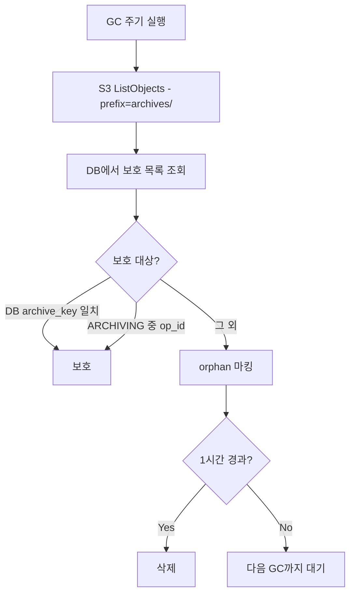

# Storage GC 시스템 (M2)

> [storage.md](./storage.md)로 돌아가기

---

## 개요

GC는 **Archive 정리**만 담당합니다.

| 리소스 | GC 필요 | 이유 |
|--------|---------|------|
| Volume | ❌ | workspace당 1개 고정, purge 시에만 삭제 |
| Archive | ✅ | op_id 변경 시 이전 버전이 orphan으로 남음 |

### DELETING vs GC

| 구분 | DELETING (purge) | GC |
|------|------------------|-----|
| 트리거 | 사용자 삭제 요청 | 주기적 배치 |
| 대상 | 특정 workspace 전체 | orphan Archive만 |
| 타이밍 | 즉시 | 1시간 지연 |
| 목적 | 완전 삭제 (보안, 과금) | 저장공간 회수 |

> **왜 분리?**: 사용자가 삭제 요청 시 즉시 처리해야 함 (기대치, 보안, 과금). GC에 의존하면 최대 1시간 지연.

---

## Archive GC

### 왜 필요한가?

```
1차 Archive (op_id = aaa):
  → archives/ws123/aaa/home.tar.gz  ← DB에 저장됨

2차 Archive (op_id = bbb):
  → archives/ws123/bbb/home.tar.gz  ← DB 업데이트
  → archives/ws123/aaa/...          ← orphan (GC 대상)
```

**Orphan 발생 원인**: 크래시, 재시도, 부분 실패, 정상적인 재아카이브

### Orphan 판단 규칙

```python
def is_orphan_archive(archive_path, workspaces):
    """Archive가 orphan인지 판단"""
    for ws in workspaces:
        # DB에 저장된 archive_key와 일치하면 보호
        if archive_path == ws.archive_key:
            return False

        # ARCHIVING 진행 중인 op_id 경로 보호
        if ws.operation == "ARCHIVING" and ws.op_id:
            if ws.op_id in archive_path:
                return False

    return True
```

### GC 프로세스



### 안전 지연

orphan 판단 후 **즉시 삭제하지 않고 1시간 대기** 후 삭제합니다.

| 항목 | 값 |
|------|---|
| 지연 시간 | 1시간 |
| 목적 | 진행 중인 작업 완료 대기 |
| 구현 | `first_orphan_detected` 타임스탬프 기록 |
| 조건 | 1시간 연속 orphan이면 삭제 |

> **왜 1시간?**: Archive Job timeout(30분) + 여유. 크래시 후 재시도가 완료되기 전에 삭제 방지.

---

## 참조

- [storage.md](./storage.md) - 네이밍 규칙, 인터페이스
- [storage-job.md](./storage-job.md) - Job 스펙
- [storage-operations.md](./storage-operations.md) - 플로우 상세
