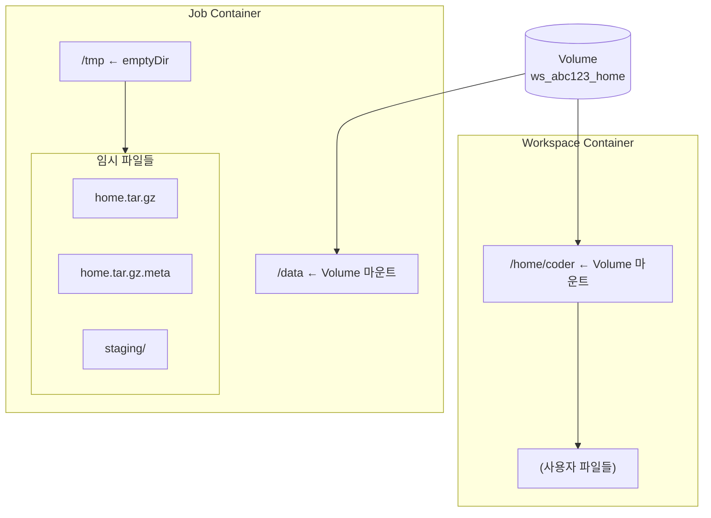
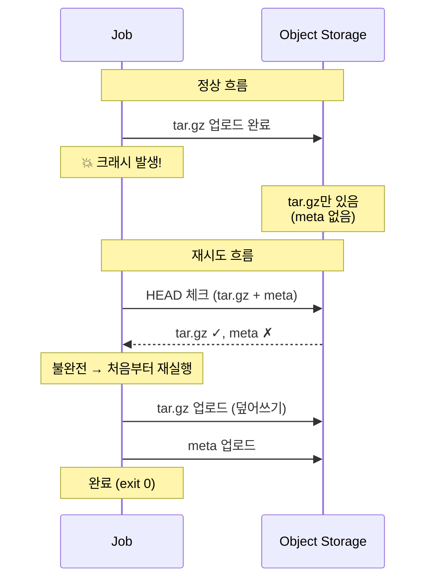

# Storage Job Specification (M2)

> [storage.md](./storage.md)로 돌아가기

---

## 개요

Job은 Volume과 Object Storage 간 데이터 이동을 담당하는 **격리된 컨테이너**입니다.

### 특성

| 항목 | 값 |
|------|---|
| 입력 | ARCHIVE_URL, S3 인증 정보 |
| 출력 | exit code (0=성공, ≠0=실패) |
| 의존성 | Object Storage만 (DB 없음, Reconciler 없음) |
| 멱등성 | HEAD 체크 (Archive), 항상 재실행 (Restore) |

> **핵심**: Job은 경로를 구성하지 않음. 전체 URL을 받아서 그대로 사용.

### 격리 원칙

```
Job은 DB를 모르고, Reconciler를 모르고, Control Plane을 모른다.
매개변수만 받아서 작업하고, 성공/실패만 반환한다.
```

### Job 실행 불변식

- Job 실행 중 workspace 컨테이너는 떠있지 않음
- Job 실행 중 Volume의 write-owner는 Job만

### 설계 철학

> **Crash-Only Design**: 복잡한 상태 관리보다 단순한 재시작을 선택
> - Stateless: Volume에 상태 저장 안 함
> - Idempotent: 재시도해도 같은 결과
> - 초기 단계(M2)에서 정확성 > 효율성

### 디스크 공간 요구사항

보수적 추정 (압축률 0% 가정):

| 작업 | /tmp | Volume | 총합 | 계산 근거 |
|------|------|--------|------|----------|
| Restore | 2.0x | 1.0x | **3.0x** | /tmp(tar.gz + staging) + /data |
| Archive | 1.0x | 1.0x | **2.0x** | /tmp(tar.gz) + /data |

> **참고**: 텍스트/코드 위주 데이터는 압축률 60-70% → 실제 Restore ~2.0x, Archive ~1.4x
>
> **권장**: 실무에서는 여유를 두고 3.2x / 2.2x 정도로 설정

---

## 공통 입력

Restore/Archive Job 모두 동일한 환경변수를 사용합니다.

| 환경변수 | 제공자 | 설명 |
|---------|--------|------|
| `ARCHIVE_URL` | StorageProvider | 전체 경로 (`s3://bucket/path/home.tar.gz`) |
| `S3_ENDPOINT` | System Config | Object Storage 엔드포인트 (비-AWS용) |
| `S3_ACCESS_KEY` | System Config | 인증 정보 |
| `S3_SECRET_KEY` | System Config | 인증 정보 |

> **참고**: StorageProvider가 archive_key를 생성하고 ARCHIVE_URL로 변환합니다:
> ```
> archive_key = archives/{workspace_id}/{op_id}/home.tar.gz
> ARCHIVE_URL = s3://{bucket}/{archive_key}
> ```

---

## 마운트 구조

### Volume 내부 구조

```
Volume (ws_abc123_home)
└── (사용자 파일들)           # 사용자 데이터만 저장
```

> **단순화**: .codehub 디렉토리 없음. Volume에는 사용자 데이터만 존재.

### 컨테이너별 마운트



**핵심**:
- Job: `/data`에 마운트
- Workspace: `/home/coder`에 마운트 (동일 Volume)
- `/tmp`: emptyDir → Job 종료 시 자동 삭제 (잔여물 없음)
- Docker/K8s 모두 동일한 단순 마운트

---

## 무결성 검증

meta 파일 기반 checksum으로 무결성을 검증합니다.

| 단계 | 방식 | 설명 |
|------|------|------|
| Archive | sha256 생성 | tar.gz의 sha256을 .meta에 저장 |
| Restore | sha256 검증 | 다운로드 후 .meta와 비교 |

> **왜 ETag/Content-MD5가 아닌가?**: 멀티파트 업로드 시 ETag ≠ MD5이고,
> Content-MD5는 멀티파트에서 파트별로만 적용됨. 별도 checksum이 확실함.

### meta 파일 형식

```
sha256:{hex_string}
```

예시:
```
sha256:e3b0c44298fc1c149afbf4c8996fb92427ae41e4649b934ca495991b7852b855
```

---

## Restore Job

Object Storage에서 Volume으로 데이터 복원.

### 동작 (pseudo-code)

```
1. ARCHIVE_URL에서 다운로드 → /tmp/home.tar.gz
2. ARCHIVE_URL.meta에서 다운로드 → /tmp/home.tar.gz.meta
   (없으면 실패: META_NOT_FOUND)
3. checksum 검증 (meta의 sha256과 다운로드 파일 비교)
4. mkdir -p /tmp/staging
5. tar.gz를 /tmp/staging에 해제 (안전 옵션 적용)
6. rsync -a --delete /tmp/staging/ /data/
7. exit 0
```

> **Crash-Only**: 크래시 시 /tmp가 사라지므로 재시도하면 처음부터 다시 시작.
> 마커 없이도 멱등성 보장 (같은 아카이브 → 같은 결과).

> **주의**: restore는 **아카이브 스냅샷으로 /data를 동기화**합니다.
> /data에 있던 기존 파일은 삭제됩니다.

### 에러 케이스

| 상황 | exit code | 복구 주체 |
|------|-----------|----------|
| S3 접근 실패 | 1 | Reconciler 자동 재시도 |
| 파일 없음 | 1 | 관리자 개입 (ARCHIVE_NOT_FOUND) |
| meta 없음 | 1 | 관리자 개입 (META_NOT_FOUND) - 아카이브 불완전 |
| checksum 불일치 | 1 | 관리자 개입 (CHECKSUM_MISMATCH) |
| tar 해제 실패 | 1 | 관리자 개입 (TAR_EXTRACT_FAILED) |
| 디스크 공간 부족 | 1 | 관리자 개입 (DISK_FULL) |

---

## Archive Job

Volume을 Object Storage로 아카이브.

### 동작 (pseudo-code)

```
1. HEAD ARCHIVE_URL + ARCHIVE_URL.meta 존재 확인
   → 둘 다 있으면 exit 0 (이미 완료)
2. /data를 tar.gz로 압축 → /tmp/home.tar.gz
3. sha256 checksum 생성 → /tmp/home.tar.gz.meta
4. ARCHIVE_URL에 업로드 (home.tar.gz)
5. ARCHIVE_URL.meta에 업로드 (home.tar.gz.meta)
6. exit 0
```

> **멱등성**: Step 1의 HEAD 체크로 이미 완료된 작업을 skip.
> ARCHIVE_URL은 op_id 포함 불변 경로이므로 같은 op_id = 같은 경로.

### 에러 케이스

| 상황 | exit code | 복구 주체 |
|------|-----------|----------|
| S3 접근 실패 | 1 | Reconciler 자동 재시도 |
| tar 압축 실패 | 1 | 관리자 개입 |
| 디스크 공간 부족 | 1 | 관리자 개입 (DISK_FULL) |
| 업로드 실패 | 1 | Reconciler 자동 재시도 |

### 부분 업로드와 GC 보호

**부분 업로드 시나리오**:



**안전성 보장**:

| 메커니즘 | 역할 |
|---------|------|
| 같은 op_id = 같은 경로 | 부분 업로드된 파일 덮어쓰기 |
| HEAD 체크 (tar.gz + meta) | 둘 다 있어야 skip |
| GC op_id 보호 | 부분 업로드 상태에서도 GC 삭제 방지 |

> **GC와의 관계**: op_id가 DB에 있으면 해당 경로(`archives/{ws_id}/{op_id}/`)는 GC가 보호.
> 부분 업로드 상태에서도 삭제되지 않음. 상세: [components/archive-gc.md](./components/archive-gc.md)

---

## tar 안전 원칙

### Restore (추출)

- 절대경로 금지
- `..` 경로 탈출 방지
- 소유권 강제 덮어쓰기 금지 (`--no-same-owner`)

### Archive (생성)

- 특수파일(socket, device) 제외

---

## 로그 표준

Job은 파싱 가능한 key=value 형식 로그를 출력합니다.

### 형식

| 시점 | 예시 |
|------|------|
| 시작 | `CODEHUB_JOB=restore ARCHIVE_URL=s3://...` |
| 단계 완료 | `STEP=DOWNLOAD RESULT=OK` |
| 성공 종료 | `RESULT=OK` |
| 실패 종료 | `RESULT=FAIL CODEHUB_ERROR=CHECKSUM_MISMATCH DETAIL=...` |

### CODEHUB_ERROR 코드

| 코드 | 설명 | 복구 주체 |
|------|------|----------|
| `S3_ACCESS_ERROR` | Object Storage 접근 실패 | Reconciler 자동 재시도 |
| `ARCHIVE_NOT_FOUND` | 아카이브 파일 없음 | 관리자 개입 |
| `META_NOT_FOUND` | meta 파일 없음 (아카이브 불완전) | 관리자 개입 |
| `CHECKSUM_MISMATCH` | sha256 불일치 | 관리자 개입 |
| `TAR_EXTRACT_FAILED` | 압축 해제 실패 | 관리자 개입 |
| `DISK_FULL` | 디스크 공간 부족 | 관리자 개입 |
| `UNKNOWN` | 기타 오류 | 관리자 개입 |

---

## Job 실행 권한

Job은 workspace와 동일한 UID/GID로 실행합니다.

| 백엔드 | 설정 |
|--------|------|
| Docker | `--user 1000:1000` |
| K8s | `securityContext.runAsUser: 1000`, `runAsGroup: 1000` |

> **이유**: tar 추출 시 파일 소유권이 Job 실행 사용자로 설정됨.
> Job ≠ workspace UID면 Permission denied 발생.

---

## Job Timeout

Job은 백엔드별 timeout을 강제합니다.

| 백엔드 | 설정 | 권장값 |
|--------|------|--------|
| K8s | `activeDeadlineSeconds` | 1800 (30분) |
| Docker | timeout wrapper | 1800초 |

> **계산 근거**: 10GB / 10MB/s = 1000초 + 여유 = 1800초
>
> **초과 시**: Job 강제 종료 (exit ≠ 0) → Reconciler가 재시도 또는 ERROR 전환

---

## 백엔드별 구현

| 항목 | Docker | K8s |
|------|--------|-----|
| Job 실행 | `docker run --rm --user 1000:1000` | Job Pod (securityContext) |
| Volume 마운트 | `-v volume:/data` | PVC mount at `/data` |
| 임시 공간 | 컨테이너 `/tmp` | emptyDir at `/tmp` |
| 완료 대기 | 동기 (exit code) | Job 상태 폴링 |
| 정리 | 자동 (`--rm`) | Job 삭제 |

---

## 에러 처리

### Exit Code 규칙

| exit code | Control Plane 동작 |
|-----------|-------------------|
| 0 | 성공 → 다음 단계 진행 |
| ≠ 0 | 실패 → StorageError 발생 |

> **참고**: 실패 원인(OOM, timeout 등)은 exit code로 구분하지 않음. 로그의 CODEHUB_ERROR로 원인 파악.

### StorageProvider 책임

StorageProvider는 Job exit code만 확인하고, `exit_code ≠ 0`이면 `StorageError`를 발생시킵니다.

---

## 참조

- [storage.md](./storage.md) - 핵심 원칙, StorageProvider 인터페이스, Operation 플로우
- [components/archive-gc.md](./components/archive-gc.md) - 경로 규칙, GC 시스템
