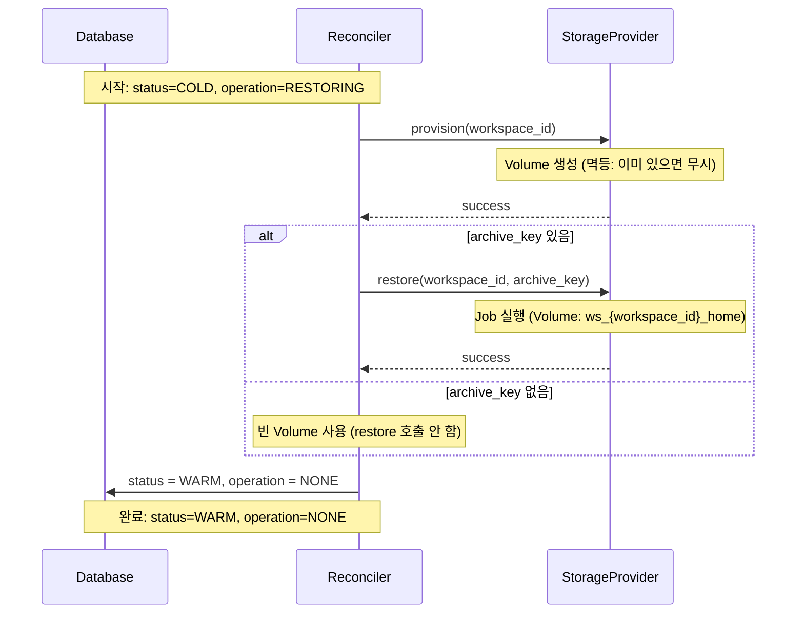
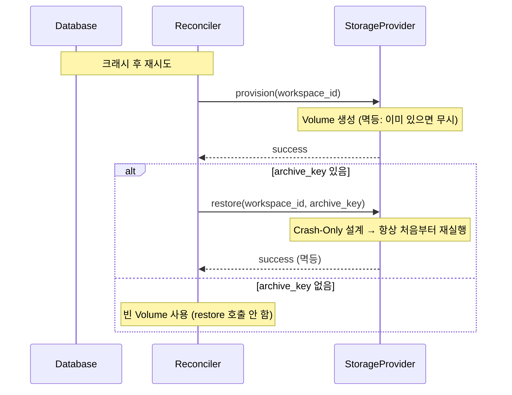
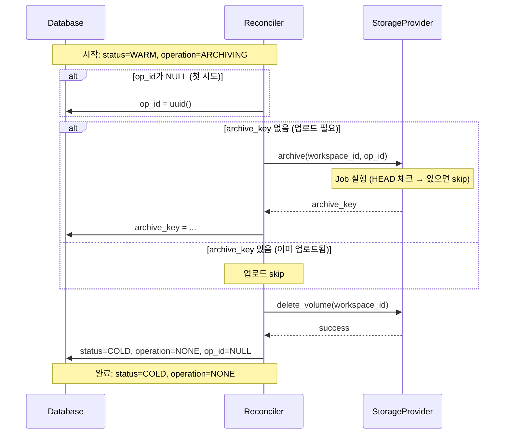
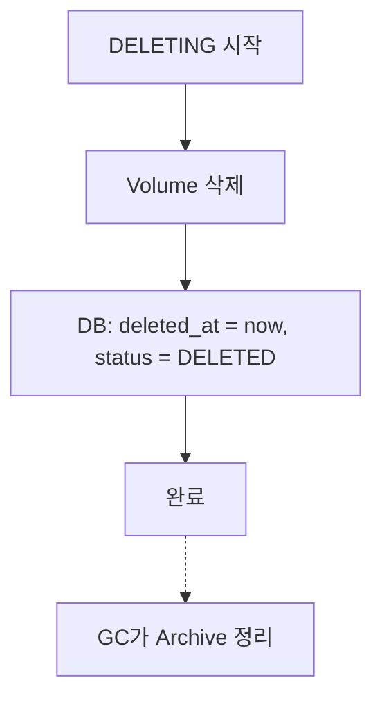

# Storage Operations - 플로우 (M2)

> [storage.md](./storage.md)로 돌아가기

---

## op_id 정책

| Operation | op_id 필요 | 이유 |
|-----------|-----------|------|
| RESTORING | ❌ | 기존 archive_key 사용, 새 경로 생성 안 함 |
| ARCHIVING | ✅ | archive_key 경로 생성에 필요 (`archives/{id}/{op_id}/...`) |
| DELETING | ❌ | Volume만 삭제, Archive는 GC가 처리 |

---

## RESTORING (COLD → WARM)

Object Storage에서 Volume으로 데이터 복원.

### 전제 조건
- `status = COLD, operation = RESTORING`

> **참고**: PENDING → COLD (INITIALIZING)는 메타데이터만 초기화하며, Storage 작업이 없습니다.

### 분기

| archive_key | Object Storage 파일 | 동작 |
|-------------|-------------------|------|
| 있음 | 있음 | `provision(workspace_id)` → `restore(workspace_id, archive_key)` |
| 있음 | 없음 | ERROR (`ARCHIVE_NOT_FOUND`) - 관리자 개입 필요 |
| 없음 | - | `provision(workspace_id)` - 빈 Volume 생성 |

> **참고**: provision은 멱등 (Volume 있으면 무시). ARCHIVING에서 Volume 삭제 후 복원할 때도 안전.

### 동작 (첫 시도)



> **Job 내부 동작**: [storage-job.md](./storage-job.md#restore-job) 참조

### 동작 (재시도)



### 실패 처리

| 에러 코드 | 상황 | 복구 방법 |
|----------|------|----------|
| `ARCHIVE_NOT_FOUND` | archive_key 있으나 Object Storage에 파일 없음 | 관리자 개입: archive_key NULL 처리 또는 백업 복원 |
| `S3_ACCESS_ERROR` | Object Storage 접근 실패 | 자동 재시도 (같은 op_id) |
| `CHECKSUM_MISMATCH` | sha256 불일치 | 관리자 개입 |
| `TAR_EXTRACT_FAILED` | tar.gz 해제 실패 | 관리자 개입 |

---

## ARCHIVING (WARM → COLD)

Volume을 Object Storage로 아카이브.

### 전제 조건
- `status = WARM, operation = ARCHIVING`
- 컨테이너가 정지된 상태 (RUNNING이 아님)

### 핵심 규칙

```
1. 업로드 (Volume 삭제 X)
2. DB에 archive_key 저장
3. Volume 삭제 → 최종 커밋
```

> **순서 중요**: archive_key DB 저장 → Volume 삭제. 크래시 시 Volume은 orphan으로 남지만 데이터는 안전.

### 동작



> **Job 내부 동작**: [storage-job.md](./storage-job.md#archive-job) 참조

### 크래시 복구

| 크래시 시점 | DB 상태 | 재시도 동작 |
|------------|---------|------------|
| 업로드 중 | archive_key=NULL, op_id 있음 | 같은 op_id로 재시도 (Job이 HEAD 체크 후 skip 또는 재업로드) |
| archive_key 저장 후 | archive_key 있음 | 업로드 skip → delete_volume만 수행 |
| Volume 삭제 후 | archive_key 있음 | 최종 커밋만 수행 |

### 멱등성
- **op_id 기반 불변 경로**: 같은 op_id → 같은 archive_key
- **Job HEAD 체크**: S3에 이미 있으면 skip
- **archive_key 체크**: DB에 저장되어 있으면 업로드 skip

---

## DELETING

Volume만 삭제. Archive는 GC가 정리.

### 전제 조건
- `operation = DELETING`
- 컨테이너가 정지된 상태 (RUNNING이 아님)
- 모든 status에서 가능 (PENDING, COLD, WARM)

### 동작



### 삭제 대상

| 리소스 | 삭제 주체 | 타이밍 |
|--------|----------|--------|
| Volume | DELETING | 즉시 |
| Archives | GC | 1시간 후 (soft-delete 감지) |

> **왜 분리?**: Volume은 즉시 해제 (컴퓨팅 비용), Archive는 GC가 일괄 정리 (저장 비용, 배치 효율)

### Soft-Delete

```
DELETING 완료 시:
  - deleted_at = NOW()
  - status = DELETED
  - archive_key 유지 (GC가 orphan 판단에 사용)
```

> **중요**: archive_key를 NULL로 하지 않음. GC가 이 값을 보고 해당 Archive를 orphan으로 판단.

### 실패 처리
- Volume 삭제 실패 시 재시도
- Archive는 GC 주기에 정리됨 (별도 처리 불필요)

---

## 참조

- [storage.md](./storage.md) - 핵심 원칙, 인터페이스
- [storage-job.md](./storage-job.md) - Job 스펙 (Crash-Only 설계)
- [storage-gc.md](./storage-gc.md) - Archive GC
- [states.md](./states.md) - 상태 전환 규칙
