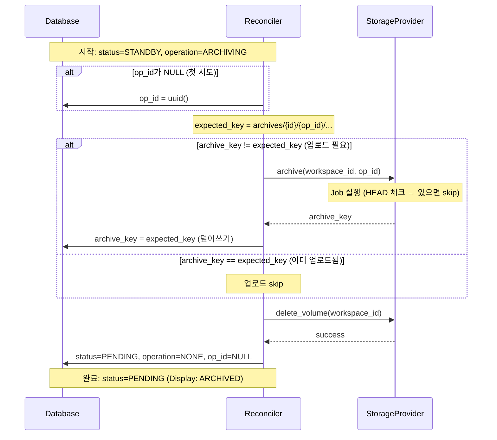

# Storage Operations - 플로우 (M2)

> [storage.md](./storage.md)로 돌아가기

---

## op_id 정책

| Operation | op_id 필요 | 이유 |
|-----------|-----------|------|
| PROVISIONING | ❌ | Volume 생성만, archive_key 생성 안 함 |
| RESTORING | ❌ | 기존 archive_key 사용, 새 경로 생성 안 함 |
| ARCHIVING | ✅ | archive_key 경로 생성에 필요 (`archives/{id}/{op_id}/...`) |
| DELETING | ❌ | Volume만 삭제, Archive는 GC가 처리 |

### op_id 생성/조회

| 시점 | op_id 상태 | 동작 |
|------|-----------|------|
| 첫 시도 | NULL | 생성 후 DB 저장 |
| 재시도 | NOT NULL | 기존 값 사용 (DB에서 조회) |

> **핵심**: op_id는 archive 호출 전에 DB에 먼저 저장됨.
> 크래시 후 재시도 시 같은 op_id로 같은 경로에 업로드.

---

## 완료 판단 원칙

**센서 기반 완료 판단**을 사용합니다.

```
Actuator 성공 반환 ≠ Operation 완료
센서 조건 충족 = Operation 완료
```

### Operation별 완료 조건

| Operation | Actuator | 완료 조건 (센서 기반) |
|-----------|----------|---------------------|
| PROVISIONING | `provision()` | `volume_exists() == True` |
| RESTORING | `provision()` + `restore()` | `volume_exists() == True` |
| STARTING | `start()` | `is_running() AND volume_exists()` |
| STOPPING | `delete()` | `!is_running() AND volume_exists()` |
| ARCHIVING | `archive()` + `delete_volume()` | `!volume_exists()` |
| DELETING | `delete()` + `delete_volume()` | `!is_running() AND !volume_exists()` |

> **이유**: Level-Triggered 철학 일관성. 크래시 복구 시 센서로 현재 상태 확인.

---

## PROVISIONING (PENDING → STANDBY)

새 워크스페이스의 빈 Volume 생성.

### 전제 조건
- `status = PENDING, operation = PROVISIONING`
- `archive_key = NULL` (아카이브 없음)

### 동작


### Reconciler pseudo-code

```python
def reconcile_provisioning(ws):
    """PROVISIONING Reconciler - 멱등, 센서 기반 완료"""

    # Actuator 호출 (멱등)
    storage.provision(ws.id)

    # 센서 기반 완료 판단
    actual = observe_actual_state(ws.id)
    if actual.volume_exists:
        ws.status = STANDBY
        ws.operation = NONE
        db.update(ws)
```

---

## RESTORING (PENDING + has_archive → STANDBY)

Archive에서 Volume으로 데이터 복원.

### 전제 조건
- `status = PENDING, operation = RESTORING`
- `archive_key != NULL` (아카이브 있음)

### 동작


> **Job 내부 동작**: [storage-job.md](./storage-job.md#restore-job) 참조

### 동작 (재시도)


### Reconciler pseudo-code

```python
def reconcile_restoring(ws):
    """RESTORING Reconciler - 멱등, 센서 기반 완료 (Crash-Only)"""

    # 단계 1: Volume 생성 (멱등)
    storage.provision(ws.id)

    # 단계 2: restore (Crash-Only: 항상 재실행)
    storage.restore(ws.id, ws.archive_key)

    # 센서 기반 완료 판단
    actual = observe_actual_state(ws.id)
    if actual.volume_exists:
        ws.status = STANDBY
        ws.operation = NONE
        db.update(ws)
```

### 실패 처리

> **상세 스펙**: [error.md](./error.md) - ErrorInfo 구조, 재시도 정책

| 에러 코드 | ErrorReason | 상황 | 복구 방법 |
|----------|-------------|------|----------|
| `ARCHIVE_NOT_FOUND` | DataLost | archive_key 있으나 Object Storage에 파일 없음 | 관리자 개입: archive_key NULL 처리 또는 백업 복원 |
| `S3_ACCESS_ERROR` | Unreachable | Object Storage 접근 실패 | 자동 재시도 (3회) |
| `CHECKSUM_MISMATCH` | DataLost | sha256 불일치 | 관리자 개입 (즉시) |
| `TAR_EXTRACT_FAILED` | ActionFailed | tar.gz 해제 실패 | 자동 재시도 (3회) |

---

## ARCHIVING (STANDBY → PENDING + has_archive)

Volume을 Object Storage로 아카이브.

### 전제 조건
- `status = STANDBY, operation = ARCHIVING`
- 컨테이너가 정지된 상태 (RUNNING이 아님)

### 핵심 규칙

```
1. 업로드 (Volume 삭제 X)
2. DB에 archive_key 저장
3. Volume 삭제 → 최종 커밋
```

> **순서 중요**: archive_key DB 저장 → Volume 삭제. 크래시 시 Volume은 orphan으로 남지만 데이터는 안전.

### 동작



> **Job 내부 동작**: [storage-job.md](./storage-job.md#archive-job) 참조

### 크래시 복구

| 크래시 시점 | DB 상태 | 재시도 동작 |
|------------|---------|------------|
| 업로드 중 | archive_key != expected_key, op_id 있음 | 같은 op_id로 재시도 (Job이 HEAD 체크 후 skip 또는 재업로드) |
| archive_key 저장 후 | archive_key == expected_key | 업로드 skip → delete_volume만 수행 |
| Volume 삭제 후 | archive_key == expected_key | 최종 커밋만 수행 |

### 멱등성
- **op_id 기반 불변 경로**: 같은 op_id → 같은 archive_key
- **Job HEAD 체크**: S3에 이미 있으면 skip
- **archive_key 체크**: DB에 저장되어 있으면 업로드 skip

### Reconciler pseudo-code

```python
def reconcile_archiving(ws):
    """ARCHIVING Reconciler - 멱등, 센서 기반 완료"""

    # 단계 1: op_id 확보
    if ws.op_id is None:
        ws.op_id = uuid()
        db.update(ws)  # 커밋 포인트 1

    # 단계 2-3: archive (expected_key와 비교하여 skip 판단)
    # Note: archive_key is None 조건 대신 expected_key 비교 사용
    #       → RESTORING 후에도 새 아카이브 생성 보장
    expected_key = f"archives/{ws.id}/{ws.op_id}/home.tar.gz"
    if ws.archive_key != expected_key:
        archive_key = storage.archive(ws.id, ws.op_id)
        ws.archive_key = archive_key
        db.update(ws)  # 커밋 포인트 2 (덮어쓰기)

    # 단계 4: Volume 삭제 (멱등)
    storage.delete_volume(ws.id)

    # 센서 기반 완료 판단
    actual = observe_actual_state(ws.id)
    if not actual.volume_exists:
        ws.status = PENDING  # Display: ARCHIVED (archive_key 있으므로)
        ws.operation = NONE
        ws.op_id = None
        db.update(ws)  # 커밋 포인트 3
```

---

## DELETING

Container와 Volume 삭제. Archive는 GC가 정리.

### 전제 조건
- `operation = DELETING`
- 모든 status에서 가능 (PENDING, STANDBY, RUNNING)

### 삭제 순서 (중요)

```
1. Container 삭제 (Instance) - 먼저
2. Volume 삭제 (Storage) - 나중
```

> **왜 이 순서?**: Volume 먼저 삭제하면 실행 중인 컨테이너의 mount가 끊어져 예기치 않은 동작 발생

### 동작


### 삭제 대상

| 리소스 | 삭제 주체 | 타이밍 |
|--------|----------|--------|
| Container | InstanceController | 즉시 |
| Volume | StorageProvider | Container 삭제 후 |
| Archives | GC | 2시간 후 (soft-delete 감지) |

> **왜 분리?**: Container/Volume은 즉시 해제 (컴퓨팅 비용), Archive는 GC가 일괄 정리 (저장 비용, 배치 효율)

### Soft-Delete

```
DELETING 완료 시:
  - deleted_at = NOW()
  - status = DELETED
  - archive_key 유지 (GC가 orphan 판단에 사용)
```

> **중요**: archive_key를 NULL로 하지 않음. deleted workspace는 GC 보호 목록에서 제외되므로, 해당 archive는 자연스럽게 orphan이 됨.

### Reconciler pseudo-code

```python
def reconcile_deleting(ws):
    """DELETING Reconciler - 센서 기반 완료, Instance + Storage"""

    # 단계 1: Container 삭제 (멱등) - 먼저
    instance.delete(ws.id)

    # 단계 2: Volume 삭제 (멱등) - 나중
    storage.delete_volume(ws.id)

    # 센서 기반 완료 판단
    actual = observe_actual_state(ws.id)
    if not actual.container_running and not actual.volume_exists:
        ws.status = DELETED
        ws.deleted_at = now()
        ws.operation = NONE
        db.update(ws)
```

### 실패 처리

> **상세 스펙**: [error.md](./error.md) - ErrorInfo 구조, 재시도 정책

| 에러 코드 | ErrorReason | 상황 | 복구 방법 |
|----------|-------------|------|----------|
| `VOLUME_DELETE_FAILED` | ActionFailed | Volume 삭제 실패 | 자동 재시도 (3회) |
| `CONTAINER_DELETE_FAILED` | ActionFailed | Container 삭제 실패 | 자동 재시도 (3회) |

- Archive는 GC 주기에 정리됨 (별도 처리 불필요)

---

## 참조

- [storage.md](./storage.md) - 핵심 원칙, 인터페이스
- [storage-job.md](./storage-job.md) - Job 스펙 (Crash-Only 설계)
- [storage-gc.md](./storage-gc.md) - Archive GC
- [error.md](./error.md) - ERROR 상태, ErrorInfo, 재시도 정책
- [instance.md](./instance.md) - InstanceController 인터페이스
- [states.md](./states.md) - 상태 전환 규칙
