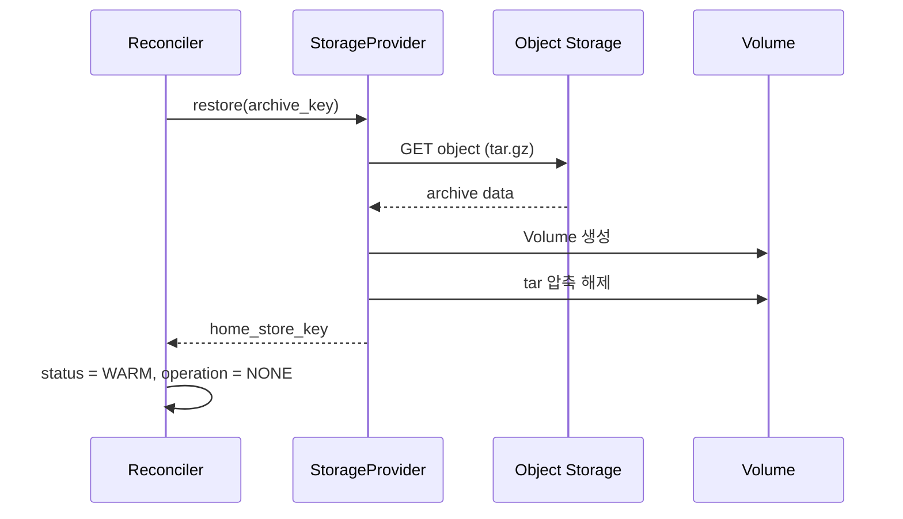
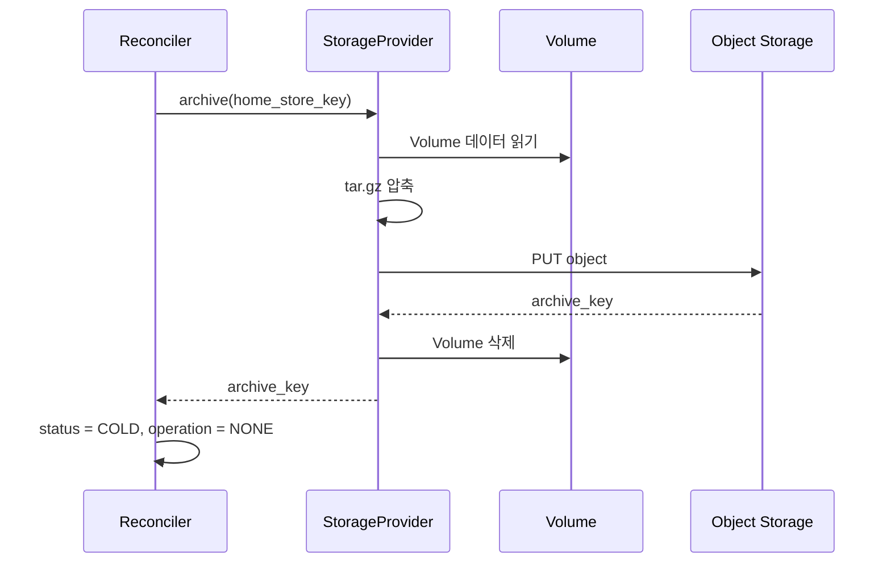
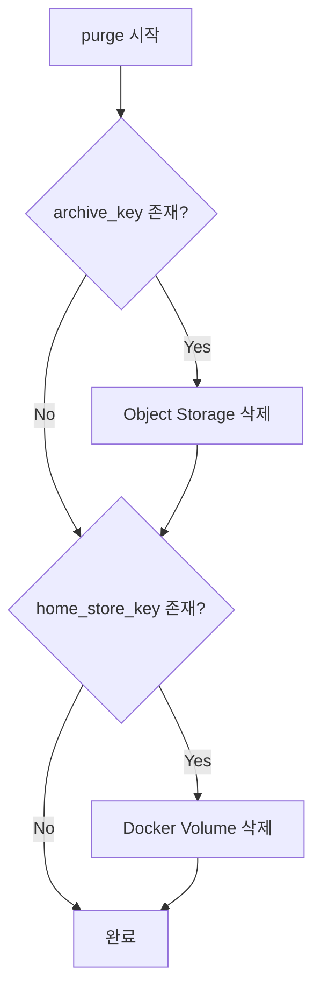
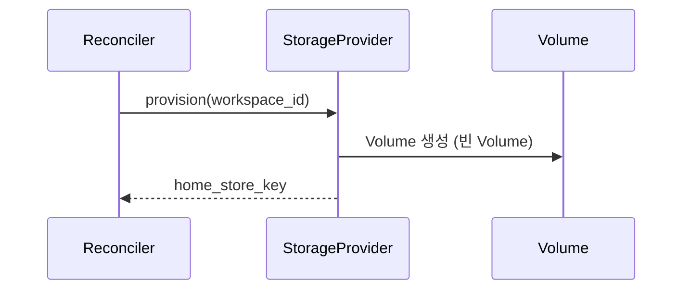

# Storage Operations (M2)

> [README.md](./README.md)로 돌아가기

---

## 개요

상태 전환 중 Storage 관련 동작을 정의합니다.

| operation | Storage 동작 |
|-----------|-------------|
| RESTORING | restore (archive → volume) |
| ARCHIVING | archive (volume → archive) |
| DELETING | purge |

### 백엔드별 용어

| 개념 | local-docker | k8s |
|------|-------------|-----|
| Volume | Docker Volume | PersistentVolumeClaim (PVC) |
| Object Storage | MinIO | S3 / MinIO |

---

## RESTORING (COLD → WARM)

Object Storage에서 Volume으로 데이터 복원.

### 전제 조건
- `status = COLD, operation = RESTORING`
- `archive_key`가 존재

### 동작



### 인터페이스

```python
async def restore(archive_key: str) -> str:
    """
    Args:
        archive_key: Object Storage 경로 (예: "archives/{workspace_id}.tar.gz")

    Returns:
        home_store_key: Docker Volume 이름 (예: "ws_{workspace_id}_home")

    Raises:
        StorageError: 복원 실패 시
    """
```

### 실패 처리
- Object Storage 접근 실패 → ERROR 상태, 재시도
- Volume 생성 실패 → ERROR 상태, 재시도
- 데이터 손상 → ERROR 상태, 관리자 개입

---

## ARCHIVING (WARM → COLD)

Volume을 Object Storage로 아카이브.

### 전제 조건
- `status = WARM, operation = ARCHIVING`
- 컨테이너가 정지된 상태 (RUNNING이 아님)

### 동작



### 인터페이스

```python
async def archive(home_store_key: str) -> str:
    """
    Args:
        home_store_key: Docker Volume 이름

    Returns:
        archive_key: Object Storage 경로

    Raises:
        StorageError: 아카이브 실패 시
    """
```

### 실패 처리
- Volume 읽기 실패 → ERROR 상태
- 업로드 실패 → Volume 유지, 재시도
- 업로드 성공 후 Volume 삭제 실패 → 수동 정리 필요

### 멱등성
- 동일한 workspace를 다시 아카이브하면 기존 archive_key 덮어쓰기
- 이전 아카이브 자동 삭제 (선택: 버전 관리 시 유지)

---

## DELETING (purge)

모든 Storage 리소스 정리.

### 동작



### 인터페이스

```python
async def purge(
    home_store_key: str | None,
    archive_key: str | None
) -> None:
    """
    모든 Storage 리소스 삭제.
    존재하지 않는 리소스는 무시 (멱등).

    Raises:
        StorageError: 삭제 실패 시
    """
```

### 실패 처리
- 삭제 실패 시 로그 기록, 수동 정리 필요
- 부분 삭제 가능 (archive만 삭제, volume은 남음)

---

## provision (신규 생성)

INITIALIZING 시 신규 Volume 생성.

### 동작



### 인터페이스

```python
async def provision(workspace_id: str) -> str:
    """
    신규 Docker Volume 생성.

    Returns:
        home_store_key: 생성된 Volume 이름
    """
```

---

## Object Storage 구조

```
bucket: codehub-archives
├── {workspace_id}/
│   └── home.tar.gz       # 현재 아카이브
│   └── home.tar.gz.meta  # 메타데이터 (선택)
```

### 아카이브 형식
- 압축: gzip (tar.gz)
- 암호화: 미구현 (M2 범위 외)

---

## 참조

- [states.md](./states.md) - 상태 전환 규칙
- [instance.md](./instance.md) - 인스턴스 동작
