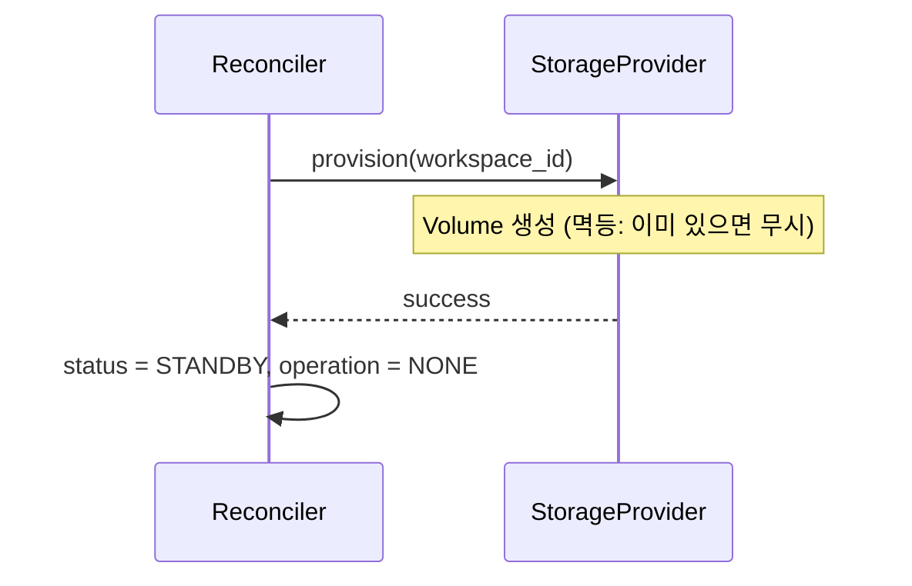
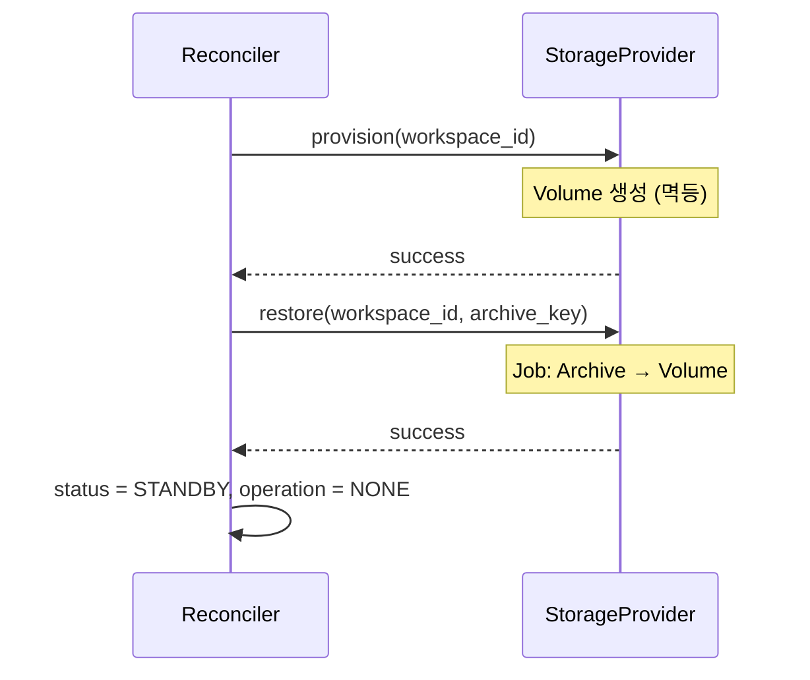
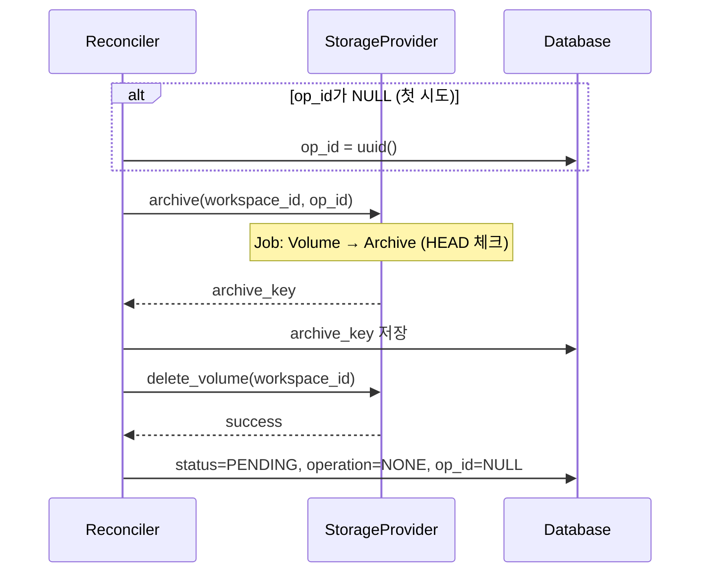

# Storage (M2)

> [README.md](./README.md)로 돌아가기

---

## 핵심 원칙

재시도/크래시/부분 실패에 안전한 Storage 설계.

1. **오퍼레이션은 workspace당 동시에 1개만** - `operation`이 락
2. **Archive는 op_id로 멱등성 확보** - 불변 경로 (HEAD 체크)
3. **Restore는 Crash-Only 설계** - 항상 재실행해도 같은 결과
4. **StorageProvider = 데이터 이동, Reconciler = DB 커밋**
5. **meta 파일 기반 checksum으로 무결성 검증** - sha256
6. **DELETING은 Volume만, Archive는 GC가 정리** - 책임 분리
7. **Workspace는 soft-delete** - GC가 orphan 판단에 필요

---

## 동시성 안전

**workspace당 operation은 동시에 1개만 실행 가능**:
- `operation != 'NONE'`이면 다른 작업 시작 불가
- 동일 workspace에 대한 동시 Archive/Restore 없음
- 따라서 **동시 덮어쓰기 이슈 없음**

> **참고**: 부분 실패 복구 시 같은 경로에 재업로드는 가능하나, 이는 순차적 재시도이므로 안전.

### Reconciler 동시성 제어

여러 Reconciler 인스턴스가 동시에 같은 workspace를 처리하는 것을 방지합니다.

**조건부 UPDATE (Optimistic Locking)**:

```sql
UPDATE workspaces
SET operation = ?, updated_at = NOW()
WHERE id = ? AND operation = 'NONE';
```

| 결과 | 의미 | 동작 |
|------|------|------|
| affected_rows = 1 | 성공 | 작업 진행 |
| affected_rows = 0 | 다른 Reconciler가 선점 | 이번 사이클 skip |

> **구현 참고**: ORM에서 `update().where(operation='NONE')` 후 affected rows 체크

---

## 불변식 (Invariants)

```
- archive Job: 같은 (workspace_id, op_id)에 대해 멱등 (HEAD 체크)
- restore Job: 같은 archive → 같은 결과 (Crash-Only)
- archive_key DB 저장 → Volume 삭제 순서 (역순 금지)
- Volume은 workspace당 1개 고정 (ws-{workspace_id}-home)
```

---

## 개요

상태 전환 중 Storage 관련 동작을 정의합니다.

| operation | Storage 동작 |
|-----------|-------------|
| PROVISIONING | provision (빈 volume 생성) |
| RESTORING | restore (archive → volume) |
| ARCHIVING | archive (volume → archive) + delete_volume |
| DELETING | delete_volume (Volume만 삭제, Archive는 GC가 정리) |

### op_id 정책

| Operation | op_id 필요 | 이유 |
|-----------|-----------|------|
| PROVISIONING | ❌ | Volume 생성만, archive_key 생성 안 함 |
| RESTORING | ❌ | 기존 archive_key 사용, 새 경로 생성 안 함 |
| ARCHIVING | ✅ | archive_key 경로 생성에 필요 (`archives/{id}/{op_id}/...`) |
| DELETING | ❌ | Volume만 삭제, Archive는 GC가 처리 |

| 시점 | op_id 상태 | 동작 |
|------|-----------|------|
| 첫 시도 | NULL | 생성 후 DB 저장 |
| 재시도 | NOT NULL | 기존 값 사용 (DB에서 조회) |

> **핵심**: op_id는 archive 호출 전에 DB에 먼저 저장됨. 크래시 후 재시도 시 같은 op_id로 같은 경로에 업로드.

### 완료 판단 원칙

**관측 기반 완료 판단**을 사용합니다.

```
Actuator 성공 반환 ≠ Operation 완료
관측 조건 충족 = Operation 완료
```

| Operation | Actuator | 완료 조건 (관측 기반) |
|-----------|----------|---------------------|
| PROVISIONING | `provision()` | `volume_exists() == True` |
| RESTORING | `provision()` + `restore()` | `volume_exists() == True` |
| STARTING | `start()` | `is_running() AND volume_exists()` |
| STOPPING | `delete()` | `!is_running() AND volume_exists()` |
| ARCHIVING | `archive()` + `delete_volume()` | `!volume_exists()` |
| DELETING | `delete()` + `delete_volume()` | `!is_running() AND !volume_exists()` |

> **이유**: Level-Triggered 철학 일관성. 크래시 복구 시 관측으로 현재 상태 확인.

### 백엔드별 용어

| 추상 개념 | local-docker | k8s |
|----------|-------------|-----|
| Volume | Docker Volume | PersistentVolumeClaim (PVC) |
| Job | 임시 컨테이너 (`docker run --rm`) | Job Pod |
| Object Storage | MinIO | S3 / MinIO |

---

## 네이밍 규칙

> ⚠️ **강한 가정**: 아래 패턴은 프로젝트 전체에서 동일하게 사용되는 불변 규칙입니다.
> Storage, Instance 모두 내부에서 동일 패턴으로 계산합니다.

모든 Storage 관련 식별자의 네이밍 패턴입니다.

### 키 형식

| 항목 | 형식 | 예시 |
|------|------|------|
| volume_key | `ws-{workspace_id}-home` | `ws-abc123-home` |
| archive_key | `archives/{workspace_id}/{op_id}/home.tar.gz` | `archives/abc123/550e8400.../home.tar.gz` |

> **K8s DNS-1123 호환**: 하이픈(`-`) 사용, 언더스코어(`_`) 사용 금지

> **Volume은 workspace당 1개 고정** - Volume GC 불필요
> **패턴 변경 시**: Storage + Instance 동시 수정 필수

### Volume 라벨 (K8s/Docker)

```yaml
labels:
  codehub.io/workspace-id: "abc123"
```

### 마운트 경로

| 컨테이너 | 마운트 경로 | 설명 |
|---------|-----------|------|
| Job | `/data` | Volume 마운트 |
| Job | `/tmp` | 임시 공간 (emptyDir) |
| Workspace | `/home/coder` | Volume 마운트 (동일 Volume) |

### Volume 내부 구조

```
Volume
└── (사용자 파일들)         # 사용자 데이터만 저장
```

> **단순화**: Volume에는 사용자 데이터만 존재. 임시 파일(staging, tar.gz)은 모두 `/tmp`(emptyDir)에 저장.

> **상세**: [storage-job.md](./storage-job.md#마운트-구조)

---

## Job (임시 컨테이너)

Archive/Restore 작업은 **Job**이 수행합니다. Job은 Volume과 Object Storage 간 데이터 이동을 담당하는 격리된 컨테이너입니다.

### 핵심 특성

| 항목 | 값 |
|------|---|
| 입력 | ARCHIVE_URL, S3 인증 정보 |
| 출력 | exit code (0=성공, ≠0=실패) |
| 의존성 | Object Storage만 (DB 없음, Reconciler 없음) |
| 멱등성 | HEAD 체크 (Archive), 항상 재실행 (Restore) |

### 설계 철학

> **Crash-Only Design**: 복잡한 상태 관리보다 단순한 재시작을 선택
> - Stateless: Volume에 상태 저장 안 함
> - Idempotent: 재시도해도 같은 결과

### 격리 원칙

```
Job은 DB를 모르고, Reconciler를 모르고, Control Plane을 모른다.
매개변수만 받아서 작업하고, 성공/실패만 반환한다.
```

> **상세 스펙**: [storage-job.md](./storage-job.md) 참조

---

## 무결성 검증

meta 파일 기반 checksum을 사용합니다.

| 단계 | 방식 | 설명 |
|------|------|------|
| Archive | sha256 생성 | tar.gz의 sha256을 .meta에 저장 |
| Restore | sha256 검증 | 다운로드 후 .meta와 비교 |

> **왜 ETag/Content-MD5가 아닌가?**: 멀티파트 업로드 시 ETag ≠ MD5이고,
> Content-MD5는 멀티파트에서 파트별로만 적용됨. 별도 checksum이 확실함.

---

## Operation 플로우

### PROVISIONING (PENDING → STANDBY)

새 워크스페이스의 빈 Volume 생성.

| 항목 | 값 |
|------|---|
| 전제 조건 | `status = PENDING, operation = PROVISIONING, archive_key = NULL` |
| Actuator | `storage.provision()` |
| 완료 조건 | `volume_exists() == True` |



### RESTORING (PENDING + has_archive → STANDBY)

Archive에서 Volume으로 데이터 복원.

| 항목 | 값 |
|------|---|
| 전제 조건 | `status = PENDING, operation = RESTORING, archive_key != NULL` |
| Actuator | `storage.provision()` → `storage.restore()` |
| 완료 조건 | `volume_exists() == True` |



> **Job 상세**: [storage-job.md](./storage-job.md#restore-job)

#### 실패 처리

| 에러 코드 | ErrorReason | 복구 방법 |
|----------|-------------|----------|
| `ARCHIVE_NOT_FOUND` | DataLost | 관리자 개입 |
| `S3_ACCESS_ERROR` | Unreachable | 자동 재시도 (3회) |
| `CHECKSUM_MISMATCH` | DataLost | 관리자 개입 |
| `TAR_EXTRACT_FAILED` | ActionFailed | 자동 재시도 (3회) |

### ARCHIVING (STANDBY → PENDING + has_archive)

Volume을 Object Storage로 아카이브.

| 항목 | 값 |
|------|---|
| 전제 조건 | `status = STANDBY, operation = ARCHIVING` |
| Actuator | `storage.archive()` → `storage.delete_volume()` |
| 완료 조건 | `!volume_exists()` |
| 순서 | 업로드 → archive_key DB 저장 → Volume 삭제 |



> **Job 상세**: [storage-job.md](./storage-job.md#archive-job)

#### 크래시 복구

| 크래시 시점 | DB 상태 | 재시도 동작 |
|------------|---------|------------|
| 업로드 중 | op_id 있음, archive_key 불일치 | 같은 op_id로 재시도 (Job HEAD 체크) |
| archive_key 저장 후 | archive_key 일치 | 업로드 skip → delete_volume만 |
| Volume 삭제 후 | archive_key 일치, !volume_exists | 최종 커밋만 |

### DELETING

Container와 Volume 삭제. Archive는 GC가 정리.

| 항목 | 값 |
|------|---|
| 전제 조건 | `operation = DELETING` (모든 status에서 가능) |
| Actuator | `instance.delete()` → `storage.delete_volume()` |
| 완료 조건 | `!is_running() AND !volume_exists()` |
| 순서 | Container 삭제 → Volume 삭제 (역순 금지) |


#### 삭제 대상

| 리소스 | 삭제 주체 | 타이밍 |
|--------|----------|--------|
| Container | InstanceController | 즉시 |
| Volume | StorageProvider | Container 삭제 후 |
| Archives | GC | 2시간 후 (soft-delete 감지) |

> **분리 이유**: Container/Volume은 컴퓨팅 비용 즉시 해제, Archive는 GC가 배치로 정리

---

## Job 에러 처리

StorageProvider가 예외를 던지면 Reconciler가 ERROR 상태로 전환:

- `previous_status` 저장 (복구 시 사용)
- `error_message` 기록
- `error_count` 증가
- `op_id` 유지 (재시도 시 같은 값 사용)

> **에러 유형 상세**: [storage-job.md](./storage-job.md#에러-처리) 참조

---

## StorageProvider 인터페이스

```python
class StorageProvider(ABC):
    """Storage 작업 추상 인터페이스

    Job(임시 컨테이너)은 구현 세부사항으로,
    각 백엔드가 내부적으로 처리함.

    핵심 원칙:
    - workspace_id, op_id를 인자로 받음 (Reconciler가 DB 관리)
    - 모든 작업은 멱등
    """

    @abstractmethod
    async def provision(self, workspace_id: str) -> None:
        """신규 Volume 생성 (멱등).

        Args:
            workspace_id: 워크스페이스 ID

        내부적으로 volume_key = ws-{workspace_id}-home 사용
        멱등성: Volume이 이미 있으면 무시
        """

    @abstractmethod
    async def restore(self, workspace_id: str, archive_key: str) -> None:
        """Object Storage → Volume (멱등).

        Args:
            workspace_id: 워크스페이스 ID
            archive_key: Object Storage 경로

        멱등성: 같은 아카이브 → 같은 결과 (Crash-Only 설계)

        Raises:
            StorageError: 복원 실패 시
        """

    @abstractmethod
    async def archive(self, workspace_id: str, op_id: str) -> str:
        """Volume → Object Storage (멱등).

        Args:
            workspace_id: 워크스페이스 ID
            op_id: 작업 ID (archive_key 생성에 사용)

        Returns:
            archive_key: 경로 (archives/{workspace_id}/{op_id}/home.tar.gz)
                        skip 여부와 무관하게 항상 동일한 값 반환

        멱등성: HEAD 체크로 이미 존재하면 skip (업로드 생략)

        Note:
            archive_key = f"archives/{workspace_id}/{op_id}/home.tar.gz"
            → op_id로부터 결정론적 계산 가능
            → skip이든 업로드든 같은 값 반환
        """

    @abstractmethod
    async def delete_volume(self, workspace_id: str) -> None:
        """Volume 삭제 (멱등).

        Args:
            workspace_id: 워크스페이스 ID

        멱등성: 존재하지 않으면 무시
        """

    # --- 관측 메서드 (Reconciler observe용) ---

    @abstractmethod
    async def volume_exists(self, workspace_id: str) -> bool:
        """Volume이 존재하는지 확인.

        Args:
            workspace_id: 워크스페이스 ID

        Returns:
            True: Volume 존재 (K8s: Terminating 포함)
            False: Volume 없음 (K8s: 완전 삭제됨)

        백엔드별 동작:
            - Docker: Volume 존재 여부
            - K8s: PVC 존재 여부 (Terminating도 True)

        용도: Reconciler의 observe_actual_state()에서 호출

        Note:
            K8s에서 Terminating 상태 PVC는 아직 존재하는 것으로 취급.
            delete_volume() 호출 후 실제 삭제 완료까지 대기해야 False 반환.
            Terminating 상태에서 stuck되면 timeout(5분) 후 ERROR 전환 권장.
        """

    # archive_exists() 제거됨 - DB archive_key 컬럼으로 has_archive 판단
    # purge 메서드 제거됨 - DELETING은 delete_volume만 호출
    # Archive는 GC가 별도로 정리 (soft-delete된 workspace의 archive는 orphan 취급)
```

---

## 참조

- [storage-job.md](./storage-job.md) - Job 스펙 (Crash-Only 설계)
- [storage-gc.md](./storage-gc.md) - Archive GC
- [error.md](./error.md) - ERROR 상태, 에러 처리
- [reconciler.md](./reconciler.md) - Reconciler 알고리즘 (관측 메서드 사용)
- [states.md](./states.md) - 상태 전환 규칙
- [instance.md](./instance.md) - 인스턴스 동작
