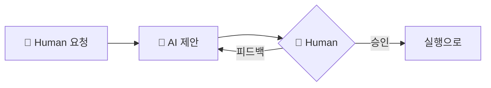
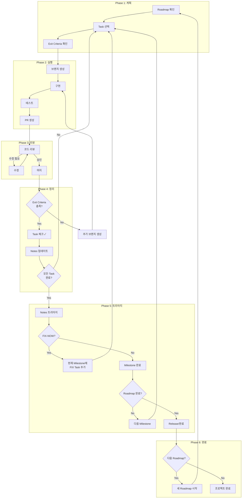
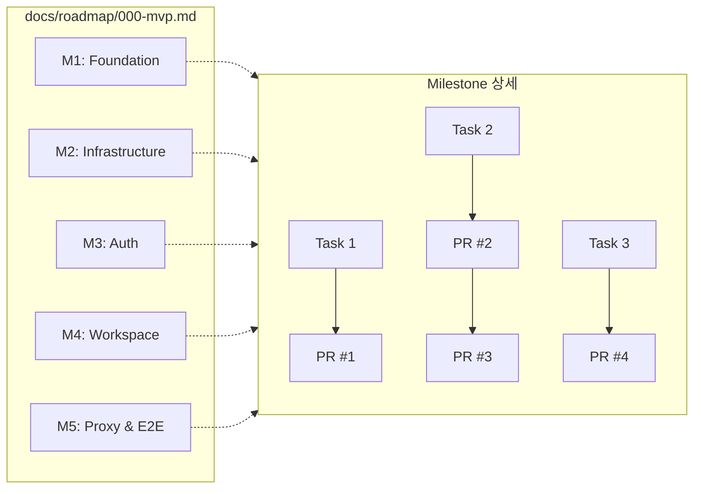
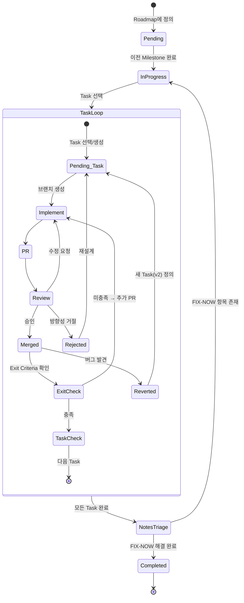
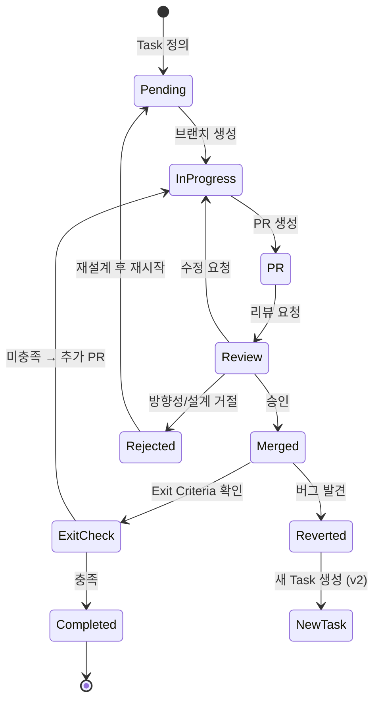
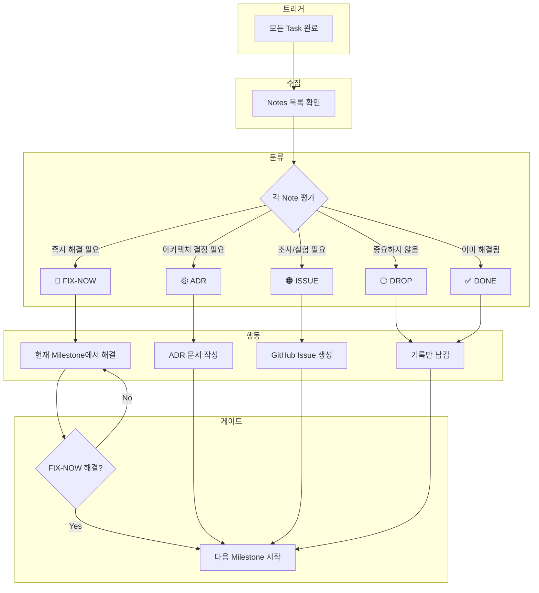
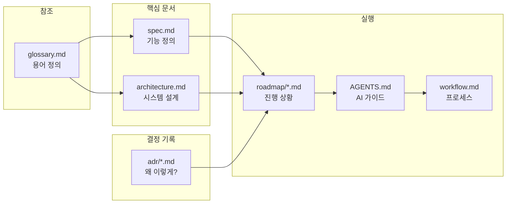
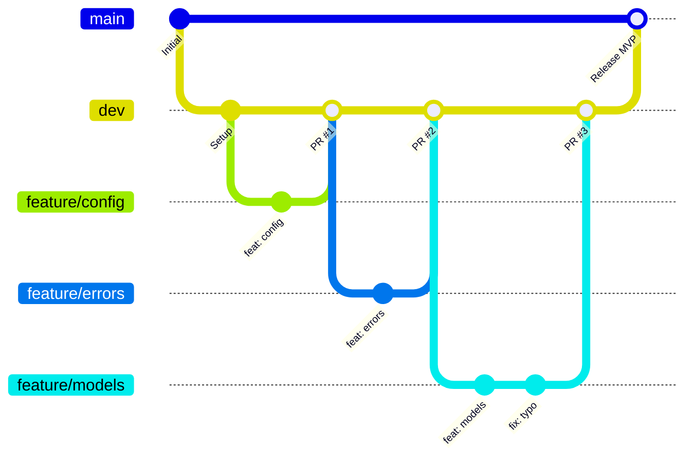

# Development Workflow

> AI + Human 협업을 위한 개발 프로세스 시각화

---

## 0. 역할 정의

| 역할 | AI | Human |
|------|-----|-------|
| 🔵 **계획** | spec 초안 제안, Roadmap/Task 시뮬레이션 | 피드백 후 최종 결정 |
| 🤖 **실행** | 브랜치 생성, 구현, 테스트, PR 생성, Notes 기록 | - |
| 🔵🤖 **리뷰** | Self-review, 설명 | 코드 리뷰, PR 승인/머지 |
| 🔵🤖 **트리아지** | Notes 정리, 분류 제안 | 최종 분류 결정 |

> **원칙**: AI는 **제안/실행**, Human은 **결정/승인**

---

## 1. 계획 수립 🔵



### 핑퐁 흐름

```
🔵 Human: 요청/질문
🤖 AI: 제안
🔵 Human: 피드백 or 승인
   ↺ (반복)
```

### 계획 단계

1. **spec.md** - 기능 요구사항
2. **Roadmap** - Milestone 구조
3. **Task** - 작업 단위 + Exit Criteria

> 각 단계마다 핑퐁 후 Human 승인 시 다음 단계로

---

## 2. 실행 흐름 🔵🤖



### 핵심 용어 정의

| 용어 | 정의 |
|------|------|
| **Task 완료** | PR 머지 + Exit Criteria 충족 → `[x]` |
| **Task 종료** | REVERTED/취소 → `[x] ~~취소선~~` (Closed) |
| **모든 Task 완료** | Open 상태(`[ ]`) Task가 0개 |
| **Milestone 완료** | 모든 Task 완료 + 트리아지 + FIX-NOW 해결 |
| **트리아지 트리거** | 모든 Task 완료 시점 |
| **1 Task = 1 PR (기본)** | 예외적으로 N PR 허용 (리스크 분산, Exit 단계적 충족) |

### 가드레일

| 구분 | 규칙 | 설명 |
|------|------|------|
| 🔴 Hard | **Blocker 즉시 라우팅** | Task 완료 대기 없이 FIX/ADR/Issue 분기 |
| 🔴 Hard | **DROP은 Human 승인** | 사유 기록 필수 (ADR 또는 roadmap notes) |
| 🔴 Hard | **Revert 시 v2 필수** | 같은 Milestone 귀속 기본. 이동은 Human 승인 |
| 🟡 Soft | **dev green 유지** | "항상"이 아니라 "최대한 + 빨리 복구" |
| 🟡 Soft | **1 Task = 1 PR 기본** | N PR은 예외 (리스크 분산, Exit 단계적 충족) |
| 🟡 Soft | **FIX-NOW 컷** | Milestone 당 1~2회. 초과 시 ADR/Backlog로 이월 |

---

## 3. Roadmap → Milestone → Task → PR

### 계층 구조



> 각 Milestone은 동일한 Task → PR 구조를 가짐 (점선은 "같은 패턴"을 의미)

### 진행 상태

```
Roadmap 000: MVP
├── M1: Foundation ✅ Completed
├── M2: Infrastructure ✅ Completed
├── M3: Auth 🔄 In Progress ← 현재 위치
├── M4: Workspace ⏳ Pending
└── M5: Proxy & E2E ⏳ Pending
```

---

## 4. Milestone 라이프사이클



---

## 5. Task 라이프사이클

### 상태 흐름



> **핵심**: PR 머지 ≠ Task 완료. **Exit Criteria 충족**이 완료 조건.

### Review 결과 구분

| 상황 | 경로 | 설명 |
|------|------|------|
| **수정 요청** | Review → InProgress | 코드 품질 이슈 → 수정 후 재리뷰 |
| **Rejected** | Review → Rejected → Pending | 방향성/설계 거절 → 재설계 후 재시작 |
| **ExitCheck 미충족** | Merged → ExitCheck → InProgress | 기능 부족/누락 → 추가 PR |
| **Revert** | Merged → Reverted → NewTask | 버그/장애 발견 → PR 롤백 후 새 Task |

> **판단 기준**
> - 코드만 고치면 됨 → **수정 요청**
> - 접근 방식 자체가 잘못됨 → **Rejected**
> - 머지 후 기능 부족 → **ExitCheck 미충족**
> - 머지 후 버그 발견 → **Revert**
>
> **Rejected vs ExitCheck 구분**
> - "추가 구현"으로 Exit 충족 가능 → **ExitCheck 미충족** (머지 허용)
> - "구조/접근 교체" 없이 Exit 불가 → **Rejected** (머지 금지)

### Task 형식

```markdown
**Tasks**:
- [ ] Task 이름 (Exit: 완료 조건 한 줄)
- [x] 완료된 Task (PR #N)
- [x] ~~Task 이름~~ (CLOSED: PR #N REVERTED → v2로 대체)
- [ ] Task 이름 v2 (Exit: 완료 조건)
```

> **완료 판정 규칙**
> - `[x]` = **완료(Done)** 또는 **종료(Closed)**
> - `[ ]` = **진행 중(Open)**
> - "모든 Task 완료" = Open 상태 Task가 0개
> - REVERTED Task는 `[x] ~~취소선~~`으로 **Closed** 처리 후, 새 Task(v2)를 Open

### Exit Criteria 예시

| Task | Exit Criteria |
|------|---------------|
| Config 모듈 구현 | env-only로도 부팅 가능, 잘못된 값은 명확한 에러 |
| Auth Middleware | 유효한 세션 쿠키로 인증 통과, 만료 시 401 |
| Storage Provider | Provision/Deprovision 멱등성 테스트 통과 |

---

## 6. Notes 트리아지

### 왜 필요한가?

```
Notes만 쌓이고 Act가 없으면:
Month 1: Notes 8개 → "관리 가능"
Month 3: Notes 24개 → "나중에 정리"
Month 5: Notes 40개 → 💥 기술 부채 폭발
```

### 트리아지 흐름



### 트리아지 결과 기록

```markdown
**Notes Triage (M1 종료)**:

| 분류 | 항목 | 처리 |
|------|------|------|
| 🔴 FIX | Session lazy loading 문제 | 현재 Milestone에 FIX Task 추가 |
| 🟡 ADR | 환경변수 우선순위 | ADR-003 작성 |
| 🟠 ISSUE | YAML 파싱 느림 | Issue #1 생성 |
| ⚪ DROP | 에러 코드 체계 고민 | 현재로 충분 |
| ✅ DONE | SQLModel async 확인 | 동작 확인됨 |
```

---

## 7. 엣지 케이스 처리

| 상황 | 처리 |
|------|------|
| **Task 의존성 발견** | Notes 기록 → 의존 Task 먼저 진행 |
| **스펙 불완전/모순** | Notes 기록 → 스펙 수정 PR 먼저 |
| **Task가 너무 큼** | Task 분리 + Roadmap 수정 |
| **Blocker 발생** | 🔴 즉시 FIX/ADR/Issue 분기 (Hard 가드레일) |
| **AI 세션 중단** | Notes/Draft PR에 현재 상태 기록 |
| **PR Revert 필요** | 🔴 v2 Task 생성 (Hard 가드레일) |
| **PR 완전 거절** | Notes 기록 → Task 재설계 후 재시작 |

### AI가 "더 좋은 아키텍처" 제안 시

| Exit Criteria에 필요? | 처리 |
|----------------------|------|
| **Yes** | 현재 Task에서 구현 |
| **No** | Notes에 기록 → Milestone 트리아지에서 ADR/Backlog/Drop 결정 |

---

## 8. 문서 간 관계



---

## 9. 브랜치 전략



### 머지 규칙

```
feature/*   → dev  : PR 리뷰 후 머지
dev → main         : 릴리즈 준비 완료 시
```

> **브랜치 규칙**
> - `feature/*`: dev의 최신 HEAD에서 생성
> - **리뷰 수정**: 같은 PR에 커밋 추가 (새 브랜치 ❌)
> - **추가 PR** (ExitCheck 미충족): 새 feature/* 브랜치 생성

### 범위 경계

> **이 프로세스의 범위**: MVP 개발 단계까지
>
> 릴리즈 이후 발견된 버그(hotfix)는 별도 운영 프로세스로 처리.
> 필요시 `hotfix/*` 브랜치 전략을 별도 문서로 정의.

---

## 10. 체크리스트

### Task 시작 시

- [ ] 🤖 Roadmap에서 현재 Task 확인
- [ ] 🤖 spec.md에서 관련 섹션 읽기
- [ ] 🤖 architecture.md에서 컴포넌트 관계 확인
- [ ] 🤖 Exit Criteria 확인 (정의는 Task 생성 시 완료)

### PR 머지 후

- [ ] 🤖 Exit Criteria 충족 확인
- [ ] 🔵 충족 시: Task 체크 `- [x] Task (PR #N)`
- [ ] 🤖 미충족 시: 추가 작업 진행 (Task 미완료 유지)
- [ ] 🤖 Notes 업데이트 (필요시)

### Milestone 종료 시

- [ ] 🤖 모든 Task 완료 확인
- [ ] 🔵🤖 Notes 트리아지 실행
- [ ] 🤖 FIX-NOW 항목 해결
- [ ] 🔵 Status를 Completed로 변경

---

## 참조

- [AGENTS.md](../AGENTS.md) - AI 에이전트 가이드
- [spec.md](./spec.md) - 기능 스펙
- [architecture.md](./architecture.md) - 시스템 아키텍처
- [ADR-000: Repository Strategy](./adr/000-repository-strategy.md)
