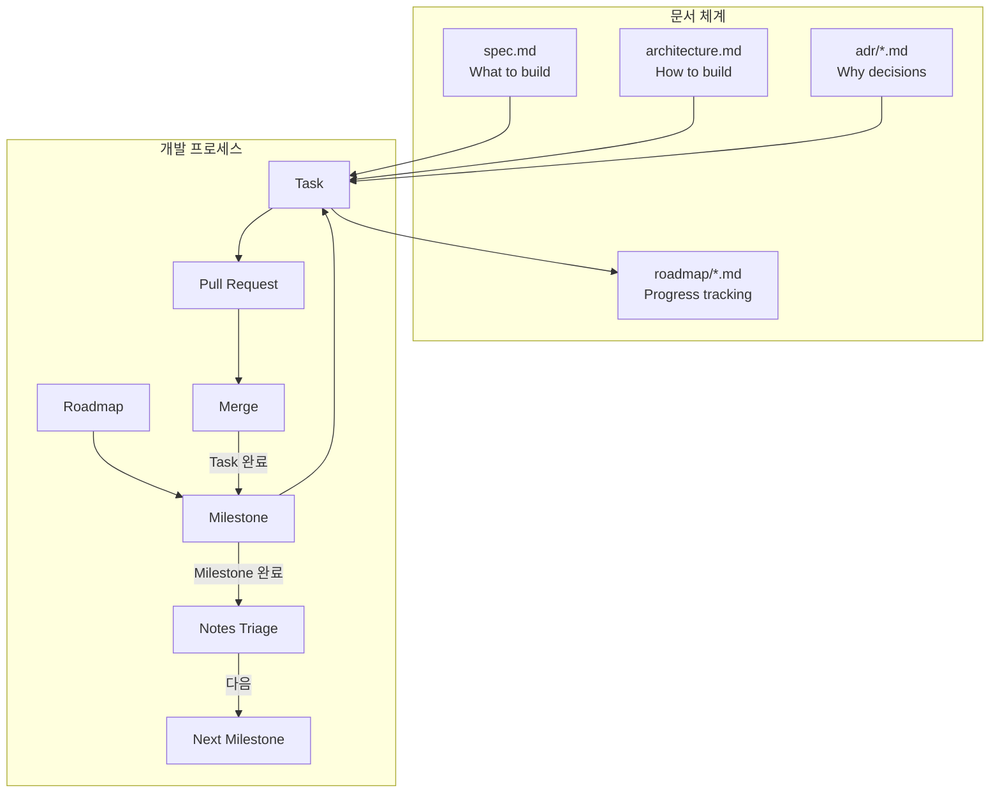
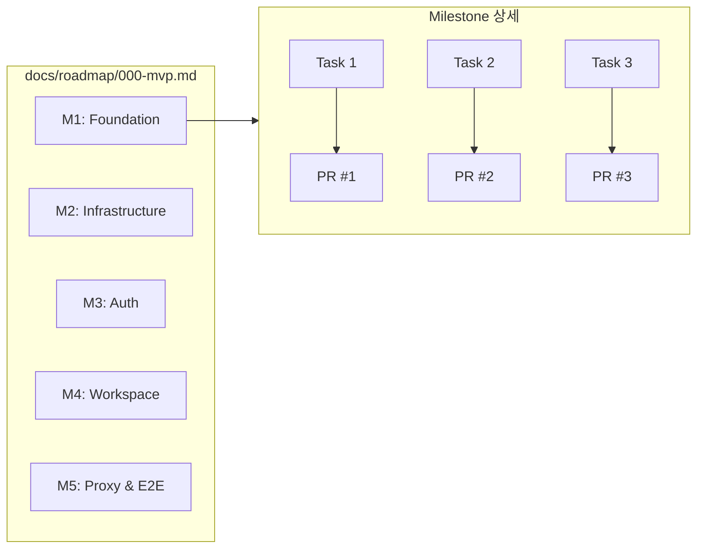
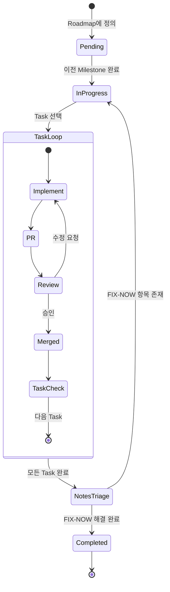
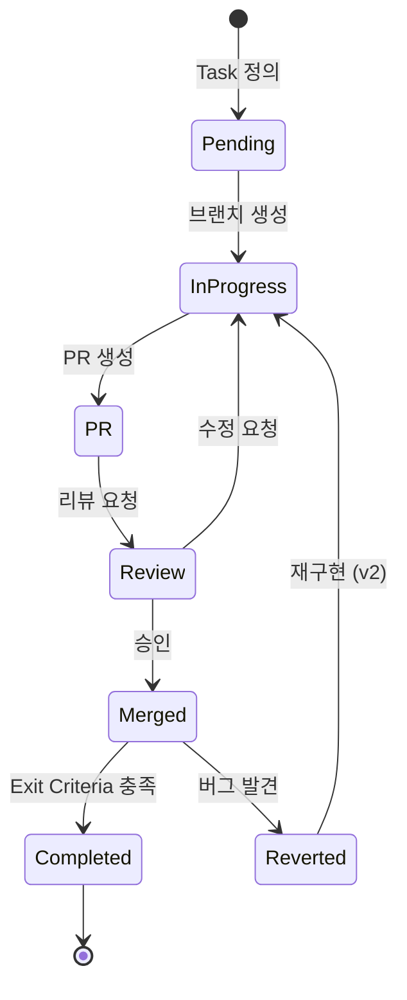
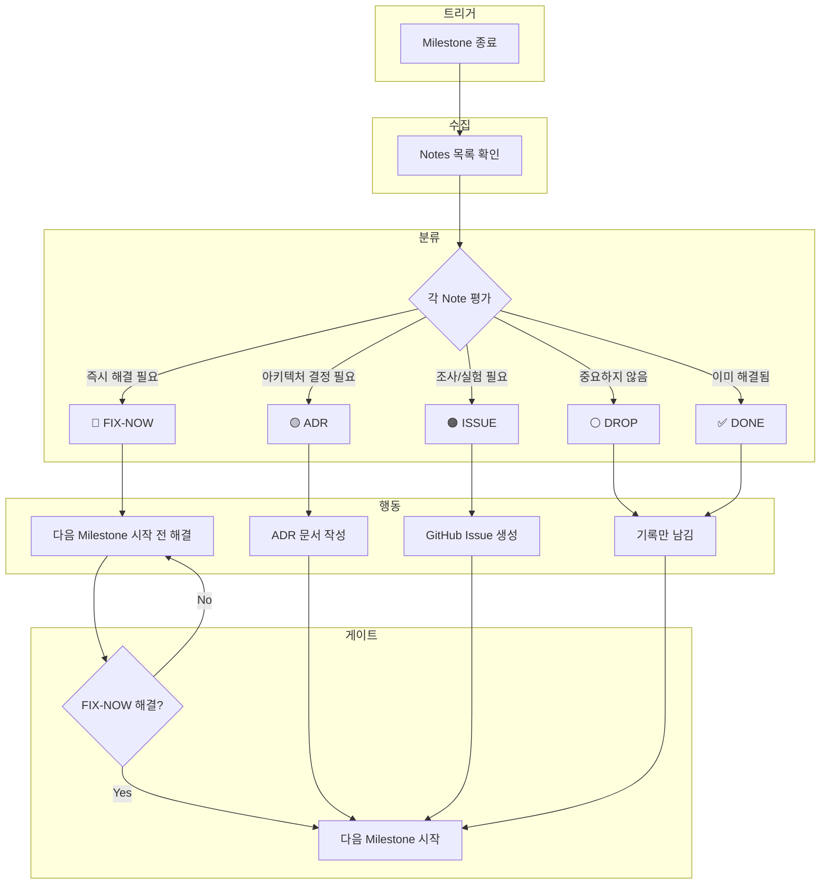
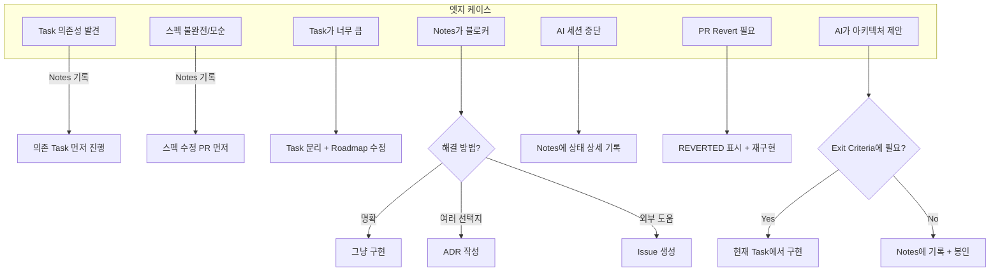
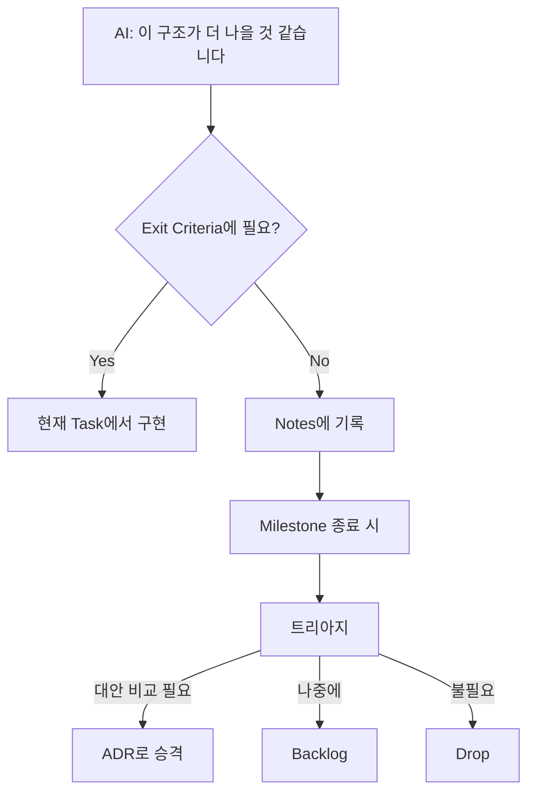
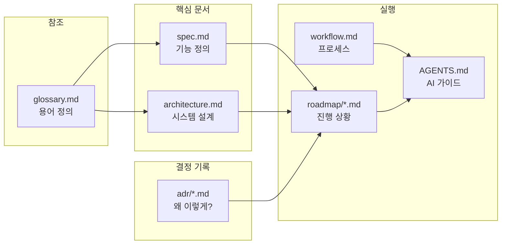
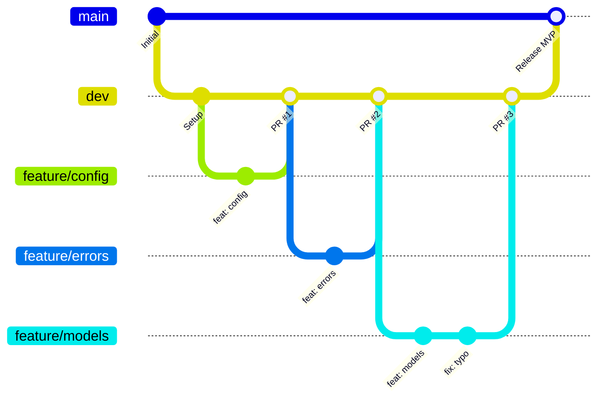
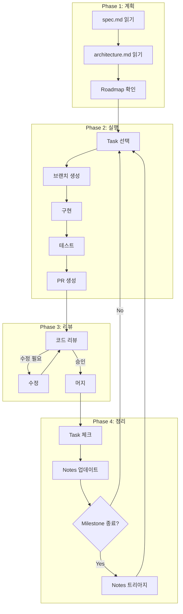

# Development Workflow

> AI + Human 협업을 위한 개발 프로세스 시각화

---

## 1. 전체 프로세스 개요



---

## 2. Roadmap → Milestone → Task → PR

### 계층 구조



### 진행 상태

```
Roadmap 000: MVP
├── M1: Foundation ✅ Completed
├── M2: Infrastructure ✅ Completed
├── M3: Auth 🔄 In Progress ← 현재 위치
├── M4: Workspace ⏳ Pending
└── M5: Proxy & E2E ⏳ Pending
```

---

## 3. Milestone 라이프사이클



---

## 4. Task 라이프사이클

### 상태 흐름



### Task 형식

```markdown
**Tasks**:
- [ ] Task 이름 (Exit: 완료 조건 한 줄)
- [x] 완료된 Task (PR #N)
- [x] Reverted Task (PR #N) **REVERTED in PR #M**
```

### Exit Criteria 예시

| Task | Exit Criteria |
|------|---------------|
| Config 모듈 구현 | env-only로도 부팅 가능, 잘못된 값은 명확한 에러 |
| Auth Middleware | 유효한 세션 쿠키로 인증 통과, 만료 시 401 |
| Storage Provider | Provision/Deprovision 멱등성 테스트 통과 |

---

## 5. Notes 트리아지

### 왜 필요한가?

```
Notes만 쌓이고 Act가 없으면:
Month 1: Notes 8개 → "관리 가능"
Month 3: Notes 24개 → "나중에 정리"
Month 5: Notes 40개 → 💥 기술 부채 폭발
```

### 트리아지 흐름



### 트리아지 결과 기록

```markdown
**Notes Triage (M1 종료)**:

| 분류 | 항목 | 처리 |
|------|------|------|
| 🔴 FIX | Session lazy loading 문제 | M2 시작 전 해결 |
| 🟡 ADR | 환경변수 우선순위 | ADR-003 작성 |
| 🟠 ISSUE | YAML 파싱 느림 | Issue #1 생성 |
| ⚪ DROP | 에러 코드 체계 고민 | 현재로 충분 |
| ✅ DONE | SQLModel async 확인 | 동작 확인됨 |
```

---

## 6. 엣지 케이스 처리



### Case: AI가 매 PR마다 "더 좋은 아키텍처" 제안



---

## 7. 문서 간 관계



---

## 8. 브랜치 전략



### 머지 규칙

```
feature/* → dev    : PR 리뷰 후 머지
dev → main         : 릴리즈 준비 완료 시
```

---

## 9. 전체 흐름 요약



---

## 10. 체크리스트

### Task 시작 시

- [ ] Roadmap에서 현재 Task 확인
- [ ] spec.md에서 관련 섹션 읽기
- [ ] architecture.md에서 컴포넌트 관계 확인
- [ ] Exit Criteria 확인/정의

### PR 머지 후

- [ ] Task 체크: `- [x] Task (PR #N)`
- [ ] Notes 업데이트 (필요시)

### Milestone 종료 시

- [ ] 모든 Task 완료 확인
- [ ] Notes 트리아지 실행
- [ ] FIX-NOW 항목 해결
- [ ] Status를 Completed로 변경

---

## 참조

- [AGENTS.md](../AGENTS.md) - AI 에이전트 가이드
- [spec.md](./spec.md) - 기능 스펙
- [architecture.md](./architecture.md) - 시스템 아키텍처
- [ADR-000: Repository Strategy](./adr/000-repository-strategy.md)
